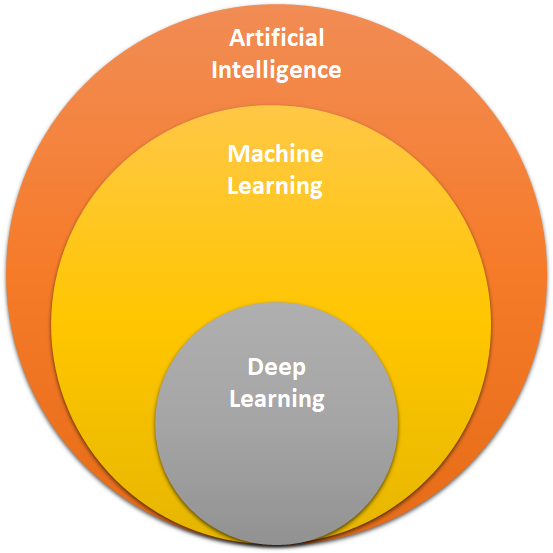
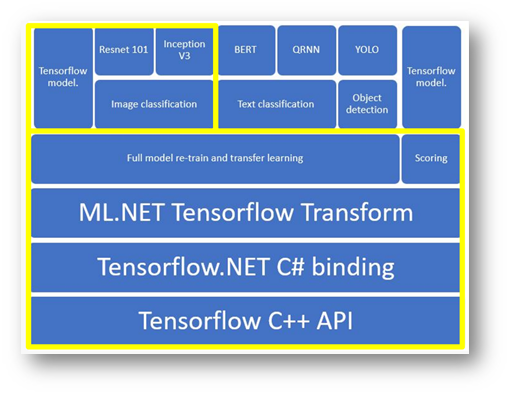

Deep Learning is a subset of machine learning. The most common algorithms used to Deep learning trainings are [neural networks](https://en.wikipedia.org/wiki/Deep_learning#Neural_networks).

## Deep learning in ML.NET

In ML.NET you can train and consume deep learning models.

### Consume models

In ML.NET you can use pretrained [TensorFlow](https://en.wikipedia.org/wiki/Deep_learning#Neural_networks) and [Open Neural Network Exchange (ONNX)](https://onnx.ai/) models to make predictions.

TensorFlow is an open-source platform for machine learning.

ONNX is an open format built to represent machine learning models. ONNX enables you to use your preferred framework with your chosen inference engine. Additionally, it makes it easier to access hardware optimizations.

### Train models

ML.NET uses TensorFlow through the low-level bindings provided by the [TensorFlow.NET](https://github.com/SciSharp/TensorFlow.NET) library. The TensorFlow.NET library is an open source and low-level API library that provides the .NET Standard bindings for TensorFlow. That library is part of the open source [SciSharp](https://github.com/SciSharp) stack libraries.

To train image classification models, using the ML.NET API, use the [ImageClassification API](https://docs.microsoft.com/dotnet/api/microsoft.ml.visioncatalog.imageclassification?view=ml-dotnet#Microsoft_ML_VisionCatalog_ImageClassification_Microsoft_ML_MulticlassClassificationCatalog_MulticlassClassificationTrainers_System_String_System_String_System_String_System_String_Microsoft_ML_IDataView_).

You can also train custom deep learning models in Model Builder. The process is generally the same, but in addition to training locally, you can also leverage Azure to train models in GPU enabled compute instances.