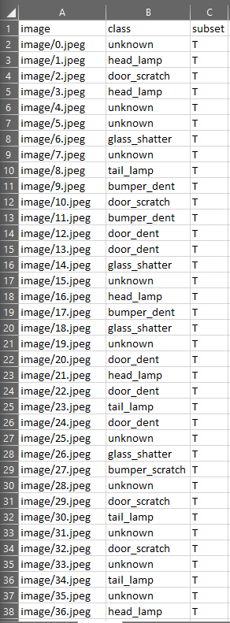

In this step, you'll download the data needed to train the model and load it into an `IDataView`.

### Download the data

[Download the data](https://storage.googleapis.com/bucket-8732/car_damage/preprocessed.zip) and unzip it.

> NOTE: This dataset is licensed from a third-party (Peltarion AB), not Microsoft.

The contents of the directory are the following:

- *image*: Directory containing all of the image files for training and testing.
- *index.csv*: File containing the following column names:
  - *image*: The relative path of the image (i.e. `image/1.jpg`).
  - *class*: The category of damage in the image.
  - *subset*: Whether the image belongs to the training(T) or validation (V) dataset.

You can open and inspect the contents of *index.csv* in a tool like Excel



### Define input schema

Create a new class in the `Shared` project called `ImageModelInput`. This class will consist solely of properties and will be mapped from the data file. Each property will reference a column using a 0-based index.

Start by adding the following `using` statement:

```csharp
using Microsoft.ML.Data;
```

Then, define the class as follows:

```csharp
public class ImageModelInput
{
    [LoadColumn(0)]
    public string ImagePath { get; set; }

    [LoadColumn(1)]
    public string DamageClass { get; set; }

    [LoadColumn(2)]
    public string Subset { get; set; }
}
```


### Load data into an IDataView

Open the `Program.cs` file in the `ImageTrainConsole` project and add the following `using` statements:

```csharp
using System.Collections.Generic;
using System.IO;
using System.Linq;
using Microsoft.ML;
using Microsoft.ML.Vision;
using Shared;
```

Inside of the class definition, add the location of the *index.csv* file and the *image* directory, which will depend on where you saved them to:

```csharp
// update this with your file's path where you saved it
private static string TRAIN_DATA_FILEPATH = @"C:\Dev\mlnet-workshop\data\preprocessed\index.csv";
private static string IMAGE_DATA_DIRECTORY = @"C:\Dev\mlnet-workshop\data\preprocessed\image";
```

Inside the `Main` method, initialize the `MLContext`. `MLContext` is the starting point for all ML.NET operations.

```csharp
MLContext mlContext = new MLContext();
```

Below the `Main` method, create a new method called `LoadImageData` to load the data from the `index.csv` file. This method will load your data and do some parsing. Note that although you can use ML.NET's `LoadFromTextFile` method to load the contents of the file directly into an `IDataView`, instead we use `LoadFromEnumerable` because there are a few manipulations we want to make to the image path before loading it into the `IDataView`.

```csharp
static IEnumerable<ImageModelInput> LoadImageData(string path, string imageFilePath, char separator=',',bool hasHeader=true)
{
    // Choose how many rows to skip
    var skipRows = hasHeader ? 1 : 0;

    // Local function to get full image path
    Func<string, string> getFilePath = imagePath => Path.Combine(imageFilePath, imagePath.Split('/')[1]);

    // Load file and create IEnumerable<ImageModelInput>
    var imageData =
        File.ReadAllLines(path)
            .Skip(skipRows)
            .Select(line =>
            {
                var columns = line.Split(separator);
                return new ImageModelInput
                {
                    ImagePath = getFilePath(columns[0]),
                    DamageClass = columns[1],
                    Subset = columns[2]
                };
            });

    return imageData;
}
```

Below `mlContext`, use the `LoadImageData` method to load the data by providing the path to the `index.csv` file and the `image` directory containing the image files.

```csharp
// Load data in index.csv file
var imageData = LoadImageData(TRAIN_DATA_FILEPATH, IMAGE_DATA_DIRECTORY);
```

Once the data is loaded, split it into training and validation sets. Doing so will help us evaluate how well the trained model performs on unseen data.

```csharp
// Split data into training and validation sets
var trainImages = imageData.Where(image => image.Subset == "T");
var validationImages = imageData.Where(image => image.Subset == "V");
```

Load the datasets into an `IDataView`.

```csharp
// Load data into IDataViews
var trainImagesDV = mlContext.Data.LoadFromEnumerable(trainImages);
var validationImagesDV = mlContext.Data.LoadFromEnumerable(validationImages);
```

