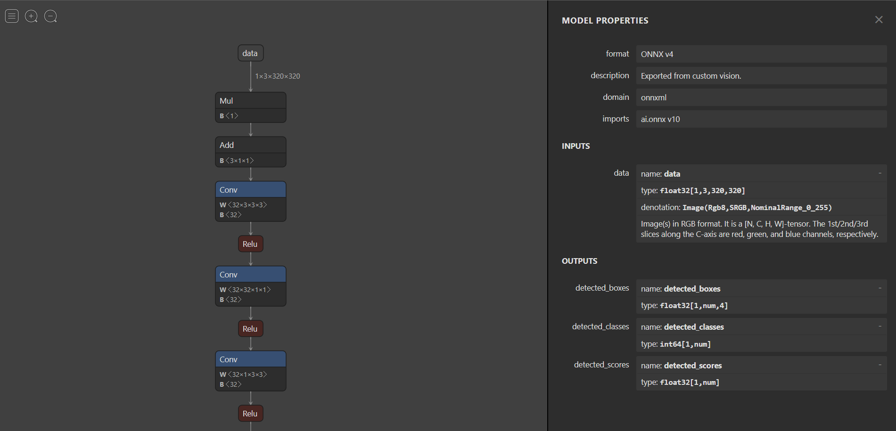

In this section, you will learn how to visualize an ONNX model using Netron.

Normally, you would need to train a model and export it to ONNX. For this lab, you already have a pretrained ONNX model in the `models` directory in this repository. The model was trained using Azure Custom Vision. The task is object detection and the export format was Compact(S1). Visit the Azure Custom Vision documentation to learn more about [exporting ONNX models](https://docs.microsoft.com/azure/cognitive-services/custom-vision-service/export-your-model).

In your browser, open [Netron](https://lutzroeder.github.io/netron/).

In Netron, select **Open Model...** and use the file explorer to import the `model.onnx` model.

A graph appears showing the layers and nodes of your model. Nodes have annotations and metadata which describes the model such as the model format, a short description, inputs and outputs. 

Select the first node in the graph, labeled **data**.

The input for the model is the following:

- *data*: A `float` array of size 3 x 320 x 320 containing the RGB values of a 320px x 320px image.

The output generated by the model contains the following:

- *detected_boxes*: a `float` array of size `n x 4` where `n` is the number of bounding boxes found in the image. The 4 represents the coordinates of two points P1(x1,y1) and P2(x2,y2) for each bounding box found by the model. The first point corresponds to the top-left point of the bounding box and the second point corresponds to the bottom-right point of the bounding box. 

- *detected_scores*: a `float` array of size `n` where `n` is the number of bounding boxes found in the image. The values range between 0 and 1.
- *dectected_classes*: a `float` array of size `n` where `n` is the number of bounding boxes found in the image. The model used in this sample detects two classes:
  - 0: CrackedWindshield
  - 1: Dent