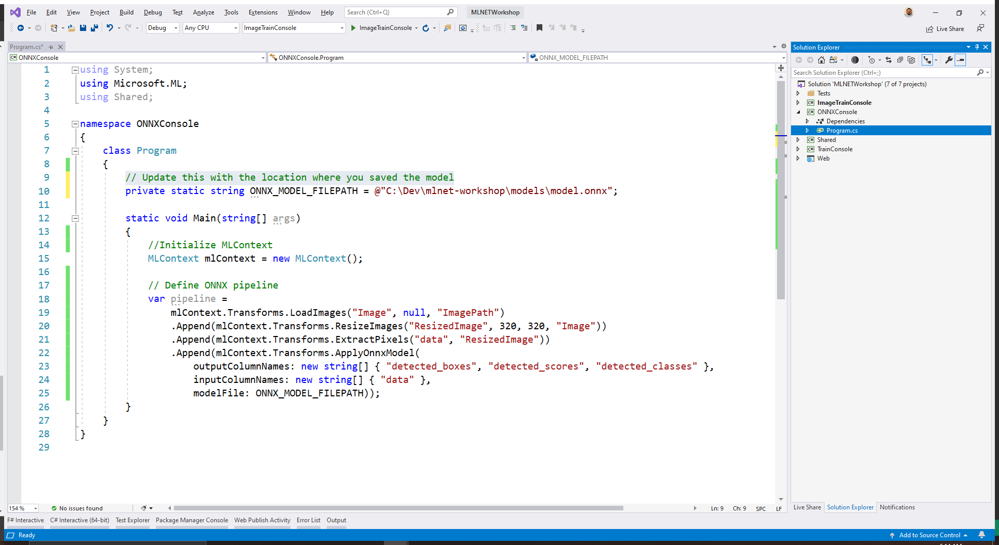

Open the `Program.cs` file in the `ONNXConsole` project.

Add the following `using` statements at the top of the file:

```csharp
using Microsoft.ML;
using Shared;
```

Then, in the class definition, add the location where the model is saved.

```csharp
// Update this with the location where you saved the model
private static string ONNX_MODEL_FILEPATH = @"C:\Dev\mlnet-workshop\models\model.onnx";
```

Inside the `Main` method, create an instance of `MLContext`.

```csharp
MLContext mlContext = new MLContext();
```

Create a pipeline to load an image and uses the ONNX model to detect objects in the image by adding the following code:

```csharp
var pipeline =
    mlContext.Transforms.LoadImages("Image", null, "ImagePath")
    .Append(mlContext.Transforms.ResizeImages("ResizedImage", 320, 320, "Image"))
    .Append(mlContext.Transforms.ExtractPixels("data", "ResizedImage"))
    .Append(mlContext.Transforms.ApplyOnnxModel(
        outputColumnNames: new string[] { "detected_boxes", "detected_scores", "detected_classes" },
        inputColumnNames: new string[] { "data" },
        modelFile: ONNX_MODEL_FILEPATH));
```

This pipeline performs the following steps:

- `LoadImages` takes the path of an image and creates a Bitmap in the `Image` column.
- The model expects a 320px x 320px image. Therefore, the contents of the `Image` column are resized and stored in the `ResizedImage` column.
- Once the image is resized, extract the pixels into a column called `data` using the `ExtractPixels` transform. Notice that the name of the column containing the pixels is `data` because that's the entrypoint of the model.
- Finally, the model is used to detect objects by using `ApplyOnnxModel` transform with the respective input and output columns of the model provided.

