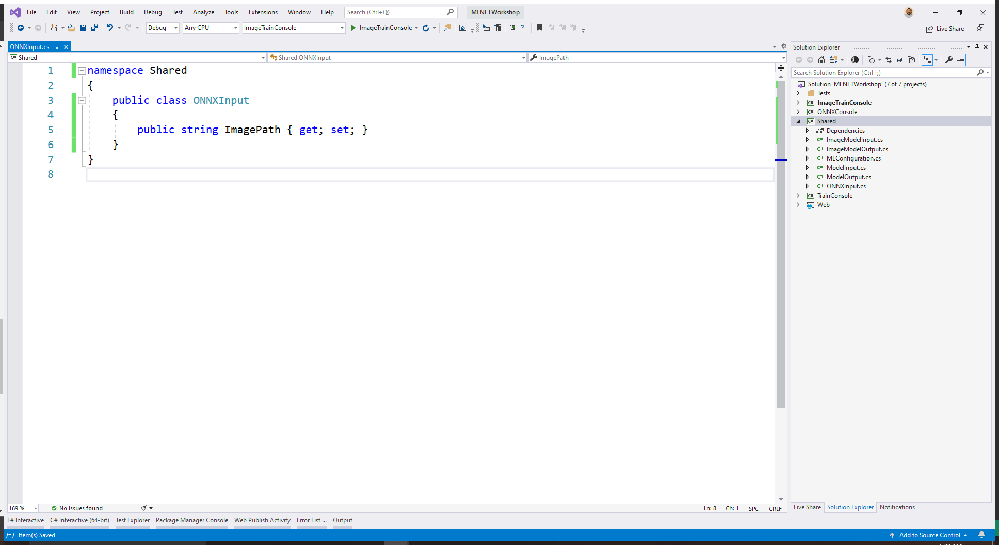

In this section you install the required NuGet packages and define the model input schema.

First, we need to add a few NuGet packages to the `ONNXConsole` project.

If you're using Visual Studio, right click on the project name and select **Manage NuGet Dependencies**. Then click the "Browse" tab and search for `Microsoft.ML.OnnxTransformer`. Make sure to install version **1.5.1**.


Repeat these steps for the `Microsoft.ML.OnnxRuntime` version `1.4.0` and `Microsoft.ML.ImageAnalytics` version `1.5.1`.

Alternately if you prefer working from the command line, you can run this command from the *src/ONNXConsole* folder:

```dotnetcli
dotnet add package Microsoft.ML.OnnxTransformer -v 1.5.1
dotnet add package Microsoft.ML.OnnxRuntime -v 1.4.0
dotnet add package Microsoft.ML.ImageAnalytics -v 1.5.1
```

### Define model input schema

In the `Shared` project, add a new class called `ONNXInput` to the root directory.

Then, define the class as follows:

```csharp
public class ONNXInput
{
    public string ImagePath { get; set; }
}
```

