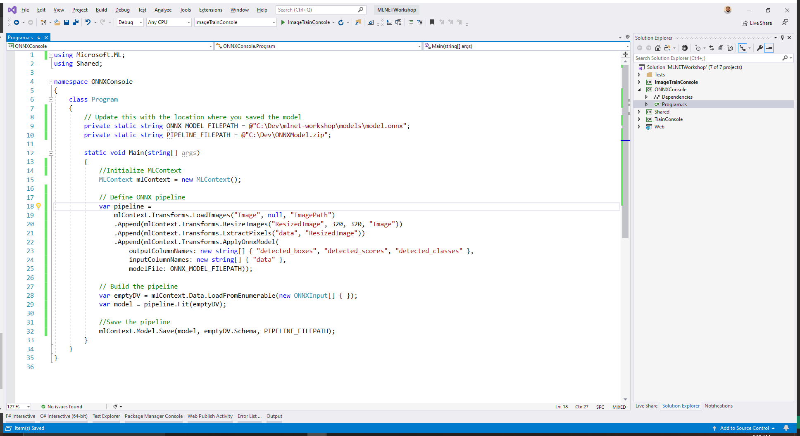

Now that you have the pipeline, you can create an ML.NET model that contains all of the preprocessing and scoring transforms. 

Since no training is actually taking place, you can use an empty `IDataView` when building the pipeline.

Below your pipeline definition, create an empty IDataView and call `Fit` to create the model.

```csharp
// Build the pipeline
var emptyDV = mlContext.Data.LoadFromEnumerable(new ONNXInput[] { });
var model = pipeline.Fit(emptyDV);
```

Now that you have a pipeline, save it for later use. The model is serialized and stored as a `.zip` file. In this case, the model will be saved to a file called *ONNXModel.zip*.

Inside the top of the class definition, set the path where you want to save your pipeline to.

```csharp
private static string PIPELINE_FILEPATH = @"C:\Dev\ONNXModel.zip";
```

Then, at the bottom of the `Main` method, add the following code:

```csharp
// Save the pipeline
Console.WriteLine("Saving pipeline...");
mlContext.Model.Save(model, emptyDV.Schema, PIPELINE_FILEPATH);
```



Set the startup project to `ONNXConsole` and run the application.

Congratulations! You have now built and saved a prediction pipeline that uses an ONNX model.