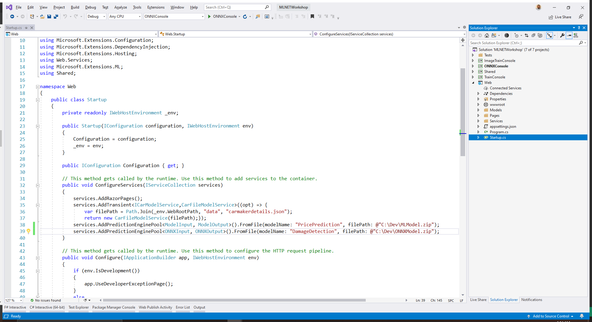
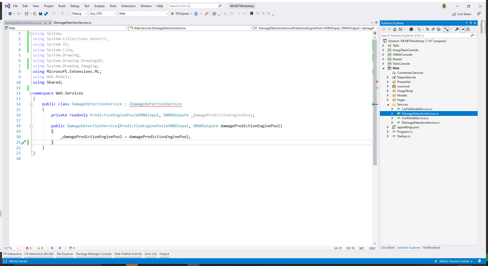
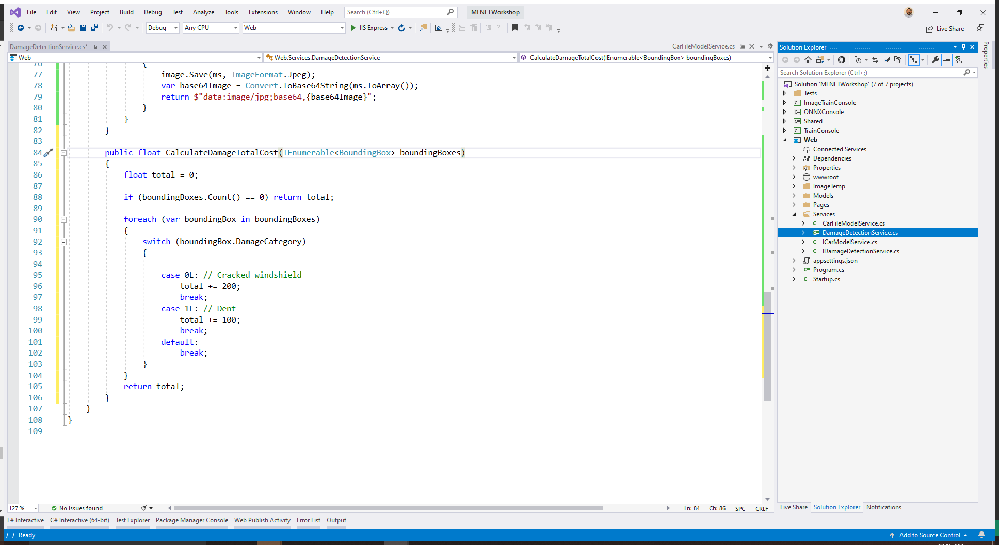
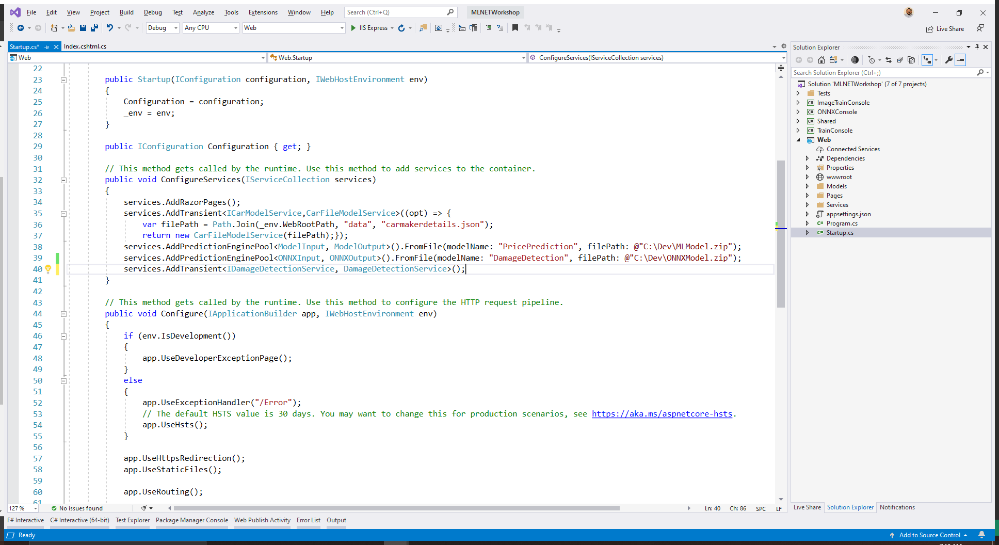
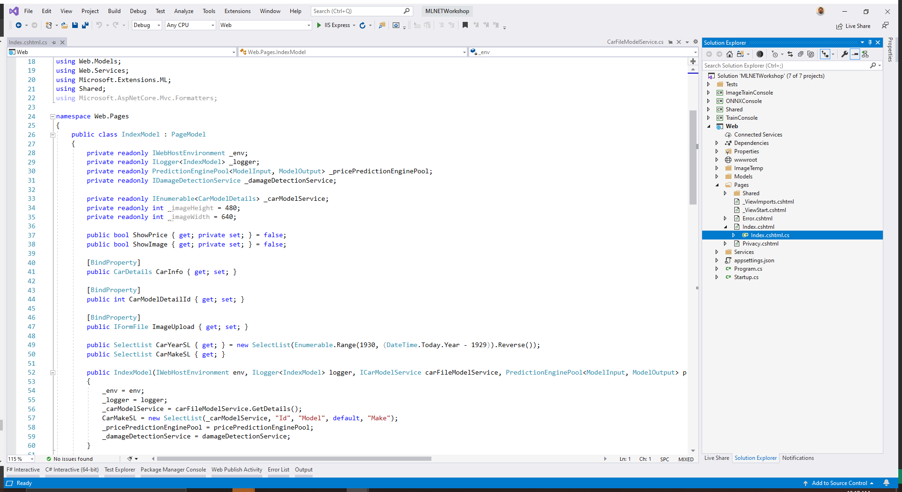
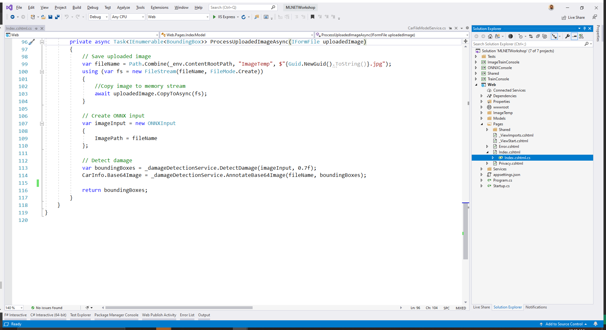
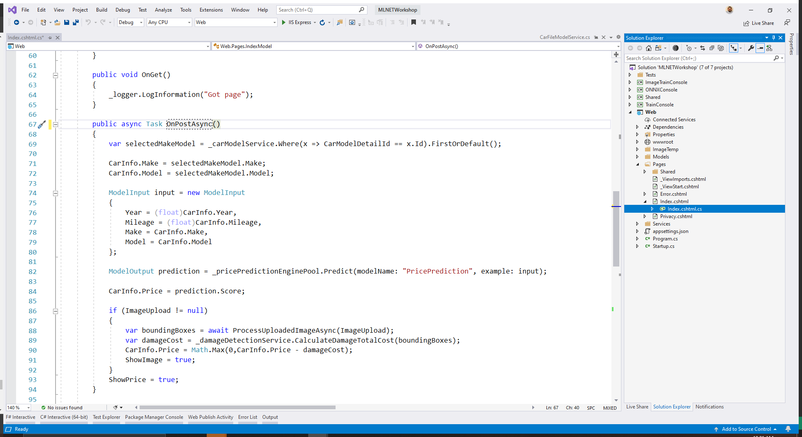
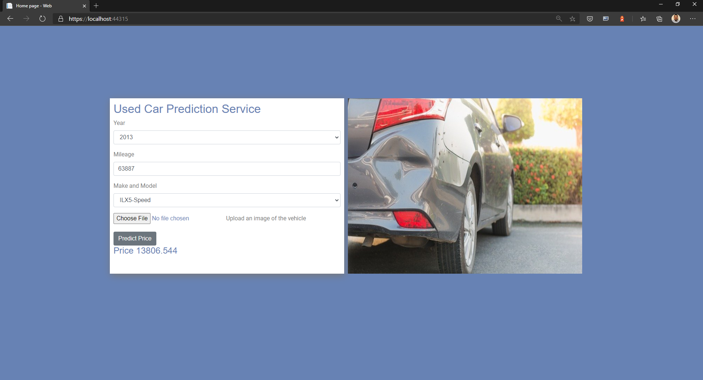

At this point, you have taken an ONNX Model from Azure Custom Vision and used it for scoring as part of an ML.NET pipeline. You can take that saved pipeline and use it inside of the web application to detect damage and adjust prices accordingly.

### Install NuGet packages

First, we need to add a few NuGet packages to the `Web` project.

If you're using Visual Studio, right click on the project name and select **Manage NuGet Dependencies**. Then click the "Browse" tab and search for `Microsoft.ML.OnnxTransformer`. Make sure to install version **1.5.1**.


Repeat these steps for the `Microsoft.ML.OnnxRuntime` version `1.4.0` and `Microsoft.ML.ImageAnalytics` version `1.5.1`.

Alternately if you prefer working from the command line, you can run this command from the *src/Web* folder:

```dotnetcli
dotnet add package Microsoft.ML.OnnxTransformer -v 1.5.1
dotnet add package Microsoft.ML.OnnxRuntime -v 1.4.0
dotnet add package Microsoft.ML.ImageAnalytics -v 1.5.1
```

### Define model output schema

In the `Shared` project, add a new class called `ONNXOutput` to the root directory.

Start by adding the following using statement:

```csharp
using Microsoft.ML.Data;
```

Then, define the class as follows:

```csharp
public class ONNXOutput
{
    [ColumnName("detected_boxes")]
    public float[] DetectedBoxes { get; set; }

    [ColumnName("detected_scores")]
    public float[] DetectedScores { get; set; }

    [ColumnName("detected_classes")]
    public long[] DetectedClasses{ get; set; }
}
```


### Configure PredictionEnginePool service

The `PredictionEnginePool` is designed for use with dependency injection which is built into ASP.NET Core. As such, you configure it just like you would any other service you want to use throughout your application.

In the `Web` project, open the *Startup.cs* file.

Then, in the `ConfigureServices` method, register a `PredictionEnginePool` service. Give it a unique and descriptive name so that you are able to differentiate it from other models and provide the path where you saved your pipeline to.

```csharp
services.AddPredictionEnginePool<ONNXInput, ONNXOutput>().FromFile(modelName:"DamageDetection",filePath:@"C:/Dev/ONNXModel.zip");
```



### Parse model outputs

The current pipeline takes an image and uses the ONNX model to detect damage in a vehicle. However, the outputs of the model still need to be parsed into bounding box objects. To do so, create a service in the web application.

#### Define bounding box schema

Start off by defining the bounding box schema.

In the *src/Web/Models* directory, create a new class called `BoundingBox` and add the following using statements at the top.

```csharp
using System.Drawing;
```

Then, replace the class definition with the following code:

```csharp
public class BoundingBox
{
    public Dimensions BoxDimensions { get; set; }
    public float Confidence { get; set; }
    public long DamageCategory { get; set; }
}

public class Dimensions
{
    public PointF P1 { get; set; }
    public PointF P2 { get; set; }
    public float Width { get { return P2.X - P1.X; } }
    public float Height { get { return P2.Y - P1.Y; } }
}
```


The outputs form the model, especially the bounding boxes detected have to be mapped to a set of coordinates. The `detected_boxes` column provides the `x` and `y` coordinates for the top-left and bottom-right points of the bounding box. These values are represented as a float because they determine the percentage offset from the origin or top-left corner of the image.

The `Dimensions` class contains the coordinates of the top-left(`P1`) and bottom-right (`P2`) points. Using these points, we can calculate the width and height.

The `BoundingBox` class encapsulates the dimensions of the bounding box as well as how confident the model is that the bounding box is the assigned damage category.

#### Define damage detection service

Now that you have define the bounding box, it's time to add the service that will detect the damage in images using the model. 

In the *src/Web/Services*, create a new interface called `IDamageDetectionService` and add the following `using` statements at the top of the file.

```csharp
using System.Collections.Generic;
using Web.Models;
using Shared;
```

Replace the interface definition with the following code:

```csharp
public interface IDamageDetectionService
{
    IEnumerable<BoundingBox> DetectDamage(ONNXInput input, float threshold);
    string AnnotateBase64Image(string imagePath, IEnumerable<BoundingBox> boundingBoxes);
    float CalculateDamageTotalCost(IEnumerable<BoundingBox> boundingBoxes);
}
```


This interface defines three methods to help with detecting damage in images:

- *DetectDamage*: Returns a list of `BoundingBox` objects with confidence greater-than or equal to the provided threshold from the outputs of the registered `DamageDetection` `PredictionEnginePool`.
- *AnnotateBase64Image*: Draws the detected bounding boxes over the provided image.
- *CalculateDamageTotalCost*: Provides the total cost of the damage found on the vehicle.

Now that you have a definition for the service, create a new class called `DamageDetectionService` in the *src/Web/Services* directory to implement the interface.

Add the following `using` statements at the top of the file:

```csharp
using System.Collections.Generic;
using System.IO;
using System.Linq;
using System.Drawing;
using System.Drawing.Drawing2D;
using System.Drawing.Imaging;
using Microsoft.Extensions.ML;
using Web.Models;
using Shared;
```

Replace the class definition with the following code:

```csharp
public class DamageDetectionService : IDamageDetectionService
{
    private readonly PredictionEnginePool<ONNXInput, ONNXOutput> _damagePredictionEnginePool;

    public DamageDetectionService(PredictionEnginePool<ONNXInput, ONNXOutput> damagePredictionEnginePool)
    {
        _damagePredictionEnginePool = damagePredictionEnginePool;
    }
}
```



The constructor takes the `PredictionEnginePool` service for the `DamageDetection` ML.NET pipeline.

Below the constructor, implement the `DetectDamage` method. The `DetectDamage` method maps uses the ONNX pipeline to detect damages on the image provided. Then, the generated `ONNXOutput` is mapped to a list of `BoundingBox` objects.

```csharp
public IEnumerable<BoundingBox> DetectDamage(ONNXInput input, float threshold)
{
    // Use prediction engine to make predictions
    ONNXOutput modelOutput = _damagePredictionEnginePool.Predict(modelName: "DamageDetection", example: input);

    // Map detected_boxes, detected_scores, detected_classes to BoundingBox objects
    var boxes = modelOutput.DetectedBoxes;
    var boundingBoxes = new List<BoundingBox>();
    for (var i = 0; i < boxes.Length; i += 4)
    {
        var boxIdx = i / 4;
        var boundingBox = new BoundingBox
        {
            BoxDimensions = new Dimensions { P1 = new PointF(boxes[i], boxes[i + 1]), P2 = new PointF(boxes[i + 2], boxes[i + 3]) },
            Confidence = modelOutput.DetectedScores[boxIdx],
            DamageCategory = modelOutput.DetectedClasses[boxIdx]
        };
        boundingBoxes.Add(boundingBox);
    }

    // Return bounding boxes that are at or above the threshold
    var topBoundingBoxes = boundingBoxes.Where(box => box.Confidence >= threshold).OrderByDescending(box => box.Confidence);
    return topBoundingBoxes;
}
```


Then, implement the `AnnotateBase64Image` method. This method takes in an image path and the bounding boxes detected and draws them onto the uploaded image. The annotated image is then encoded as a base64 string and returned to  the user.

```csharp
public string AnnotateBase64Image(string imagePath, IEnumerable<BoundingBox> boundingBoxes)
{
    using(var image = Image.FromFile(imagePath))
    {
        var originalImageWidth = image.Width;
        var originalImageHeight = image.Height;

        foreach (var box in boundingBoxes)
        {
            var left = (int)Math.Max(box.BoxDimensions.P1.X * originalImageWidth, 0);
            var top = (int)Math.Max(box.BoxDimensions.P1.Y * originalImageHeight, 0);
            var width = (int)Math.Min(originalImageWidth - left, box.BoxDimensions.Width * originalImageWidth);
            var height = (int)Math.Min(originalImageHeight - top, box.BoxDimensions.Height * originalImageHeight);

            using (Graphics thumbnailGraphic = Graphics.FromImage(image))
            {
                thumbnailGraphic.CompositingQuality = CompositingQuality.HighQuality;
                thumbnailGraphic.SmoothingMode = SmoothingMode.HighQuality;
                thumbnailGraphic.InterpolationMode = InterpolationMode.HighQualityBicubic;

                Pen pen = new Pen(Color.Red, 3.2f);

                // Draw bounding box on image
                thumbnailGraphic.DrawRectangle(pen, left, top, width, height);
            }
        }

        using (var ms = new MemoryStream())
        {
            image.Save(ms, ImageFormat.Jpeg);
            var base64Image = Convert.ToBase64String(ms.ToArray());
            return $"data:image/jpg;base64,{base64Image}";
        }
    }
}
```


Finally, implement the `CalculateDamageTotalCost` method:

```csharp
public float CalculateDamageTotalCost(IEnumerable<BoundingBox> boundingBoxes)
{
    float total = 0;

    if (boundingBoxes.Count() == 0) return total;

    foreach (var boundingBox in boundingBoxes)
    {
        switch (boundingBox.DamageCategory)
        {

            case 0L: // Cracked windshield
                total += 200;
                break;
            case 1L: // Dent
                total += 100;
                break;
            default:
                break;
        }
    }
    return total;
}
```



If the car has a cracked windshield, the cost of the vehicle drops by $200. If the car has a dent, then the price drops by $100.

#### Register damage detection service

Now that you have implemented the damage detection service, you have to register it in the *Startup.cs* file so it is available throught your application.

Add the following code at the bottom of `ConfigureServices` method of the *Startup.cs* file of the `Web` project:

```csharp
services.AddTransient<IDamageDetectionService, DamageDetectionService>();
```



#### Use damage detection service

Use the `DamageDetectionService` to detect damage and adjust the price of your car accordingly.

Open the *src/Web/Pages/Index.cshtml.cs* file and directly below the `_carModelService` variable definition add the following code:

```csharp
private readonly IDamageDetectionService _damageDetectionService;
```

Replace the constructor with the following code which injects and sets the value of  `_damageDetectionService`.

```csharp
public IndexModel(IWebHostEnvironment env, ILogger<IndexModel> logger, ICarModelService carFileModelService, PredictionEnginePool<ModelInput, ModelOutput> pricePredictionEnginePool, IDamageDetectionService damageDetectionService)
{
    _env = env;
    _logger = logger;
    _carModelService = carFileModelService.GetDetails();
    CarMakeSL = new SelectList(_carModelService, "Id", "Model", default, "Make");
    _pricePredictionEnginePool = pricePredictionEnginePool;
    _damageDetectionService = damageDetectionService;
}
```



Replace the `ProcessUploadImageAsync` method with the following code which uses the `IDamageDetection` service to get the bounding boxes and annotate the image.

```csharp
private async Task<IEnumerable<BoundingBox>> ProcessUploadedImageAsync(IFormFile uploadedImage)
{
    // Save uploaded image
    var fileName = Path.Combine(_env.ContentRootPath, "ImageTemp", $"{Guid.NewGuid().ToString()}.jpg");
    using (var fs = new FileStream(fileName, FileMode.Create))
    {
        //Copy image to memory stream
        await uploadedImage.CopyToAsync(fs);
    }

    // Create ONNX input
    var imageInput = new ONNXInput
    {
        ImagePath = fileName
    };

    // Detect damage
    var boundingBoxes = _damageDetectionService.DetectDamage(imageInput, 0.7f);
    CarInfo.Base64Image = _damageDetectionService.AnnotateBase64Image(fileName, boundingBoxes);

    return boundingBoxes;
}
```



The `ProcessUploadedImageAsync` method takes the uploaded image saves it to the `ImageTemp` directory in the `Web` project. Once the image is saved, the `IDamageDetectionService` is used to generate the bounding boxes (if any) and annotate the image with them. The annotated image is then encoded as a base64 string for display on the web page. Finally, the bounding boxes are returned for further processing.

Replace the `OnPost` method with the following code for the `OnPostAsync` method:

```csharp
public async Task OnPostAsync()
{
    var selectedMakeModel = _carModelService.Where(x => CarModelDetailId == x.Id).FirstOrDefault();

    CarInfo.Make = selectedMakeModel.Make;
    CarInfo.Model = selectedMakeModel.Model;

    ModelInput input = new ModelInput
    {
        Year = (float)CarInfo.Year,
        Mileage = (float)CarInfo.Mileage,
        Make = CarInfo.Make,
        Model = CarInfo.Model
    };

    ModelOutput prediction = _pricePredictionEnginePool.Predict(modelName: "PricePrediction", example: input);

    CarInfo.Price = prediction.Score;

    if (ImageUpload != null)
    {
        var boundingBoxes = await ProcessUploadedImageAsync(ImageUpload);
        var damageCost = _damageDetectionService.CalculateDamageTotalCost(boundingBoxes);
        CarInfo.Price = Math.Max(0,CarInfo.Price - damageCost);
        ShowImage = true;
    }
    ShowPrice = true;
}
```



In the snippet above, the information from the `CarInfo` model is taken and a new instance of `ModelInput` is created. Then, the `Predict` function is used to predict the price of a vehicle, given the inputs from the `input` variable. Once a prediction is made, the `Price` property of the `CarInfo` is set to the predicted value.

As an additional step, if an image is uploaded, the `IDamageDetection` service is used to adjust the price of the vehicle if any damage is found.

Then, the price of the car is displayed on screen.

### Run the app

Set the startup project to `Web` and run the application. Fill in the form fields and select **Predict Price**.

Compared with the original application which did not use object detection, we can see that the original price of $13806 is reduced to $13706 because of the dent.

**No object detection**


**Object detection**


Congratulations! You have now used both the price prediction and object detection ONNX models inside your web application.