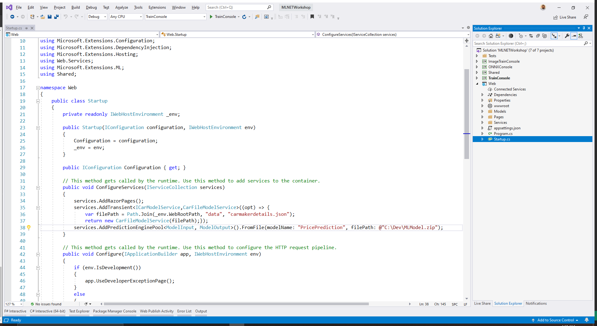

The `PredictionEnginePool` is designed for use with dependency injection which is built into ASP.NET Core. As such, you configure it just like you would any other service you want to use throughout your application.

In the *Web* project, open the *Startup.cs* file and add the following `using` statements to the top to reference the *Shared* and *Microsoft.ML.Extensions* NuGet package.

```csharp
using Microsoft.Extensions.ML;
using Shared;
```

Then, in the `ConfigureServices` method, register the `PredictionEnginePool` service and use the path of where you saved your model.

```csharp
services.AddPredictionEnginePool<ModelInput, ModelOutput>().FromFile(@"C:\Dev\MLModel.zip");
```

In this case, the model was loaded from a file, but you can also load models stored remotely via publicly accessible endpoints using the `FromUri` method.

