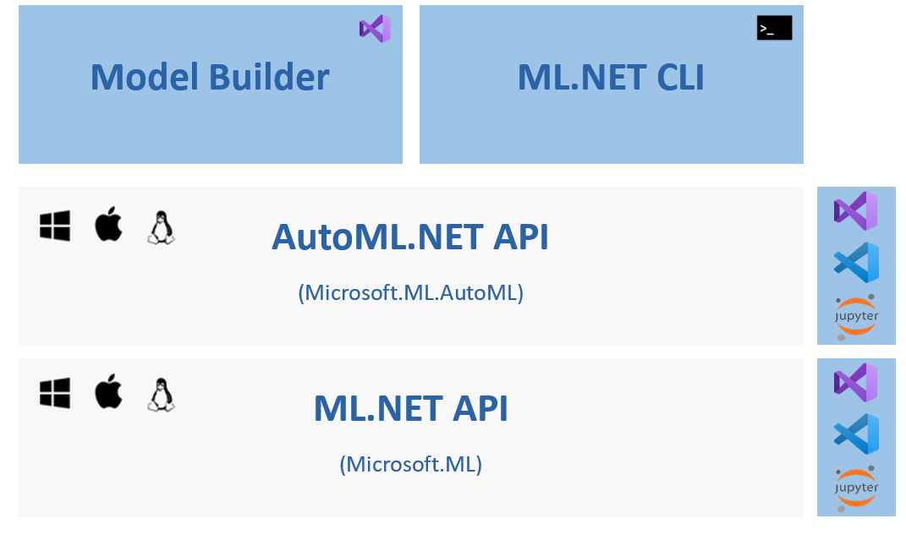

Automated Machine Learning, or AutoML, automatically builds and trains models with a combination of the best performing algorithm and settings. You simply specify the machine learning task and supply the dataset, and AutoML chooses and outputs the highest quality model by trying out multiple combinations of algorithms and related algorithm options.

## ML.NET and AutoML
ML.NET supports local AutoML and Azure AutoML depending on the scenario.

The AutoML.NET API is a layer on top of the ML.NET API, and the tooling (ML.NET Model Builder and ML.NET CLI) implement the AutoML.NET API.

The team is working on adding all ML.NET scenarios to both local and Azure AutoML.