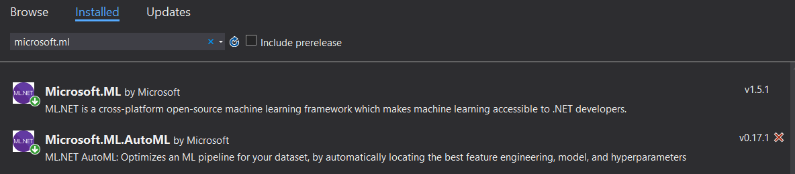
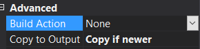
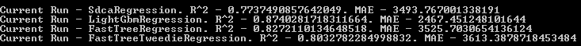
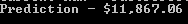

The AutoML.NET API implements local AutoML for ML.NET.

To start using the AutoML API, create a new .NET Core 3.0 console application. This lab will use the "true_car_listings.csv" dataset.

Install the `Microsoft.ML` (v1.5.1) and `Microsoft.ML.AutoML` (v0.17.1) NuGet packages.

Alternatively, you can use the dotnet CLI:

```dotnetcli
dotnet add package Microsoft.ML -v 1.5.1
dotnet add package Microsoft.ML.AutoML -v 0.17.1
```



Start by adding the following using statements to your *Program.cs* file:

```csharp
using Microsoft.ML;
using Microsoft.ML.AutoML;
```

Drag and drop the *true_car_listings.csv* dataset from the workshop's data folder into the solution. Right click the dataset in the solution and go to Properties. Set the "Copy to Output" setting to "Copy if newer".



In the *Program.cs* file, replace the Console.WriteLine line with the code below to create a new ML Context.

```csharp
var context = new MLContext();
```

Next, create a new class called `CarData.cs`. 

Add the following using statements to your *CarData.cs* file:

```csharp
using Microsoft.ML;
using Microsoft.ML.AutoML;
```

Then add the code below to *CarData.cs* to define the model input schema:

```csharp
public class CarData
{
    [LoadColumn(0)] 
    public float Price { get; set; }
    [LoadColumn(1)]
    public float Year { get; set; }
    [LoadColumn(2)]
    public float Mileage { get; set; }
    [LoadColumn(3)]
    public string City { get; set; }
    [LoadColumn(4)]
    public string State { get; set; }
    [LoadColumn(5)] 
    public string Vin { get; set; }
    [LoadColumn(6)]
    public string Make { get; set; }
    [LoadColumn(7)]
    public string Model { get; set; }
}
```

Next, load the data in *Program.cs* using the "context.Data.LoadFromTextFile" method with the below code. Note that the header is set to "true" and the separator character is set to comma.

```csharp
var data = context.Data.LoadFromTextFile<CarData>("./true_car_listings.csv", hasHeader: true, separatorChar: ',');
```

Now you can drop columns that aren't useful for creating your model. Use the below code in *Program.cs* to drop the Vin, State, and City columns:

```csharp
var dropColumnsTransform = context.Transforms.DropColumns("Vin", "State", "City");
```

Next, use the "Fit" and "Transform" methods on the transform with the loaded data to drop the columns.

```csharp
var newData = dropColumnsTransform.Fit(data).Transform(data);
```

AutoML experiments require settings. Use the below code to create an instance of RegressionExperimentSettings.

```csharp
var settings = new RegressionExperimentSettings
{
    MaxExperimentTimeInSeconds = 60
};

```

Here you're setting the maximum time in seconds to execute the experiment. The more time it has to go through different algorithms and hyperparameters, the better your results can be. However, in this case, give it only a minute so you can get quick results.

There are other settings you can set here, such as what metric to use to determine how well a model is performing or what trainers you want AutoML to exclusively use.

With the settings defined, you can create an AutoML experiment with the following code:

```csharp
var experiment = context.Auto().CreateRegressionExperiment(settings);
```

For especially long experiment times, it helps to see the progress of what AutoML has already gone through. You can add a progress handler to print out anything you need, including the current trainer it went through and what its metrics were. Use the below code to create a progress handler:

```csharp
var progress = new Progress<RunDetail<RegressionMetrics>>(p =>
{
    if (p.ValidationMetrics != null)
    {
        Console.WriteLine($"Current Run - {p.TrainerName}. R^2 -                                                                 {p.ValidationMetrics.RSquared}. MAE - {p.ValidationMetrics.MeanAbsoluteError}");
    }
});
```

With the experiment created, use the code below to execute the experiment. This will take only a minute to run since you set 1 minute as the experiment time. This also uses the progress handler you created just above.

```csharp
var run = experiment.Execute(newData, labelColumnName: "Price", progressHandler: progress);
```

With the run, you can get the best run's model.

```csharp
var bestModel = run.BestRun.Model;
```

Now that you have a model, you can use it to perform a test prediction.

Create a new class called *CarPrediction*.

Add the following using statements to your *CarPrediction.cs* file:

```csharp
using Microsoft.ML;
using Microsoft.ML.AutoML;

Then add the following code to define the model output schema:

```csharp
public class CarPrediction
{
    [ColumnName("Score")]
    public float PredictedPrice { get; set; }
}
```

In your *Program.cs* file, create a prediction engine with the code below, and use `bestModel` as the parameter:

```csharp
var predictionEngine = context.Model.CreatePredictionEngine<CarData, CarPrediction>(bestModel);
```

The "CreatePredictionEngine" takes in two generic methods: the `CarData` as the input class and the `CarPrediction` as the output class.

Then use the code below in *Program.cs* to create a new `CarData` instance with some test data:

```csharp
var carData = new CarData
{
    Model = "FusionS",
    Make = "Ford",
    Mileage = 61515f,
    Year = 2012f
};

```

With the test data, you can call the `Predict` method on the prediction engine to generate a prediction from your model:

```csharp
var prediction = predictionEngine.Predict(carData);
```

Then, use the following code to write out the prediction to the console and format it into currency:

```csharp
Console.WriteLine($"Prediction - {prediction.PredictedPrice:C}");
```

Run the project, and while this is running you should see the progress output:



Once it finishes, you can see the predicted price for the example data you gave it:



Congratulations! You've built an ML.NET model using the AutoML.NET API.

If you missed any parts, you can download the [completed app](https://github.com/luisquintanilla/mlnet-workshop-guide/archive/9.0.zip).