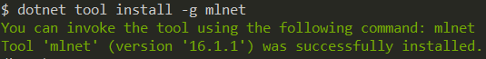
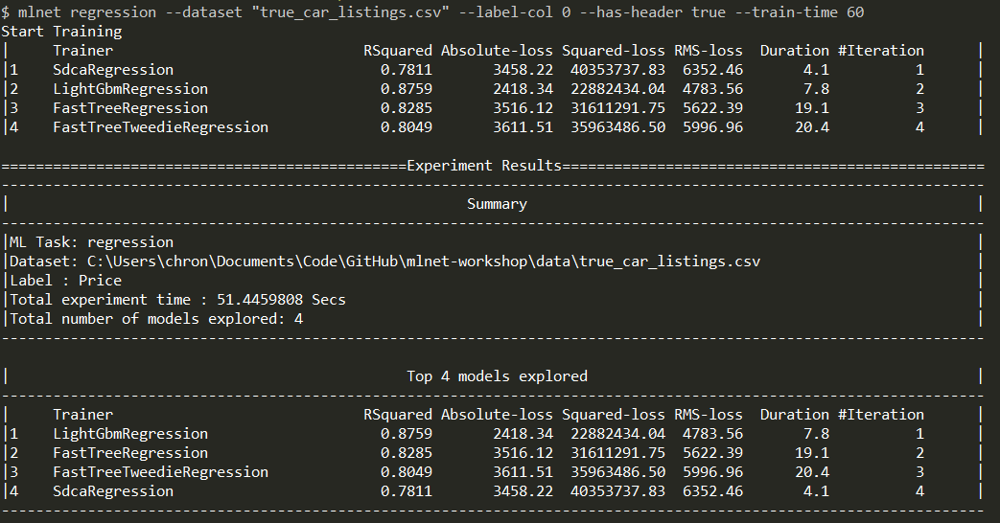

ML.NET provides a code-free way to get started with tooling that implements the AutoML.NET API.

## ML.NET Model Builder

ML.NET Model Builder is a UI in Visual Studio that implements AutoML and generates the code files necessary for model consumption.

You can learn more about ML.NET Model Builder in our [Docs](https://docs.microsoft.com/dotnet/machine-learning/automate-training-with-model-builder).

## ML.NET CLI

ML.NET also has a command line interface tool called the [ML.NET CLI](https://docs.microsoft.com/dotnet/machine-learning/automate-training-with-cli) that implements AutoML.

To install the ML.NET CLI, make sure you have .NET Core 3.0 SDK installed, and then in your terminal type the command below.

```console
dotnet tool install -g mlnet
```



Once it's installed you can start using it. The ML.NET CLI currently has three commands you can use:
 - Regression
 - Classification
 - Recommendation

 In this section, we will use the Regression command.

 In your terminal, go to the location on your machine that has the "true_car_listings.csv" dataset. Run the below command to initiate an AutoML run on the dataset.

 ```console
mlnet regression --dataset "true_car_listings.csv" --label-col 0 --has-header true --train-time 60
```

The command has a few additional options:
- The "dataset" tells the ML.NET CLI what dataset to use.
- The "label-col" tells the ML.NET CLI what column number the label column is. Notice we are using 0 so this is zero-based.
- The "has-header" tells the ML.NET CLI if the dataset contains a header row.
- The "train-time" tells the ML.NET CLI how long to train in seconds.

Once the training is done, you will see output similar to the output below.



This will also create a C# project that contains the ML.NET code to create the best model that was found as well as code to test it.

Congratulations! You have just used the ML.NET CLI to create an ML.NET model!
