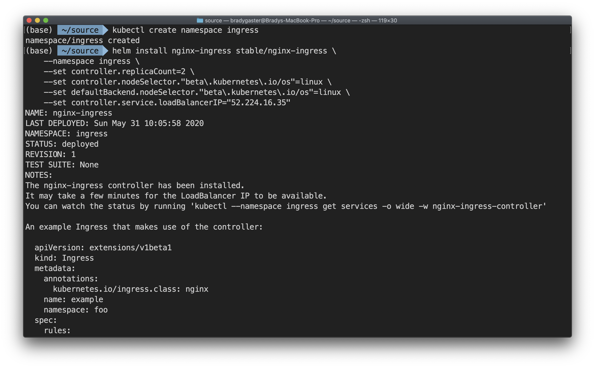
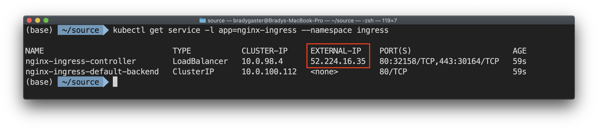
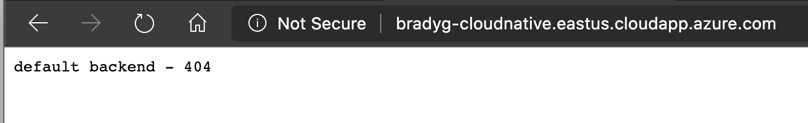

In this step, you'll use Helm and the Kubernetes command line (`kubectl`) to create a public NGINX ingress and enable external access to the AKS cluster.

Create a namespace for your ingress resources.

```bash
kubectl create namespace ingress
```

Use Helm to deploy an NGINX ingress controller. Replace the string `{ip-you-copied}` in the command below before executing it in your terminal.

```bash
helm install nginx-ingress stable/nginx-ingress \
    --namespace ingress \
    --set controller.replicaCount=2 \
    --set controller.nodeSelector."beta\.kubernetes\.io/os"=linux \
    --set defaultBackend.nodeSelector."beta\.kubernetes\.io/os"=linux \
    --set controller.service.loadBalancerIP="{ip-you-copied}"
```

Once the command executes, you'll be provided details on setting up an NGINX controller in the terminal output.



Now, use the Kubernetes CLI (`kubectl`) to validate that the public IP address is associated.

```bash
kubectl get service -l app=nginx-ingress --namespace ingress
```

Within a few moments, you should see the `EXTERNAL-IP` column update to reflect the public IP address you created earlier.



When you browse to the FQDN you created and mapped to the public IP address, you reach the AKS cluster and the NGINX controller. The UI doesn't appear yet because we haven't yet mapped the ingress to any individual services.



Next, you'll set up TLS in the cluster so that `https` traffic will be routed properly to (and within) the cluster.
