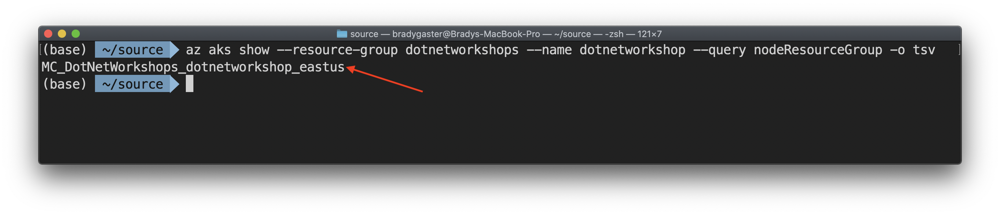
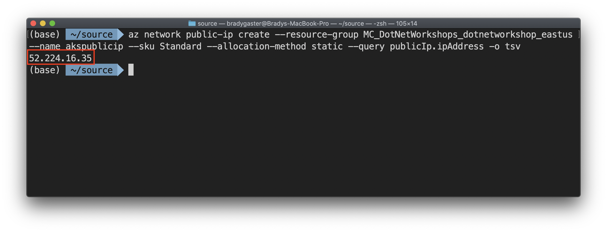
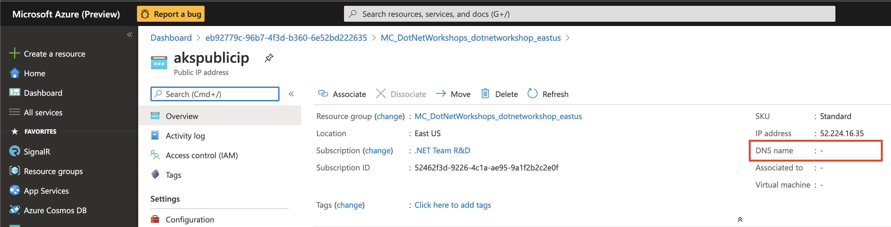
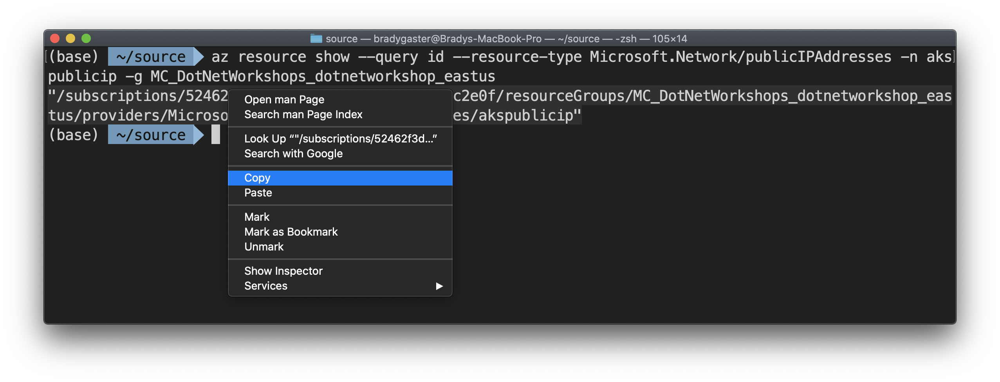
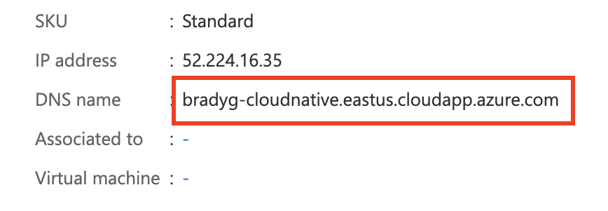
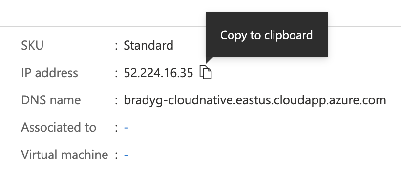

In this step you'll use the Azure CLI in some advanced scenarios to manipulate the public IP address of the AKS cluster. The goal of this step is to associate a fully-qualified domain name with a new public IP address.

Get the resource group where the network resources are located that support your AKS cluster.

```bash
az aks show --resource-group dotnetworkshops --name dotnetworkshop --query nodeResourceGroup -o tsv
```

The CLI will return the name of the resource group in which the AKS cluster's network resources are stored. When it does, copy the resource group name to your clipboard.



Open the Azure portal and paste in the name of the resource group into the search box. Then click the resource group you find to open the resource group portal blade in the browser.


Execute this Azure CLI script, replacing the string `<resource-group>` with the name of the resource group you copied.

```bash
az network public-ip create --resource-group <resource-group> --name akspublicip --sku Standard --allocation-method static --query publicIp.ipAddress -o tsv
```

The result of the call will be displayed in the terminal window, but filtered to only show the public IP address that was just created. Copy this to your clipboard.



Go back to the Azure portal blade for the resource group containing the AKS cluster's network resources. Find the **Public IP address** resource you just created in the resource group (you may need to refresh).


Note how the DNS name for the IP address is blank.



Use the name of the Public IP address resource and the name of the resource group in which it is housed (the resource group name you copied earlier) to execute an Azure CLI script that will provide the resource ID of the Public IP address resource.

```bash
az resource show --query id --resource-type Microsoft.Network/publicIPAddresses -n akspublicip -g MC_DotNetWorkshops_dotnetworkshop_eastus
```

When the CLI command executes, copy the resource id string it pumps into the terminal window.



For the HTTPS certificates to work correctly, configure an FQDN for the ingress controller IP address. Update the following script with the IP address of your ingress controller and a unique name that you would like to use for the FQDN. Use the ID of the public ip address resource you copied earlier.

> Note: You should probably **not** use the string *workshop*, but rather use your alias or something you know will be unique. The DNS will be used as the prefix in a string such as `workshop.eastus.cloudapp.azure.com`, so if the prefix you've chosen has already been used, it might not work. So, use something unique.

```bash
az network public-ip update --ids {resource-id-string-you-copied} --dns-name bradyg-cloudnative
```

After a few moments you should see the public ip address resource updated with the FQDNS of the AKS cluster's ingress.



Copy the public IP address from the portal.



In the next step you'll use Helm and the Kubernetes command line (`kubectl`), along with Helm, to create a public nginx ingress and enable external access to the AKS cluster.
