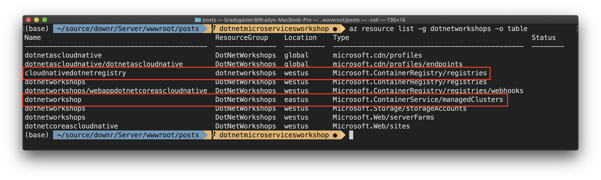

Once you package up an application or microservice into a container image, that image must be stored somewhere safe until a consumer needs to get the image to create an instance of it (or thousands of instances of it) and run the application.

The Azure Container Registry (ACR) instance you just created is where you'll **store** the container images. The Azure Kubernetes Service (AKS) cluster is where you'll **run** or **host** those services once you need them to be running.

With public container registries, like Docker Hub, there's no need for a trust relationship&mdash;he image can be pulled by anyone with the URL to its location in the registry. But with private registries, like Azure Container Registry, you need to establish a trust relationship between the cluster and the registry, or the registry won't be accessible to the cluster. When the cluster can't see the registry, the cluster can't pull images from it.

> Currently-running images eventually stop running. Every process dies. When that happens, if the cluster can't pull an image because it lacks access, that service is gone.

Luckily, setting up a trust relationship between the AKS cluster and an ACR registry is as easy as one Azure CLI command:

```bash
az aks update -g <resource-group> -n <aks-name> --attach-acr <acr-name>
```

By executing an `az resource list` Azure CLI command you can see a list of the resources in a specific resource group. I'll filter by a specific resource group using the `-g <resource-group>` parameter and show the results in a table using the `-o table` parameter.



In this example, I have a few more resources in this resource group than you may at this point in the workshop. The highlighted resources are the ones about which I care here:

1. I have an ACR instance named `cloudnativedotnetregistry` to be used for the workshop's container images.
1. I have an AKS cluster named `dotnetworkshop` in which I'll be deploying my microservices.

Given those values, you would execute the Azure CLI script from earlier using these parameters. Use your own instance and cluster names and your own resource group.

```bash
az aks update -g dotnetworkshops -n dotnetworkshop --attach-acr cloudnativedotnetregistry
```

This will set up a trust relationship between my `dotnetworkshop` AKS cluster and the `cloudnativedotnetregistry` registry in the same resource group. This will enable my AKS cluster to pull images from my ACR instance.
