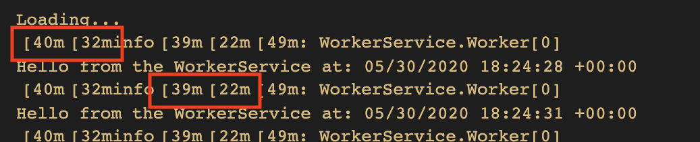
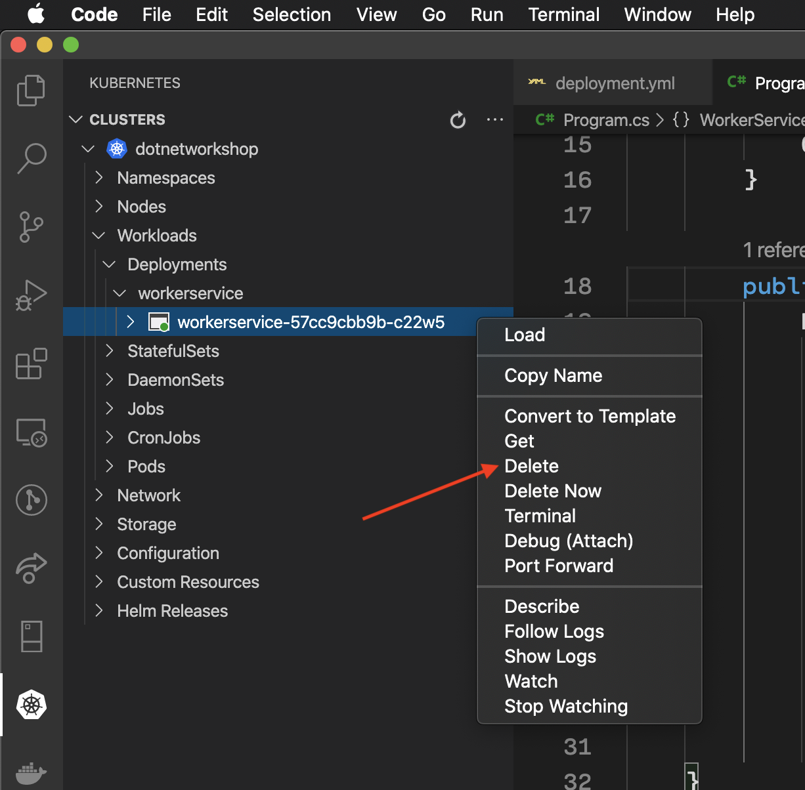
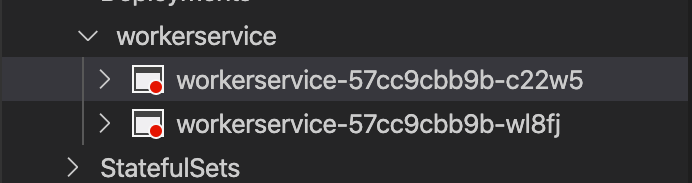
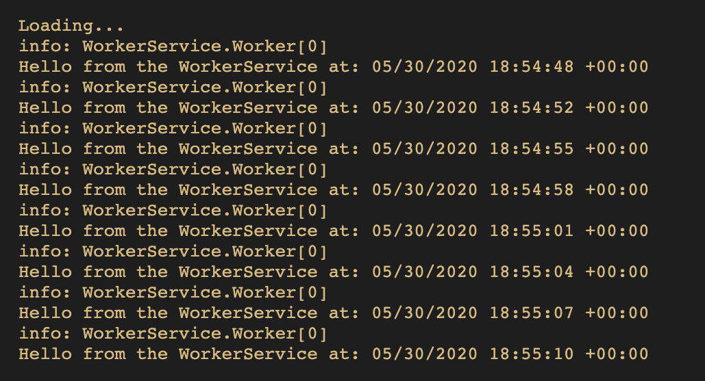

Once the `WorkerService` is deployed and you use the Visual Studio Code tools for Kubernetes to follow the microservice's logs, you probably noticed some color code being output, that makes the logs difficult to read.


Look more closely at the logs and you'll see how the odd text being output is the color-coding for the log output.



This sort of dirtied output is also visible when you look at your containers in the Azure portal's Log Analytics view of the containers running in your AKS cluster.


To remove the colors from the logs, open up the `WorkerService` project's `Program.cs` file. The `CreateHostBuilder` method does the bare minimum - it bootstraps the `Worker` classs as a hosted service and assumes the default hosting configuration.

```csharp
public static IHostBuilder CreateHostBuilder(string[] args) =>
    Host.CreateDefaultBuilder(args)
        .ConfigureServices((hostContext, services) =>
        {
            services.AddHostedService<Worker>();
        });
```
Add the logging extensions namespace to your `using` declarations.

```csharp
using Microsoft.Extensions.Logging;
```

Add a call to the extension method `ConfigureLogging` before the `ConfigureServices` method is called. The resulting `CreateHostBuilder` should look like this.

```csharp
public static IHostBuilder CreateHostBuilder(string[] args) =>
    Host.CreateDefaultBuilder(args)
        .ConfigureLogging(loggingBuilder =>
        {
            loggingBuilder.AddConsole(options =>
            {
                options.DisableColors = true;
            });
        })
        .ConfigureServices((hostContext, services) =>
        {
            services.AddHostedService<Worker>();
        });
```

Rebuild the Docker image for the `WorkerService` project. Then, re-push it to your ACR registry. Finally, find the active `workerservice` pod in the AKS cluster. Right-click it and select **Delete** to delete the running instance of the pod.



You'll see the pod turn red, as well as a new pod appear, also red.



In a moment (or if you refresh the cluster view), you'll see the new `workerservice` pod turn green and the old one vanish.


Now, when you you follow the logs for the newly-created microservice, you'll see the improvements in the log output. Now it's much easier to read.



This brings you to the close of phase 2 of the workshop. In phase 3, you'll add a simple HTTP API microservice to the cluster and call it from the Worker.