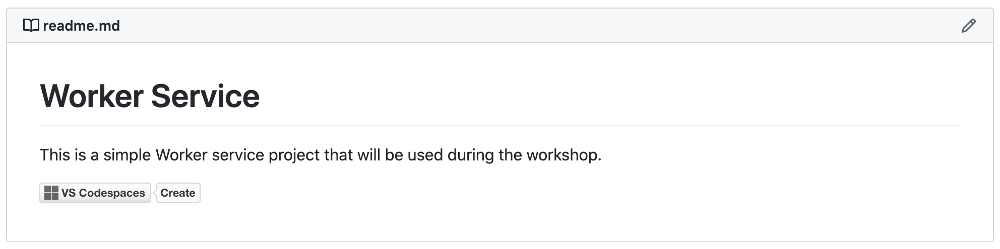
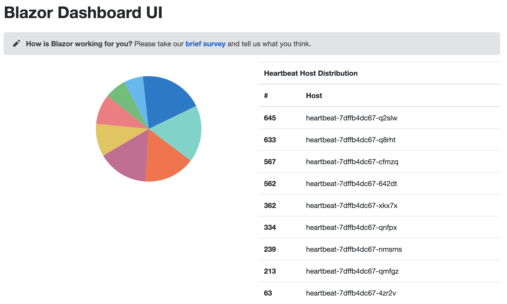

This is the final step in getting the Blazor WebAssembly wired up. To make this final step short, less error-prone, and hopefully, provide a climactic end to the development experience, the `workerservice`, `publicui`, and a new service, the `grpcservice`, which will stream the heartbeat data from the `workerservice` to the `publicui`, have been packaged up as three separate repositories, complete with their own `devcontainer.json` files.

Control-click each of these links to open up the repositories in new browser tabs.

1. [gRPC Service](https://github.com/bradygaster/HeartbeatGrpcService)
1. [Public UI Service](https://github.com/bradygaster/PublicUi)
1. [Worker Service](https://github.com/bradygaster/WorkerService)

As you open each repository in a new tab you'll see that each has a convenient Visual Studio Codespaces button in each. Click each one, and walk through the process of creating a new Codespace for each repository.



Once each Codespace is set up and initialized, and once all the extensions have loaded for each, do the following actions in each Codespace:

> Note: Do this in this order: `grpcservice`, `publicui`, `workerservice`.

1. Use the **Azure: Sign In** command in the command palette to sign in to your tenant and Azure subscription.
1. Add the right AKS cluster to your `.kubeconfig` using the Kubernetes tools.
1. Open the `deployment.yml` file in each of the Codespaces.
1. Replace the string `{acr-prefix}` with the prefix of your ACR registry in each of the `deployment.yml` files.
1, Open the `Dockerfile` in each of the Codespaces.
1. Rebuild the Docker image.
1. Once the image has rebuilt, push it to your ACR registry.

Delete each of the deployments for the `grpcservice`, `publicui`, and `workerservice` deployments using the Kubernetes tools for Visual Studio.

Then, use the **Kubernetes: Apply** command in the Codespace's command palette to apply each of the `deployment.yml` files against the cluster.

Once this has completed, browsing to the home page of the AKS cluster will return a pie chart of the heartbeat data being fed into the UI by the streaming gRPC service.



The pie chart will be as up-to-date as the "last refresh," so as you refresh it, you'll see how the Worker iterates over multiples instances of the `heartbeat` API as it executes.

From there:

1. The `workerservice` sends messages to the `grpcservice`:

    ```csharp
    protected override async Task ExecuteAsync(CancellationToken stoppingToken)
    {
        while (!stoppingToken.IsCancellationRequested)
        {
            try
            {
                
                Task.Run(() => {
                    var json = _httpClient.GetStringAsync("http://heartbeat/").Result;
                    var instanceInfo = JsonSerializer.Deserialize<InstanceInfo>(json);
                    _logger.LogInformation($"Internal API from host {instanceInfo.HostName} received at {instanceInfo.HostTimeStamp}");

                    try
                    {
                        var reply = _heartbeatClient.ReceiveHeartbeat(new HeartbeatService.HeartbeatMessage
                        {
                            HostName = instanceInfo.HostName,
                            HostTimeStamp = Timestamp.FromDateTime(instanceInfo.HostTimeStamp)
                        });

                        _logger.LogInformation($"Heartbeat received with success: {reply.Success}");
                    }
                    catch(Exception x)
                    {
                        _logger.LogError(x, "Error calling gRPC service");
                    }
                });
            }
            catch(Exception ex)
            {
                _logger.LogError(ex, "Error during HTTP request");
            }

            await Task.Delay(500, stoppingToken);
        }
    }
    ```

1. As the `grpcservice` receives pings from the `workerservice`, it stashes them into an `IMemoryCache` variable.

    ```csharp
    private HeartbeatMessage GetHeartbeatCache()
    {
        return _memoryCache.Get<HeartbeatMessage>(_cacheKey);
    }

    private void SetHeartbeatCache(HeartbeatMessage message = null)
    {
        _memoryCache.Set(_cacheKey, message);
    }

    public override Task<HeartbeatReceivedResponse> ReceiveHeartbeat(
        HeartbeatMessage request, 
        ServerCallContext context)
    {
        SetHeartbeatCache(request);

        return Task.FromResult(
            new HeartbeatReceivedResponse
            {
                Success = true
            });
    }
    ```

1. The `publicui` server host has a `HeartbeatStreamService` class that establishes a streaming connection with the gRPC service. As it receives messages from the gRPC service, it pops them up to the UI using a SignalR Hub.

    ```csharp
    public class HeartbeatStreamService : IHostedService
    {
        private GrpcChannel _channel;
        private HeartbeatClient _heartbeatClient;
        private readonly ILogger<HeartbeatStreamService> _logger;
        private CancellationTokenSource _cancellationTokenSource;
        private readonly IHubContext<HeartbeatHub> _heartbeatHub;

        public HeartbeatStreamService(ILogger<HeartbeatStreamService> logger, 
            IHubContext<HeartbeatHub> heartbeatHub)
        {
            _heartbeatHub = heartbeatHub;
            _logger = logger;
            _cancellationTokenSource = new CancellationTokenSource();
        }

        public Task StartAsync(CancellationToken cancellationToken)
        {
            // -----------------
            // you'd want to remove this line for production use, once your certs are prod
            AppContext.SetSwitch("System.Net.Http.SocketsHttpHandler.Http2UnencryptedSupport", true);
            // -----------------
            
            _channel = GrpcChannel.ForAddress(Strings.GrpcServiceUrl);
            _heartbeatClient = new HeartbeatClient(_channel);

            Task.Run(async () => {
                await foreach (var response in _heartbeatClient.StreamHeartbeats(new Empty(), 
                    cancellationToken: _cancellationTokenSource.Token).ResponseStream.ReadAllAsync())
                {
                    await _heartbeatHub.Clients.All.SendAsync(Strings.HeartbeatReceivedEventName, response.HostName, response.HostTimeStamp.ToDateTime());
                    _logger.LogInformation($"Streamed heartbeat from {response.HostName}");
                }
            });

            return Task.CompletedTask;
        }
    }
    ```

1. On the client side, the ASP.NET Core SignalR Client for .NET is used to connect to the Blazor WebAssembly app's server host, which hosts the SignalR Hub.

    ```csharp
    @code {
    class DataItem {
        public string Host { get; set; }
        public int Count { get; set; }
    }

    List<DataItem> _dataItems = new List<DataItem> ();

    string _lastHostNameReceived;
    protected override async Task OnInitializedAsync () {
        var url = _navigationManager.ToAbsoluteUri (Strings.HeartbeatHubUrl);
        var connection = new HubConnectionBuilder ()
            .WithUrl (url)
            .WithAutomaticReconnect ()
            .Build ();

        connection.On<string, DateTime> (Strings.HeartbeatReceivedEventName, (hostName, hostTimeStamp) => {
            _lastHostNameReceived = hostName;

            if (_dataItems.Any (x => x.Host == _lastHostNameReceived)) {
                _dataItems.First (x => x.Host == _lastHostNameReceived).Count += 1;
            } else {
                _dataItems.Add (new DataItem {
                    Count = 1,
                        Host = _lastHostNameReceived
                });
            }

            _dataItems = _dataItems.OrderByDescending (x => x.Count).ToList ();

            StateHasChanged ();
        });

        await connection.StartAsync ();
        }
    }
    ```

1. Finally, the data is rendered using a 3rd party Blazor WebAssembly pie charting component and in a table to provide a legend for the data.

    ```html
    <div class="container">
        <div class="row">
            <div class="col-sm-12">
                <h1>Blazor Dashboard UI</h1>
                <SurveyPrompt Title="How is Blazor working for you?" />
            </div>
        </div>
    <div class="row">
        <div class="col-sm-6">
            <RadzenChart style="float: right; width: 400px;">
                <RadzenTooltipOptions Visible="false" />
                <RadzenLegend Visible="false" />
                <RadzenPieSeries Data="@_dataItems" 
                    Title="Host Count" 
                    CategoryProperty="Host" 
                    ValueProperty="Count" />
            </RadzenChart>
        </div>
        <div class="col-sm-6">
            <table class="table">
                <thead>
                    <tr>
                        <th scope="col" colspan="2">Heartbeat Host Distribution</th>
                    </tr>
                </thead>
                <thead>
                    <tr>
                        <th scope="col">#</th>
                        <th scope="col">Host</th>
                    </tr>
                </thead>
                <tbody>
                @foreach (var dataItem in _dataItems)
                {
                    <tr>
                        <th scope="row">@dataItem.Count</th>
                        <td>@dataItem.Host</td>
                    </tr> 
                }
                </tbody>
            </table>
        </div>
    </div>
    </div>
    ```