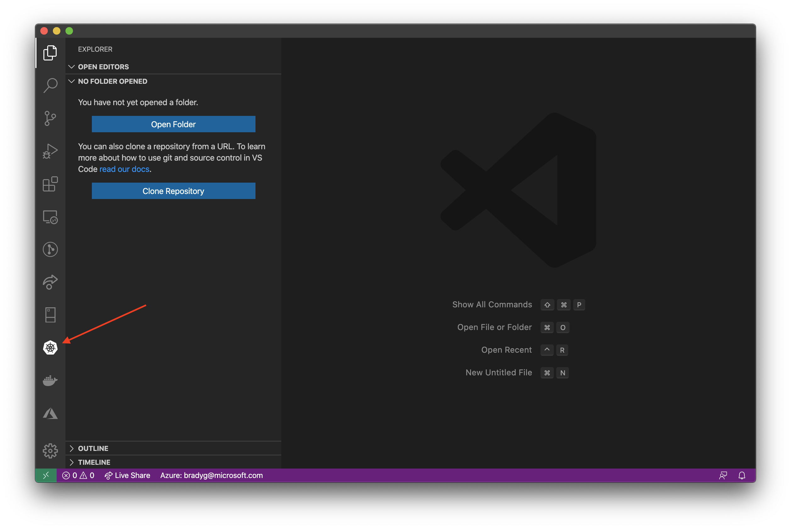
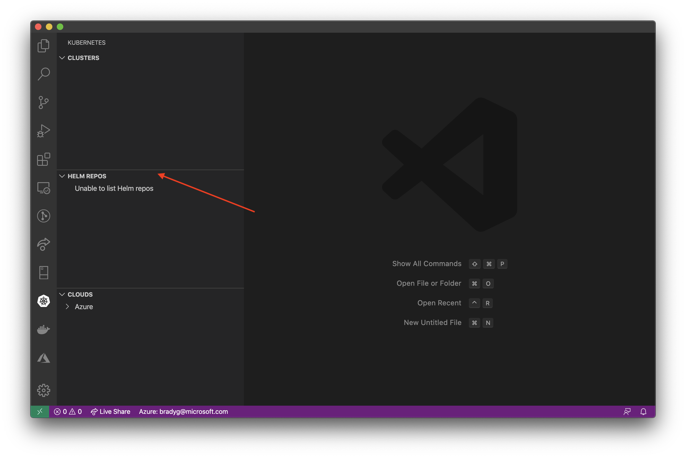
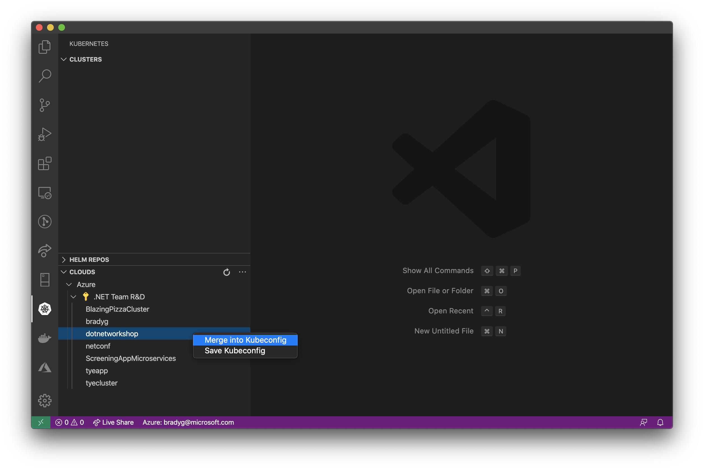
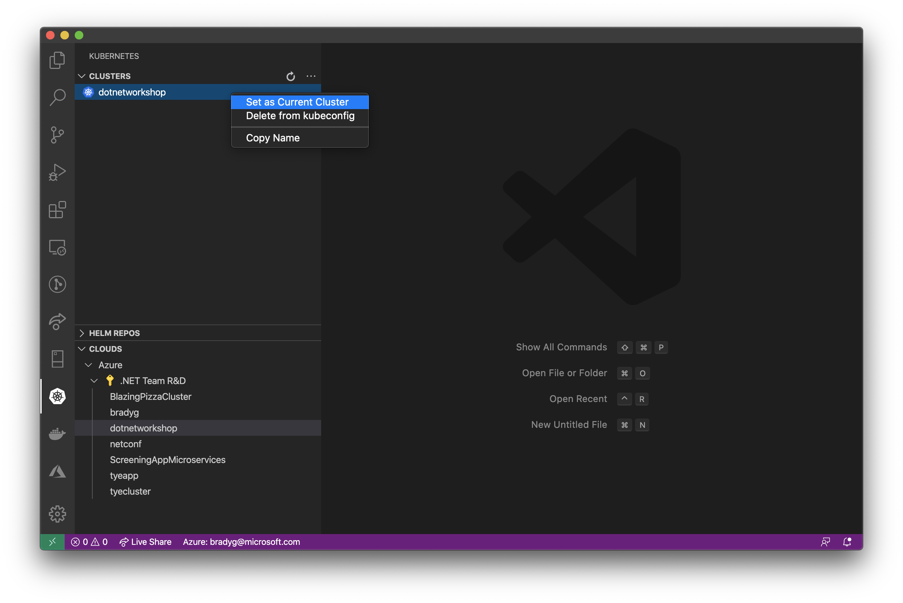
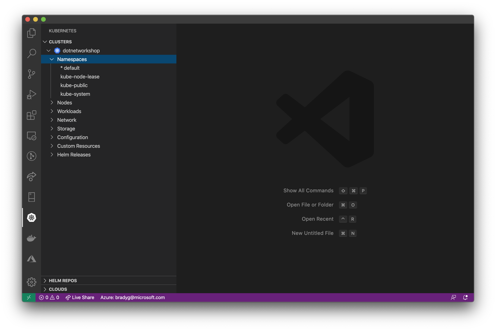

The final step in the setup process is to get Visual Studio Code connected directly to the AKS cluster. The Visual Studio Code tools for Kubernetes support **any** Kubernetes cluster on **most** clouds, so the step of connecting a Visual Studio Code to a Kubernetes cluster is specific and not associated with your Azure login.

Click the Kubernetes logo in the Visual Studio Code command bar.

We won't be using the Helm tools for this exercise, so you can click the panel to hide this segment of the Kubernetes tool window.

Expand the Azure node, then right-click the AKS cluster you created earlier and select the **Merge into Kubeconfig** menu option.

The cluster will appear in the list of clusters. Right-click the cluster and make it the current cluster.

Once you've set the AKS cluster you created as the current cluster, you should be able to see all of the services and configuration currently in the cluster within Visual Studio Code.

---

Now that your development environment is all set up and you're connected to your cluster, you can take a break. Next, you'll deploy your first C# Worker Service into AKS.
