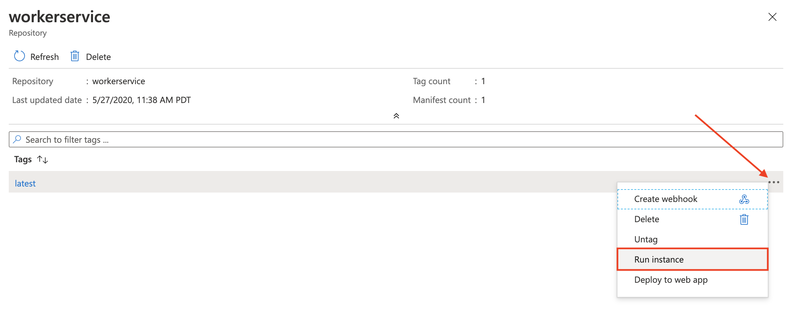
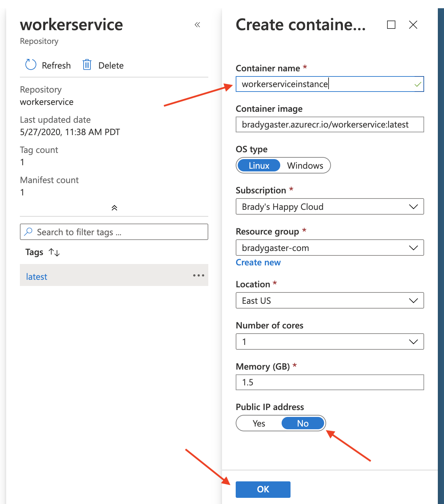
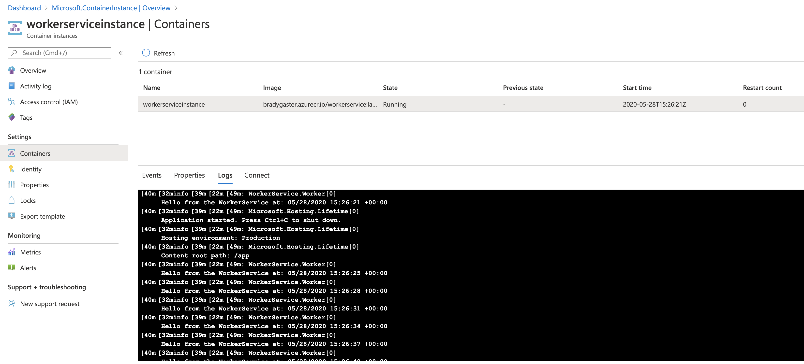

If you have a need for a short-lived instance, like a background Worker that spins up, processes a pile of data, and then destroys itself, you should try Azure Container Instances (ACI). ACI gives you per-second billing capability, and in some cases can be your least expensive option for single-instance, transient microservices.

In the last step, you navigated to the Azure Portal to look at your ACR instance's container images (or "repositories"). The portal provides a few options for spinning up Docker container images right away.

Click the ellipse button (...) next to the `latest` tag for the `workerservice` image. Then, select **Run instance**.

Give the new instance a name, make sure **Linux** is selected, select **No** from the **Public IP address** toggle, as this container instance won't need to service HTTP/S requests, and click the **OK** button to start the instance.

Once the deployment completes, click the **Go to resource** link in the Azure portal. Once there you'll see the process of ACI pulling the `workerservice` container image from ACR, create an instance of it, and run it. You may see some failures there, as well, but as long as the container instance starts up, you're good.

The instance will start up and you'll be able to click **Logs** in the ACI portal blade to see the container instance running the `WorkerService` code.

Once you see the logs running, go back to the overview page for the ACI instance you created. Click the **Delete** button in the portal to delete the resource.

Now that you've used ACI to create a single instance of a container, let's start using the power of Kubernetes to orchestrate a multi-container microservice topology.
