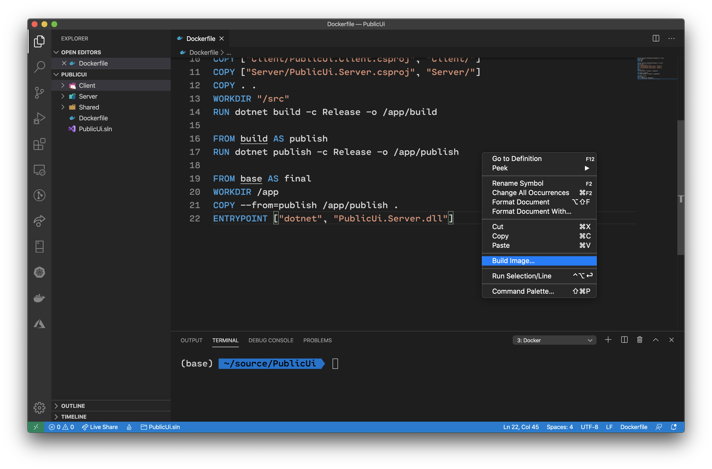

In this phase, you'll create a new Blazor WebAssembly project. This app will be hosted atop the ASP.NET Core HTTP server, Kestrel. The app will receive messages from the `workerservice` project using the new gRPC support available in .NET Core 3.1.

The first step is to create a new Blazor WebAssembly project. You can do this via the .NET CLI using the `dotnet new` command.

```bash
dotnet new blazorwasm -ho -o PublicUi
```

Add a new *Dockerfile* at the root of the solution. Add the following code to the *Dockerfile*:

```docker
FROM mcr.microsoft.com/dotnet/core/aspnet:3.1 AS base
WORKDIR /app
EXPOSE 80
EXPOSE 443

FROM mcr.microsoft.com/dotnet/core/sdk:3.1 AS build
WORKDIR /src
COPY ["PublicUi.sln", "."]
COPY ["Shared/PublicUi.Shared.csproj", "Shared/"]
COPY ["Client/PublicUi.Client.csproj", "Client/"]
COPY ["Server/PublicUi.Server.csproj", "Server/"]
COPY . .
WORKDIR "/src"
RUN dotnet build -c Release -o /app/build

FROM build AS publish
RUN dotnet publish -c Release -o /app/publish

FROM base AS final
WORKDIR /app
COPY --from=publish /app/publish .
ENTRYPOINT ["dotnet", "PublicUi.Server.dll"]
```

Since a Blazor WebAssembly solution is comprised of a series of projects, all of the projects need to be copied into the Docker container image and compiled. Right-click inside the *Dockerfile* in Visual Studio Code to build the Docker image.



Push the image to ACR once it is built.

We won't deploy the public UI into the AKS cluster yet. Before the public UI can be deployed to the AKS cluster, we'll need to install a public NGINX ingress controller into the AKS cluster.
