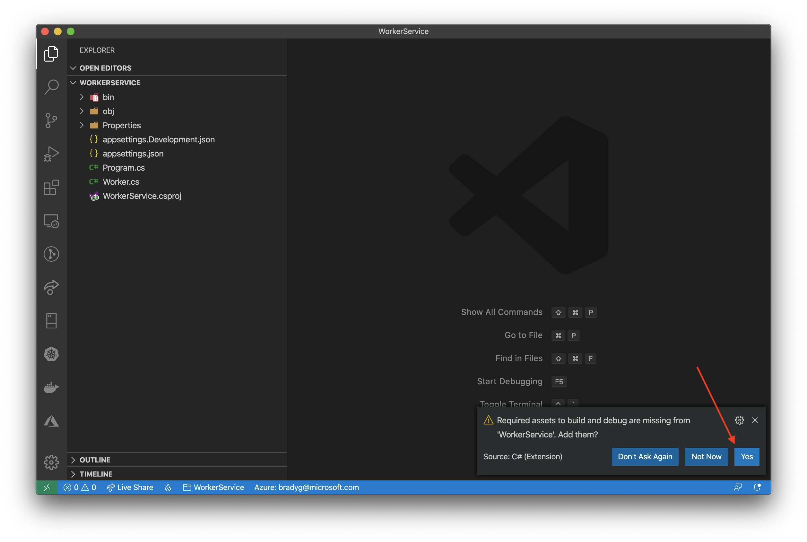
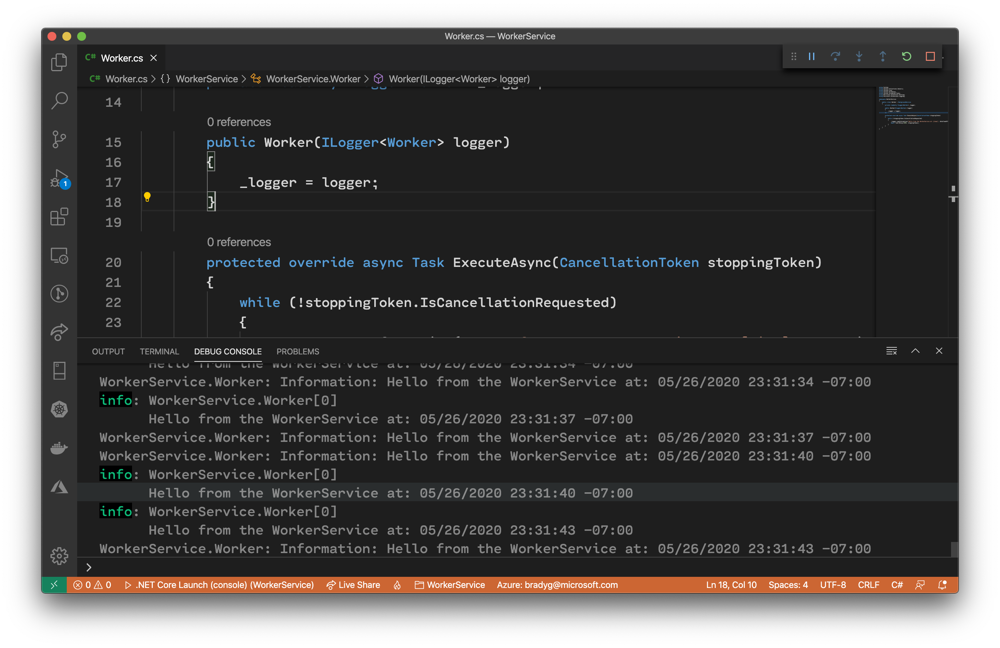

In .NET Core 3.0 we introduced the idea of the Worker template. The Worker template, or "Worker Service," bootstraps your project with a pre-wired [BackgroundService](https://docs.microsoft.com/en-us/aspnet/core/fundamentals/host/hosted-services?view=aspnetcore-3.1&tabs=visual-studio#backgroundservice-base-class) class. `BackgroundService` classes provide an implementation for the `IHostedService` interface, and are great for scenarios like `web-queue-worker` or when you need background processing that "runs forever."

Create a Worker project by using the `dotnet new` command.

```bash
dotnet new worker -o WorkerService
cd WorkerService
code .
```

Visual Studio Code should open to the folder in which the new `WorkerService` project was created. If asked, click **Yes** when Visual Studio Code asks if you'd like to add required assets to the project.



Open up the `Worker.cs` file. Inside it, you'll see the `ExecuteAsync` method. This method will run continuously until the Worker process exits or the `StopAsync` method is called.

```csharp
protected override async Task ExecuteAsync(CancellationToken stoppingToken)
{
    while (!stoppingToken.IsCancellationRequested)
    {
        _logger.LogInformation("Worker running at: {time}", DateTimeOffset.Now);
        await Task.Delay(1000, stoppingToken);
    }
}
```

Increase the amount of time the `ExecuteAsync` method pauses in between executions, or change the message being displayed.

```csharp
protected override async Task ExecuteAsync(CancellationToken stoppingToken)
{
    while (!stoppingToken.IsCancellationRequested)
    {
        _logger.LogInformation("Hello from the WorkerService at: {time}", DateTimeOffset.Now);
        await Task.Delay(3000, stoppingToken);
    }
}
```

Once you're satisfied with the change you've made, hit F5 or debug the Worker. It will run in the console or terminal window and simply write to the standard output as the `ExecuteAsync` method fires.


