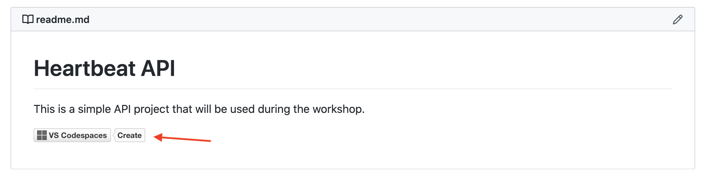
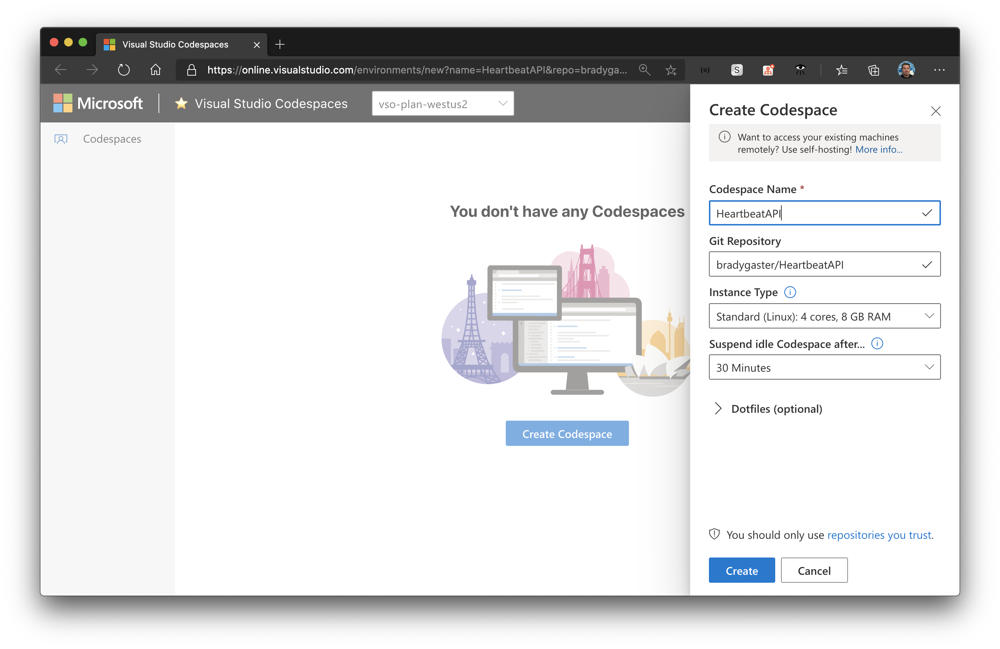
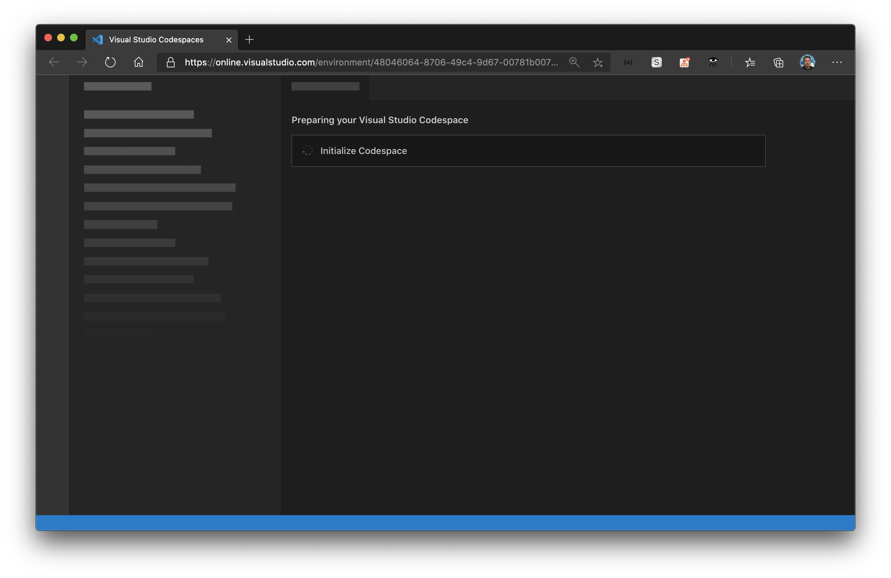
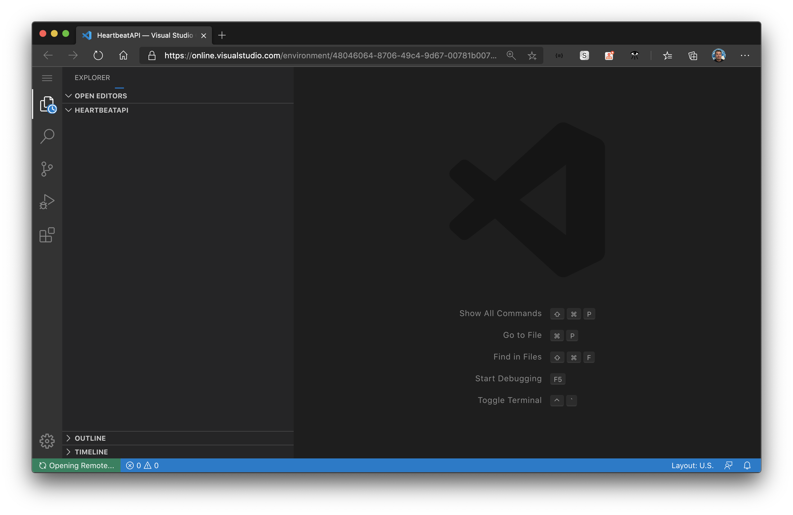
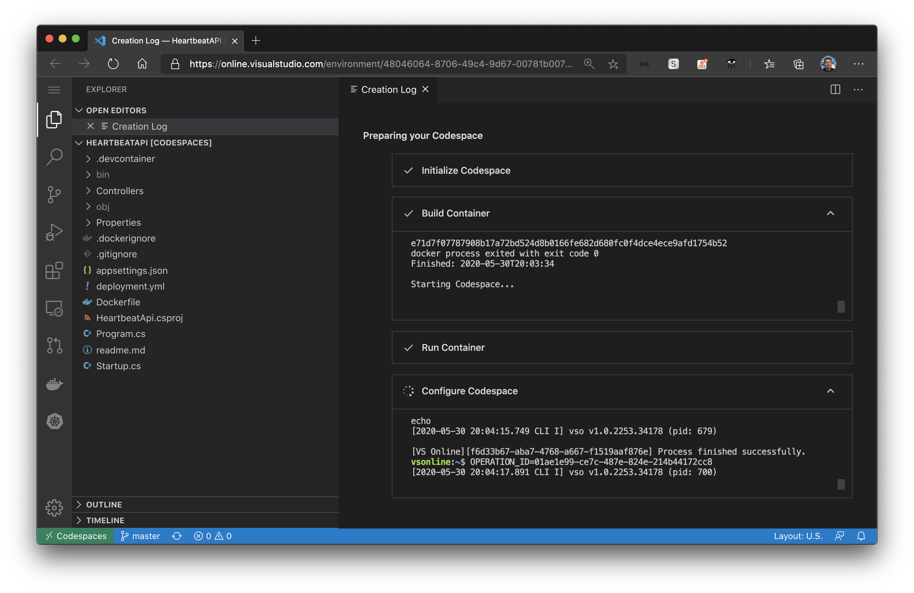
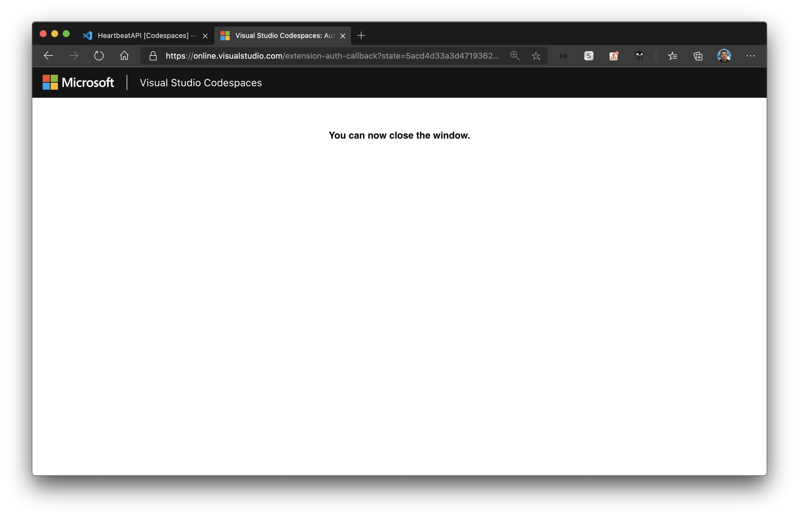
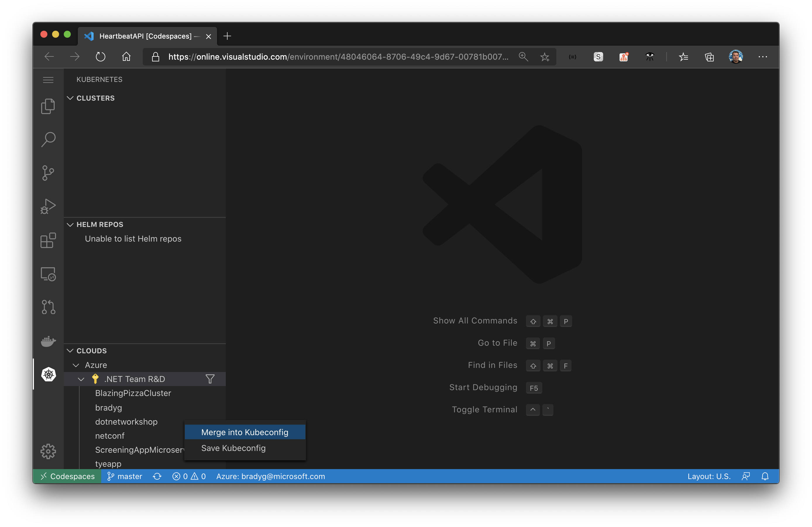
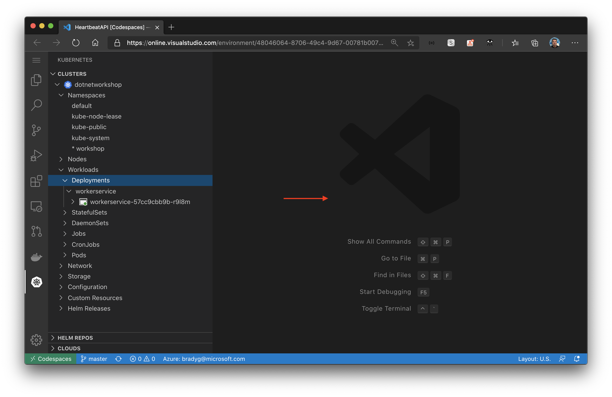

In this step you'll not only develop for the cloud, you'll develop *in the cloud* using Visual Studio Codespaces. Codespaces enables you to develop using the familiar Visual Studio Code interface, with all the extensions you installed earlier, right within your browser. You could code on your iPad when you're on the road, on a friend or family member's low-power machine using their browser when you don't have access to your development workstation - anywhere you can open a browser can become your development environment.

> Note: During this step you should log into Visual Studio Codespaces using a new tab in the same browser instance where you're logging into Azure. This way your login will flow through both experiences.

Open up the Heartbeat API repository in a new browser tab by control-clicking [here](https://github.com/bradygaster/HeartbeatApi). Fork the repository into your own organization or GitHub account.

> Note: You'll want to fork the repository and **not** work from the original one, as you'll later push code into the repository to change how the API works, so you should be using your **own** fork of the repo, not the original repo.

In the `readme.me` you'll see a link to open the repository up in Visual Studio Codespaces.

Give the Codespace a name, then click the **Create** button to create your new Codespace.

The Codespace will initialize, and you'll be shown a waiting dialog.

Then, the codespace will open, appearing to load the project in a Visual Studio Code interface.

Finally, the extensions and dependencies of those extensions (in our case, the Kubernetes CLI, which is dependency of the Kubernetes tools for Visual Studio Code) are installed and configured.

Now that your Codespace is ready, log in to Azure using the Azure Tools for Visual Studio Code much like you did in the desktop edition of Visual Studio Code, using the Azure Sign-in command in the command palette.

Then close the confirmation window when it appears.

Go to the Kubernetes tools and use the **Clouds** panel to merge the AKS cluster you want to target into your Kubernetes configuration for the Codespace in which you're working.

Then, select the `workshop` namespace, and you should see the `workerservice` instance you deployed earlier running.

Now that you have your Codespace set up and the repository's code open in it, we can iterate through some of the same steps we did with the Worker, but in our Codespace, to deploy the Heartbeat API into the AKS cluster.
