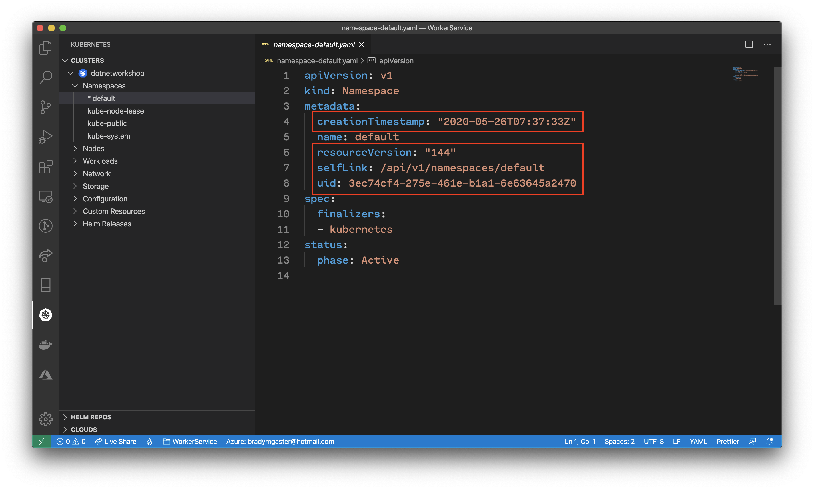
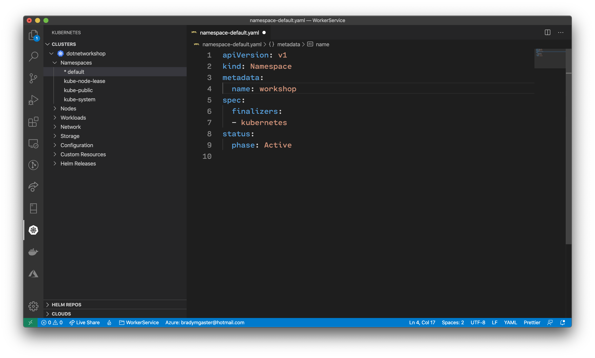
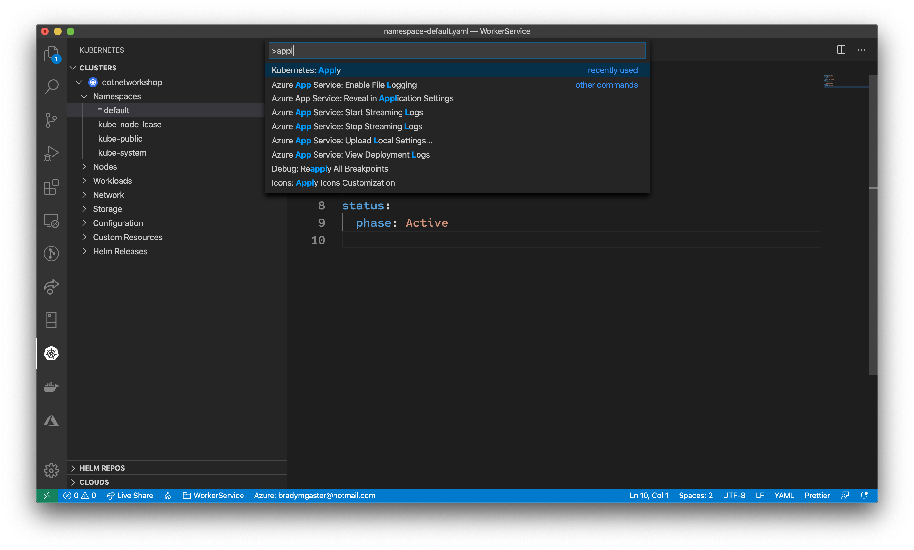
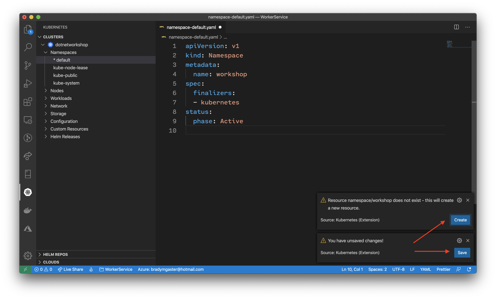
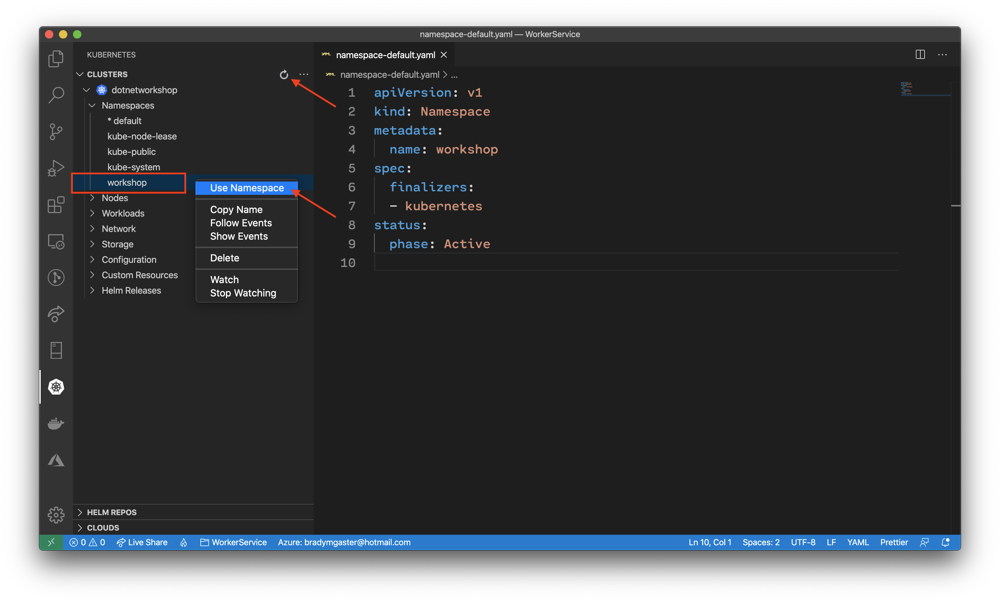

A namespace in a cluster is a logical grouping of services within the cluster. Think of a namespace in a cluster as similar to a resource group in Azure - it logically groups together a collection of microservices.

Expand the namespaces node using the Visual Studio Code tools for Kubernetes. Click the `default` namespace. You'll see the YAML representation of the `default` namespace open in Visual Studio Code.

Delete these items from the YAML file open in Visual Studio Code:

1. `creationTimestamp`
1. `resourceVersion`
1. `selfLink`
1. `uid`

Then, change the `default` namespace in the file to be `workshop`.

Use the Visual Studio Code command palette to find the **Kubernete:Apply** command by searching for `apply` in the palette.

Click the **Save** button to save the `.yml` file, then click the **Apply** button to apply the changes to the cluster.

Once the apply command completes and you refresh the Kubernetes cluster explorer panel, you should see the new `workshop` namespace in the tree view.

Right-click the `workshop` namespace and select the **Use namespace** option to set the `workshop` namespace as the default, selected namespace for the rest of the workshop.