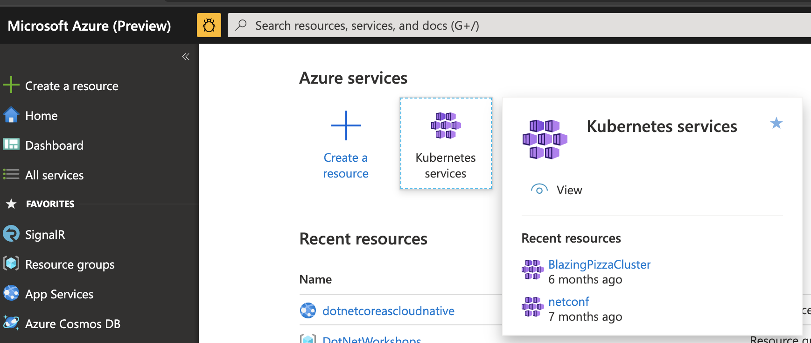
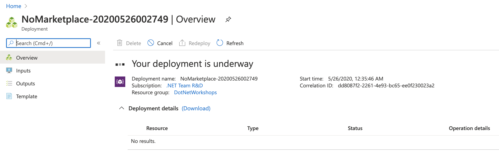
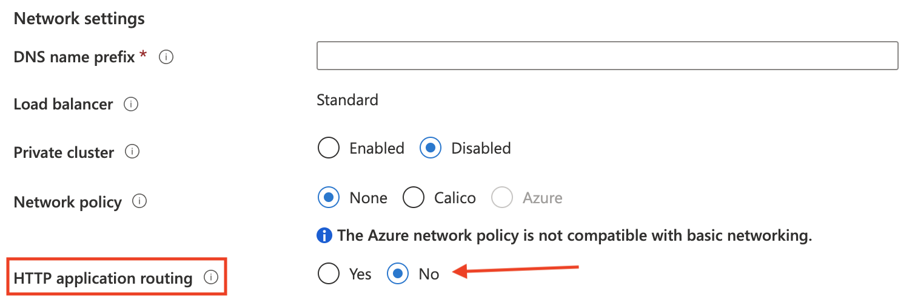

First, you'll need to create a new Azure Kubernetes Service (AKS) cluster in your Azure subscription. There are two options for doing this: the Azure CLI and the Azure Portal. Today, we'll use the Portal so that we can more clearly discuss the various configuration settings.

The Azure portal is an easy way to create a new AKS cluster and drop it into your resource group using the portal's resource creation experience. With most of the defaults accepted, you should be able to start the AKS cluster creation process off without error.

Once the cluster's deployment had been readied you'll be provided a lot of updates and status as it deploys. After a few minutes, the Portal will reflect the deployment progress and then, it will complete.

> **Note**: When you're creating the AKS cluster, make sure you **do not** enable HTTP Application Routing. You want to make sure to select **No** here. Later, you'll set up an NGINX service to provide ingress.

Next, you'll create an Azure Container Registry (ACR) in which your containers will be held.
