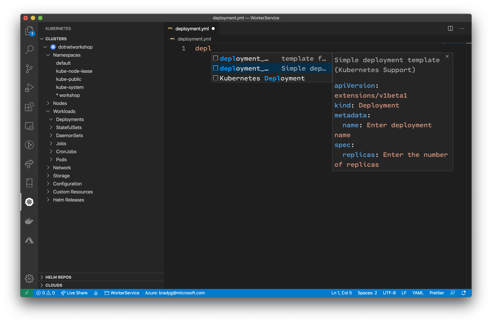
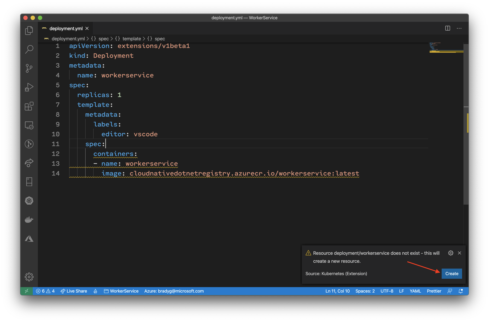
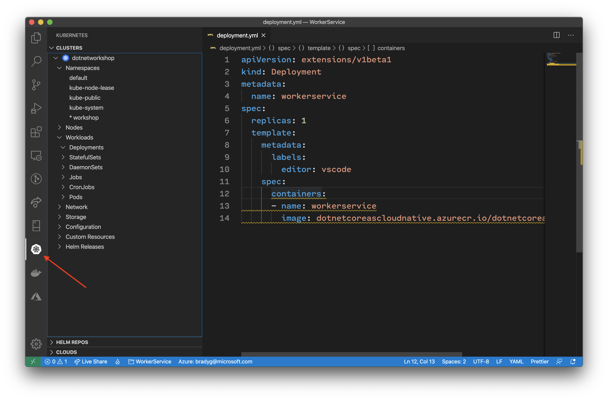
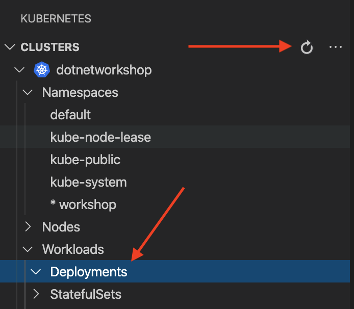
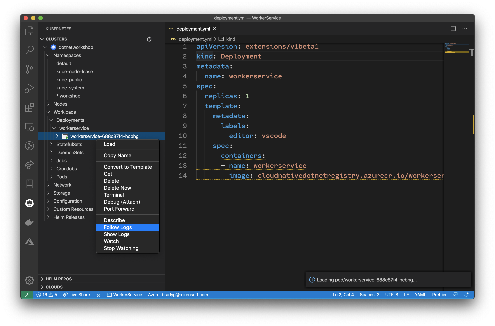
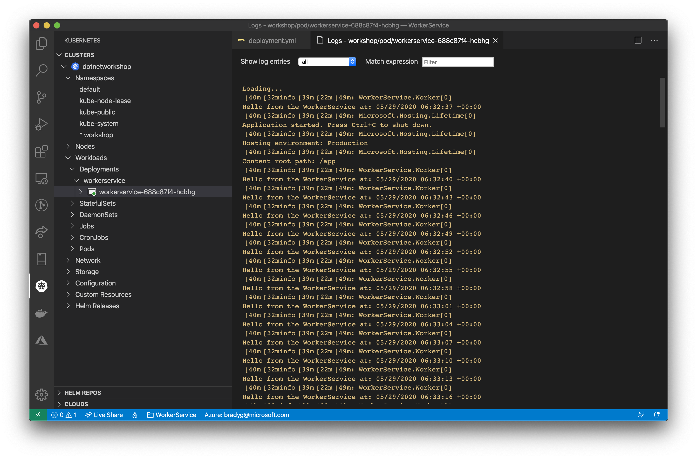

There are a multitude of ways you can deploy a microservice to AKS. In this phase of the workshop you'll be hand-authoring a Kubernetes YAML file. This is a *very specific* (and very primitive) way of deploying microservices, but it helps to understand the actual Kubernetes structure of `pods`, `deployments`, `services`, and `ingresses` when you look at the YAML representing their construction.

 In most cases developers use [Helm Charts](https://helm.sh/) or CI/CD tools like [GitHub Actions](https://github.com/features/actions) to facilitate deployment. We'll cover more of that later, but a basic understanding of the Kubernetes YAML format is fundamental to understanding the various concepts of a microservice running in Kubernetes.

Add a new file to the project named `deployment.yml`. Then open the file, and start typing the word `deployment`. Note how the intellisense suggests a few Kubernetes-related snippets.



Find the snippet named `Simple deployment template` and select it. Visual Studio Code will auto-fill the `deployment.yml` file for you from the template.

```yaml
apiVersion: extensions/v1beta1
kind: Deployment
metadata:
  name: Enter deployment name
spec:
  replicas: Enter the number of replicas
  template:
    metadata:
      labels:
        editor: vscode
    spec:
      containers:
      - name: name
        image: Enter containers image
```

Replace the `name` properties with the value `workerservice` and the `image` property with the path to your image in ACR. Also, set the `replicas` property to be 1 - this way we only create one instance of the worker.

> Note: We'll cover multiple-replica scenarios in the next phase of the workshop.

```yaml
apiVersion: extensions/v1beta1
kind: Deployment
metadata:
  name: workerservice
spec:
  replicas: 1
  template:
    metadata:
      labels:
        editor: vscode
    spec:
      containers:
      - name: workerservice
        image: dotnetcoreascloudnative.azurecr.io/dotnetcoreascloudnative:latest
```

Open the Visual Studio Command palette and type `apply` once again to apply the `deployment.yml` file you have opened. Visual Studio Code will validate that you want to create a new resource.



The Kubernetes tools will create the new microservice in the AKS cluster. Then, the cluster will automatically pull the image from ACR. Once Visual Studio Code confirms the deployment is complete, click on the Kubernetes tab to open the Kubernetes tools (if not already open).



Refresh the cluster view in Visual Studio Code. Then, expand the **Deployments** node in the tree view.



You'll see the `workerservice` deployment underneath the **Deployments**  node.



You'll see the `workerservice` deployment. When you expand the actual instance of the container and select **Follow logs**, you can see the logs in real-time as the `WorkerService`'s `ExecuteAsync` method fires iteratively.



Feel free to chsnge the `replicas` value to see what happens when you scale out (or back in) the number of instances of an individual service you want to have active.

Also, note how, when you right-click-delete an individual instance of a deployment, within a few seconds the deployment is re-created. This is how Kubernetes manages your individual microservices to make sure they're always running and always as up-to-date as what you have in the registry.
