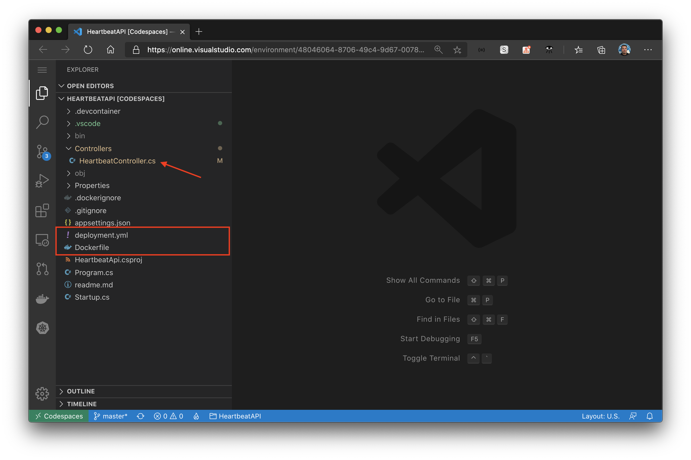
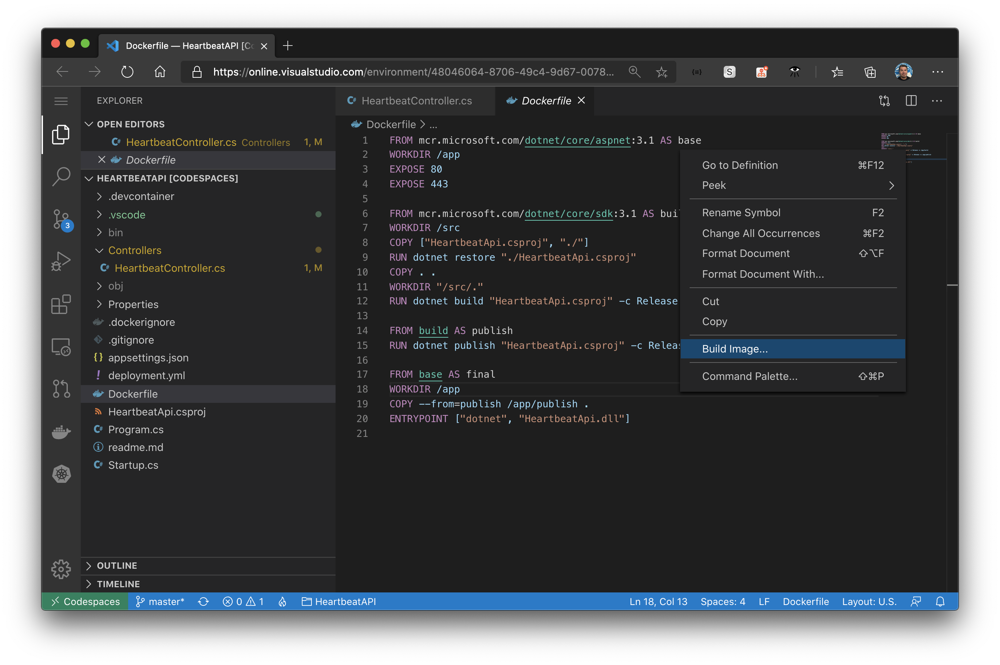
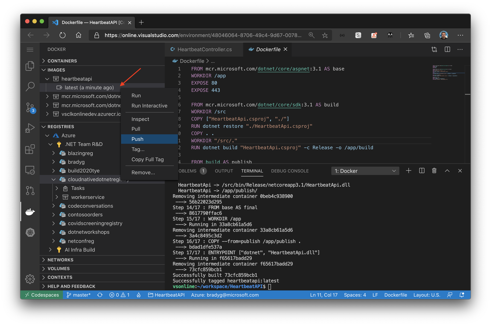
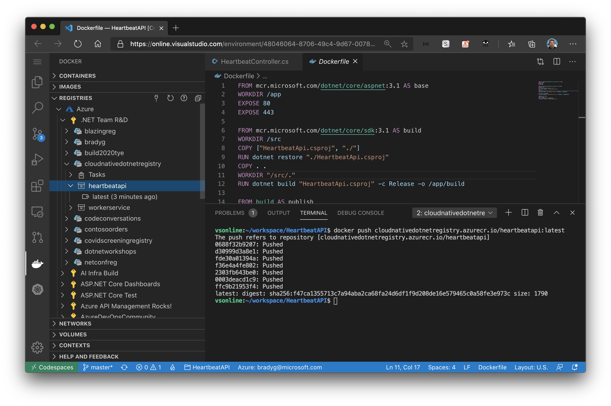
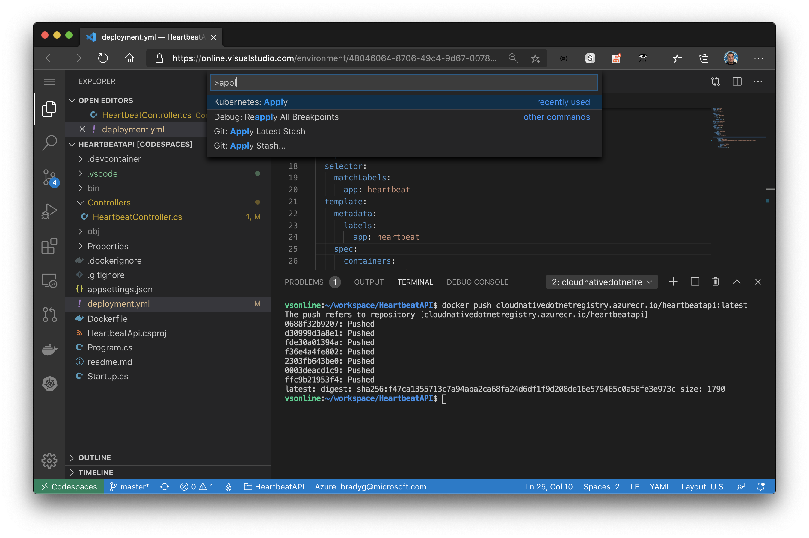
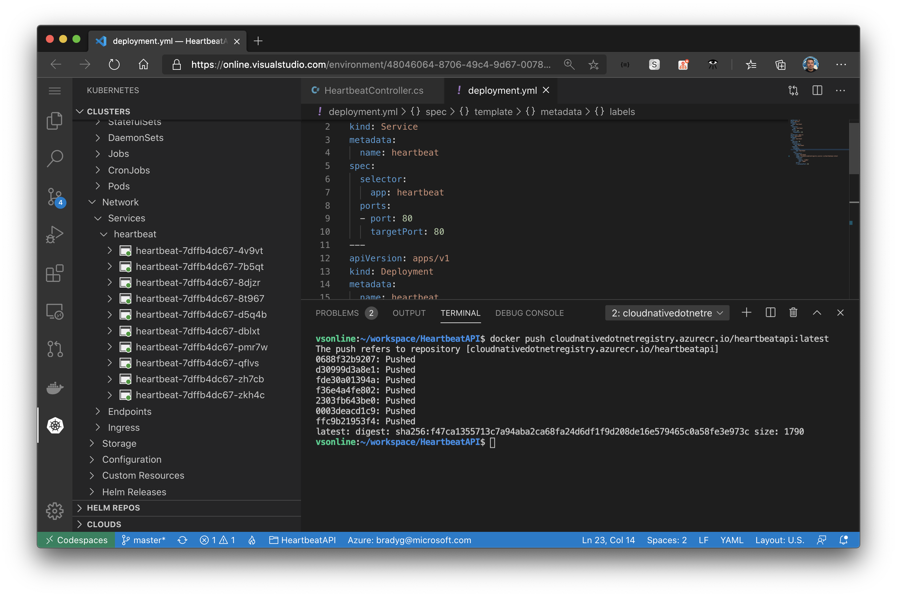

Codespaces is great for getting going, because now we've got all the code we need to run and deploy the project in the repository, which gets pulled right into the development environment (the Codespace).

The project already has a `Dockerfile` and a `deployment.yml` file to aid in the deployment of the app to ACR and later, AKS. The project has a single controller, `HeartbeatController`.



Open the `HeartbeatController.cs` file and you'll see that the controller has one method that responds on HTTP GET requests to the root (`/`) of the site.

```csharp
[ApiController]
[Route("/")]
public class HeartbeatController : ControllerBase
{
    [HttpGet]
    public async Task<ActionResult> Get()
    {
        return new JsonResult(new
        {
            HostName = Environment.MachineName,
            HostTimeStamp = DateTime.UtcNow
        });
    }
}
```

This means that, as the API is called, it will return the machine name - or in the case of it running in a Docker container within a Kubernetes cluster, the container instance's name. You'll be creating more than one instance of the Heartbeat API within the cluster, so this response will inform the Worker, who is calling the API, which instance served the request.

Open the `Dockerfile` and right-click anywhere in it. Select **Build image** from the context menu to build the Docker image.



Once the image has finished building, find it in the Codespace instance's Docker tools panel, and push it to your ACR instance like you did with the Worker in Visual Studio Code on your desktop.



Once the image is pushed, you'll see it appear in the ACR registry in your Codespace.



Open up the the `deployments.yml` file. Notice also that, in addition to the `deployment` components of this YAML file which you've seen before in the `WorkerService` deployment file, the HTTP API `deployment.yml` file contains a Service component as well. This identifies an internal route to the API for other microservices in the cluster.

```yaml
apiVersion: v1
kind: Service
metadata:
  name: heartbeat
spec:
  selector:
    app: heartbeat
  ports:
  - port: 80
    targetPort: 80
```

Also notice how the Deployment component of the file specifies that 10 replicas of the microservice should be created when the deployment happens. This means we'll have 10 instances of the API running so we're sure to have enough instances available to service the whole cluster.

```yaml
apiVersion: apps/v1
kind: Deployment
metadata:
  name: heartbeat
spec:
  replicas: 10
  selector:
    matchLabels:
      app: heartbeat
```

You'll see that the ACR repository path has the string `{your-registry}` in it.

```yaml
...

spec:
  containers:
  - name: heartbeat
    image: {your-registry}.azurecr.io/heartbeatapi:latest
    resources:
      limits:
        memory: "128Mi"
        cpu: "500m"

...
```

You'll replace this with your ACR instance's prefix:

```yaml
...

spec:
  containers:
  - name: heartbeat
    image: cloudnativedotnetregistry.azurecr.io/heartbeatapi:latest
    resources:
      limits:
        memory: "128Mi"
        cpu: "500m"

...
```

Apply the changes using the **Kubernetes Apply**.



Now, when you look in the Kubernetes cluster tools in Visual Studio Code, you'll see there are 10 instances of the heartbeat API running in the cluster.



Now that the heartbeat API service has been deployed into the cluster the `WorkerService` will need to be updated to make calls to it.
