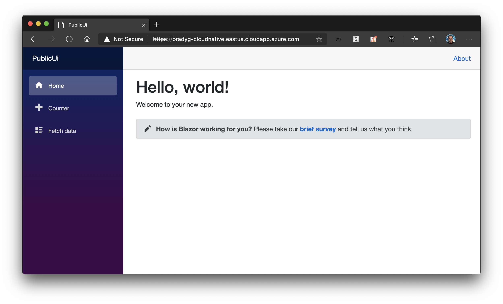

Now that the Blazor WebAssembly UI is in ACR and the ingress is ready, you can deploy the Blazor UI to the AKS cluster and make it the public-facing front door of the cluster in a few easy steps.

Add a new *deployment.yml* file to the root of the `PublicUi` project. This file will essentially be the same content as the `heartbeat` service's *deployment.yml* file, but you'll change the name of the service to be `publicui` instead of `heartbeat`.

> **Note**: make sure to replace the `{your-registry}` prefix for the ACR registry before you apply the file.

```yml
apiVersion: v1
kind: Service
metadata:
  name: publicui
spec:
  selector:
    app: publicui
  ports:
  - port: 80
    targetPort: 80
---
apiVersion: apps/v1
kind: Deployment
metadata:
  name: publicui
spec:
  replicas: 1
  selector:
    matchLabels:
      app: publicui
  template:
    metadata:
      labels:
        app: publicui
    spec:
      containers:
      - name: heartbeat
        image: {your-registry}.azurecr.io/publicui:latest
        resources:
          limits:
            memory: "128Mi"
            cpu: "500m"
        ports:
        - containerPort: 80
```

Now, apply the changes using the **Kubernetes: Apply** command in the command palette.

Once you've applied the change to push the `publicui` service into the cluster, you'll want to use the *hello-world-ingress.yml* file with a `kubectl delete` command to delete the old ingress. The ingress is currently in the `ingress` namespace, and you want to move it to the `workshop` namespace, where your other microservices are running.

```bash
kubectl delete -f hello-world-ingress.yml --namespace ingress
```

Now open the *hello-world-ingress.yml* file in Visual Studio Code. Change the `serviceName` property so that it points to the `publicui` service you just deployed.

```yml
apiVersion: extensions/v1beta1
kind: Ingress
metadata:
  name: hello-world-ingress
  annotations:
    kubernetes.io/ingress.class: nginx
    cert-manager.io/cluster-issuer: letsencrypt-staging
    nginx.ingress.kubernetes.io/rewrite-target: /$1
spec:
  tls:
  - hosts:
    - bradyg-cloudnative.eastus.cloudapp.azure.com
    secretName: tls-secret
  rules:
  - host: bradyg-cloudnative.eastus.cloudapp.azure.com
    http:
      paths:
      - backend:
          serviceName: publicui
          servicePort: 80
        path: /(.*)
```

Apply the changes using the Kubernetes CLI once more. Use either the Kubernetes CLI or the command palette, as either will work.

```bash
kubectl apply -f hello-world-ingress.yml --namespace workshop
```

Now, browsing to the root of your AKS cluster's FQDN resolves to the `publicui` service, and the Blazor WebAssembly UI loads.



Now that the UI is deployed, we can wire up a gRPC service that pumps data from the `workservice` into the `publicui` service so site visitors can see what's happening.
