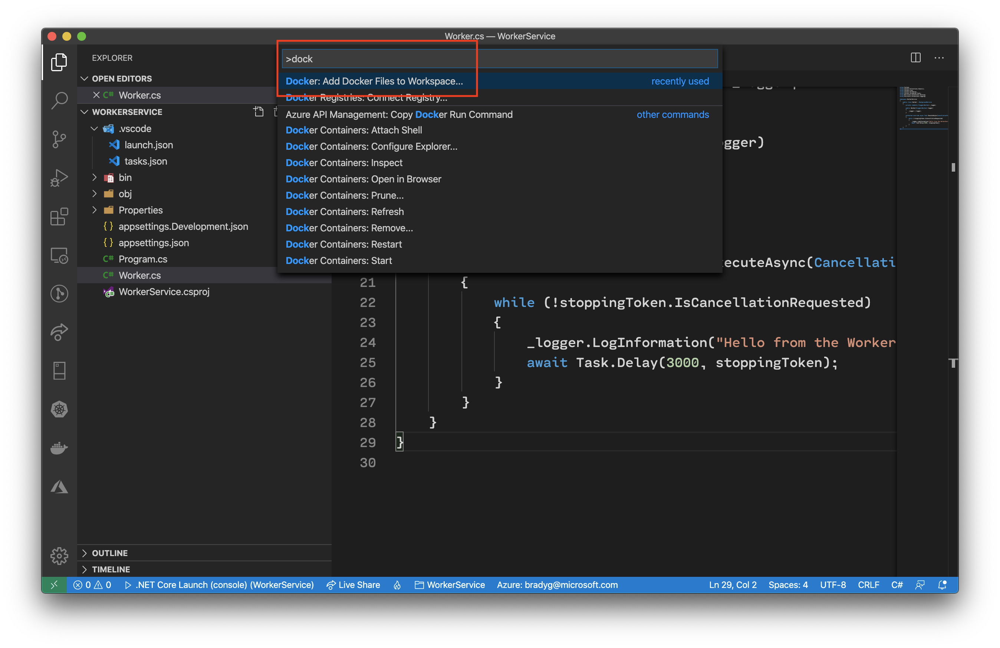
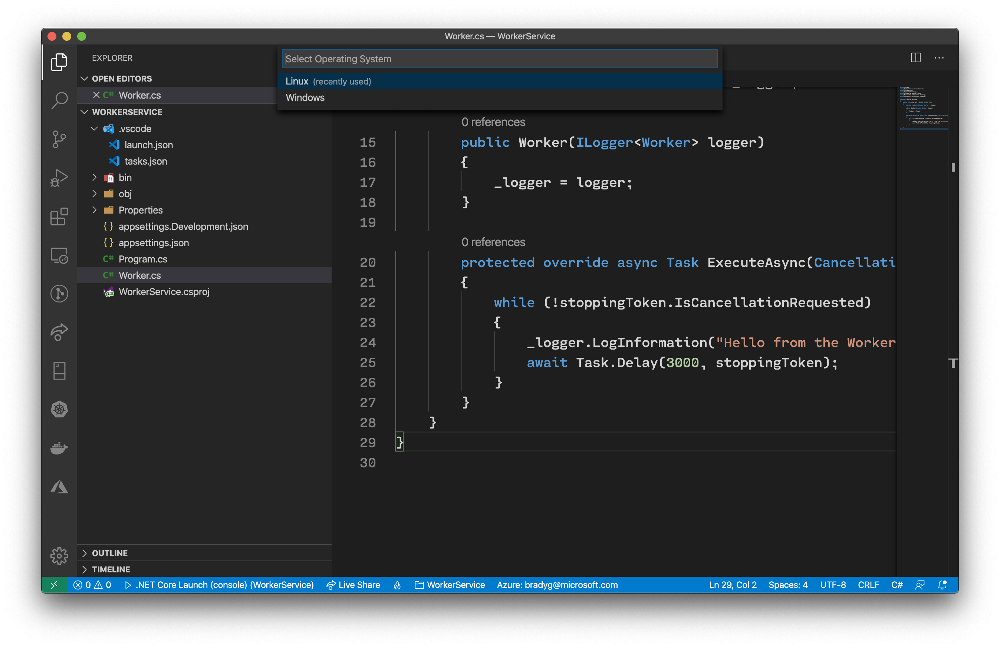
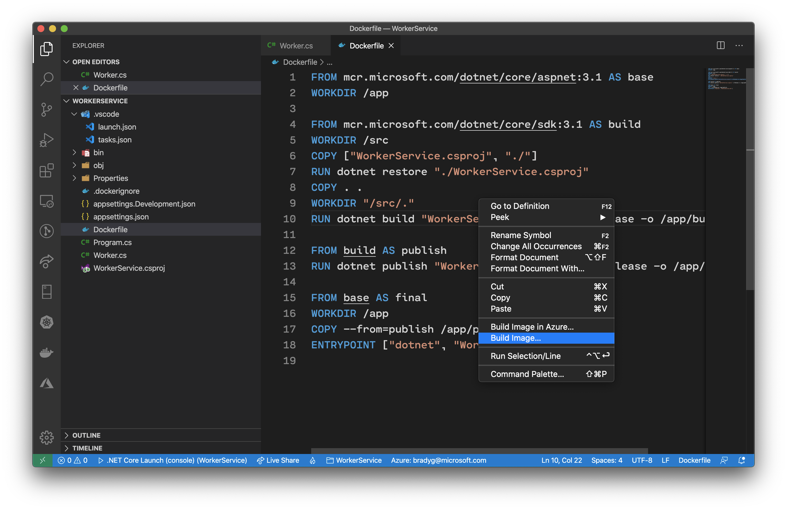
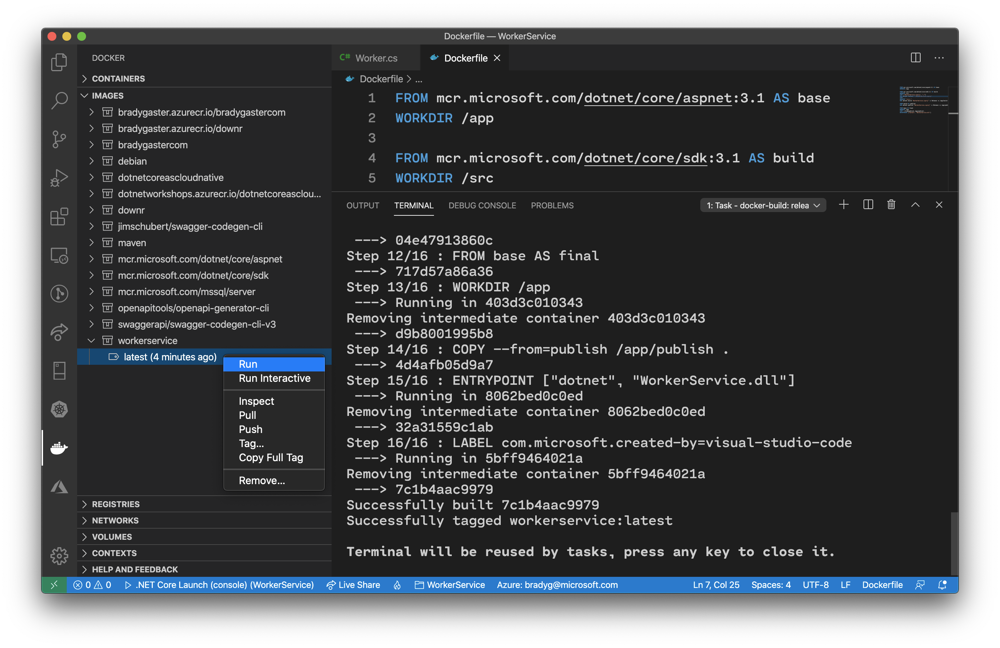
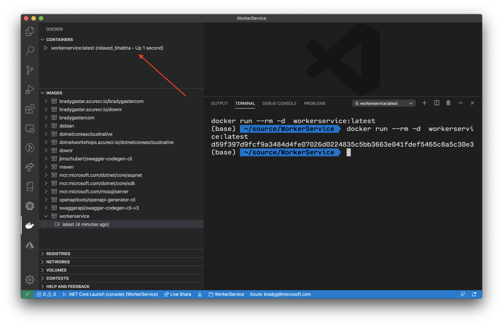
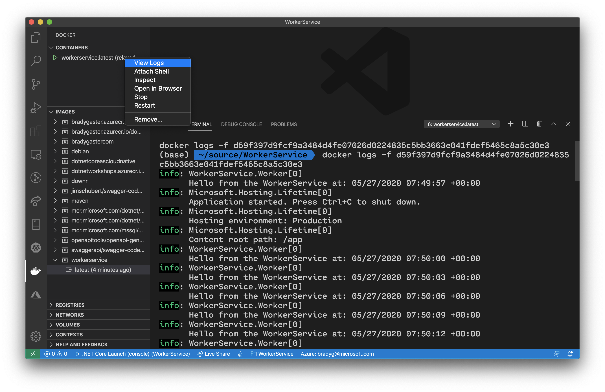

The first step on the road to getting your code running as a microservice in a Kubernetes cluster is to package the code up into a Docker container. Both Visual Studio and Visual Studio Code have first-class tools for adding `Dockerfile`s to your projects, but for now we'll stay within Visual Studio Code. Use the Visual Studio Code command palette to search for `docker` and then select the **Add Docker files to workspace** command.



Select **ASP.NET Core**, as we want to use the ASP.NET Core base image.


Then, select Linux from the final menu. You could select Windows here, but it would require additional (yet [well-documented and not-too-complex](https://docs.microsoft.com/en-us/azure/aks/windows-container-cli#add-a-windows-server-node-pool)) configuration to the AKS cluster that's beyond the scope of this workshop. For now, we won't need to do this as all of our microservices will be pure .NET Core 3.1.



When asked if you want additional `Docker Compose` files, say no, as we won't be using Docker Compose in this workshop, and leave the port fields blank.

> Note: The port value is set by default. When asked, just hit backspace or delete.

When finished, the `Dockerfile` should look like this.

```docker
FROM mcr.microsoft.com/dotnet/core/aspnet:3.1 AS base
WORKDIR /app

FROM mcr.microsoft.com/dotnet/core/sdk:3.1 AS build
WORKDIR /src
COPY ["WorkerService.csproj", "./"]
RUN dotnet restore "./WorkerService.csproj"
COPY . .
WORKDIR "/src/."
RUN dotnet build "WorkerService.csproj" -c Release -o /app/build

FROM build AS publish
RUN dotnet publish "WorkerService.csproj" -c Release -o /app/publish

FROM base AS final
WORKDIR /app
COPY --from=publish /app/publish .
ENTRYPOINT ["dotnet", "WorkerService.dll"]
```

Right-click anywhere within the open `Dockerfile`, or right-click on the `Dockerfile` icon in the file explorer in Visual Studio Code. Select **Build image** to build the `WorkerService` project into a Docker container.



Docker Desktop will download the base images if you don't have them already, build the `WorkerService` project into a Docker container, and provide an update when it has completed.


Click the Docker tools icon in Visual Studio Code to open up the Docker view of your images, containers, and more. The new `workerservice` Docker image is visibile in the **Images** panel. Right-click the `workerservice` image and select the **Run** menu option.



The `workerservice` image will be created and started. Once it has, it will be visible in the **Containers** panel.




To view the logs of the container while it is running on your local computer, right-click the container and select **View Logs**. The logs from the Worker's standard output will appear in the integrated terminal in Visual Studio Code.



Now that you have the `WorkerService` project packaged up and running as a Docker-contained microservice, you'll push it to the cloud.