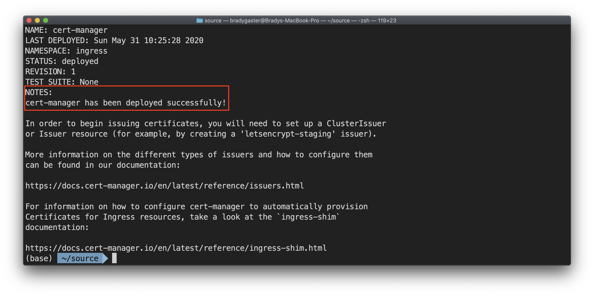
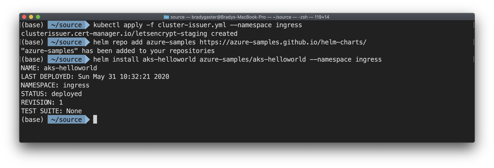
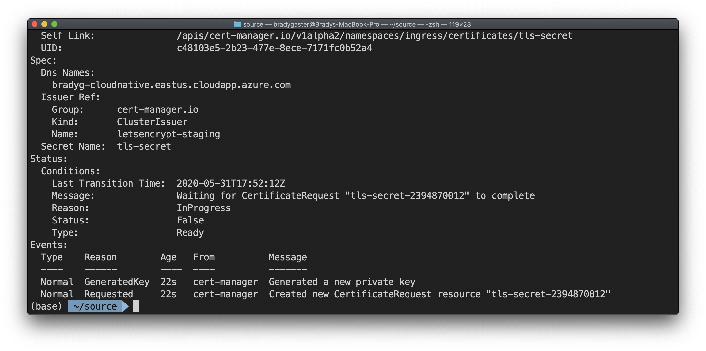

The NGINX ingress controller supports TLS termination. There are several ways to retrieve and configure certificates for HTTPS. We'll be using cert-manager, which provides automatic Let's Encrypt certificate generation and management functionality. Run the script below to create the certificate manager.

```bash
# Install the CustomResourceDefinition resources separately
kubectl apply --validate=false -f https://raw.githubusercontent.com/jetstack/cert-manager/release-0.13/deploy/manifests/00-crds.yaml

# Label the cert-manager namespace to disable resource validation
kubectl label namespace ingress cert-manager.io/disable-validation=true

# Add the Jetstack Helm repository
helm repo add jetstack https://charts.jetstack.io

# Update your local Helm chart repository cache
helm repo update

# Install the cert-manager Helm chart
helm install \
    cert-manager \
    --namespace ingress \
    --version v0.13.0 \
    jetstack/cert-manager
```

You should see a message in the terminal window confirming the installation succeeded.



Create a file named *cluster-issuer.yml* with the following code in it:

```yml
apiVersion: cert-manager.io/v1alpha2
kind: ClusterIssuer
metadata:
  name: letsencrypt-staging
spec:
  acme:
    server: https://acme-staging-v02.api.letsencrypt.org/directory
    email: bradyg@microsoft.com
    privateKeySecretRef:
      name: letsencrypt-staging
    solvers:
      - http01:
          ingress:
            class: nginx
```

Apply the template using the Kubernetes CLI.

```bash
kubectl apply -f cluster-issuer.yml --namespace ingress
```

Add the azure samples Helm repository, which contains handy sample microservice packages for testing your installation.

```bash
helm repo add azure-samples https://azure-samples.github.io/helm-charts/
```

Create the first demo application from a Helm chart with the following command:

```bash
helm install aks-helloworld azure-samples/aks-helloworld --namespace ingress
```

Your terminal should provide confirmation after each step completes.



Create a new file named *hello-world-ingress.yml* and paste the following code into it.

> **Note**: You'll need to change the `host` and `hosts` properties to match your own ingress URL.

```yml
apiVersion: extensions/v1beta1
kind: Ingress
metadata:
  name: hello-world-ingress
  annotations:
    kubernetes.io/ingress.class: nginx
    cert-manager.io/cluster-issuer: letsencrypt-staging
    nginx.ingress.kubernetes.io/rewrite-target: /$1
spec:
  tls:
  - hosts:
    - bradyg-cloudnative.eastus.cloudapp.azure.com
    secretName: tls-secret
  rules:
  - host: bradyg-cloudnative.eastus.cloudapp.azure.com
    http:
      paths:
      - backend:
          serviceName: aks-helloworld
          servicePort: 80
        path: /(.*)
```

Create the resource by using the Kubernetes CLI.

```bash
kubectl apply -f hello-world-ingress.yml --namespace ingress
```

Check to see how the certificate issuer is working using the command:

```bash
kubectl describe certificate tls-secret --namespace ingress
```

You should see that TLS is now working.



You can also now browse to the `https` version of your cluster's FQDN. Next, you'll deploy the Blazor WebAssembly UI and change the ingress to route to it instead of the Hello World sample.
