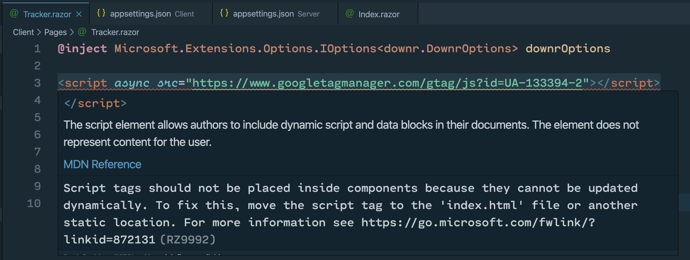

Since downr is built using Blazor WebAssembly, I'll be loading components into areas of the page. Given I wanted to continue to use Google Analytics to track each page (and component) load, simply slapping the Google Analytics tracking JavaScript code on my `index.html` page isn't sufficient. I'll need to track traffic on a component-by-component basis. This post walks through the usage of the Google Analytics feature in downr, and describes how I built it.

## How to enable Google Analytics in downr

Enabling GA support is as simple as changing one setting in `appsettings.json`. Here's my file before I added GA support:

```json
{
  "downr": {
    "title": "bradygaster.com",
    "rootUrl": "https://bradygaster.com",
    "pageSize": 4,
    "author": "brady gaster",
    "indexPageText": "Hi! I'm a christian dad who lives near Seattle, works at Microsoft with the talented folks on the .NET team, tinkers with MIDI hardware, and makes loud music with computers.",
    "imagePathFormat": "https://bradygasterdotcom.azureedge.net/posts/{0}/media/"
  }
}
```

Here's the `appsettings.json` file with support added:

```json
{
  "downr": {
    "title": "bradygaster.com",
    "rootUrl": "https://bradygaster.com",
    "pageSize": 4,
    "author": "brady gaster",
    "indexPageText": "Hi! I'm a christian dad who lives near Seattle, works at Microsoft with the talented folks on the .NET team, tinkers with MIDI hardware, and makes loud music with computers.",
    "imagePathFormat": "https://bradygasterdotcom.azureedge.net/posts/{0}/media/",
    "googleTrackingCode" : "UA-133394-2"
  }
}
```

Once downr users add a value for the `googleTrackingCode`, Google Analytics lights up. It's that simple.

## Tracking code in components? No.

The first thing I thought was, *let's put the tracking code into each component*. This was **far** too easy a solution to really work. What if I build in more features over time, resulting in nested components? I don't want to repeat the same JavaScript code at various points throughout the site - that'd get bloated quickly.

Not to mention the fact that the Razor compiler knows this isn't a good idea and lets me know pretty clearly why.



> Thanks, team, for saving me from doing something not-quite-right here!

## How tracking was implemented

The implementation wasn't too complex. Before I wrote the code to support it, I established a few assumptions & goals:

1. I'm going to want to add support for Azure Application Insights, so whatever I do, I need it to not "tie" me to Google Analytics as my only means of tracking.
1. downr users will want to easily configure their own GA code.
1. The tracker should be reusable in other components.

The first step was to add the configuration property to the `DownrOptions` class, which provides `IOption<T>`-style configuration throughout the downr's components, services, and controllers.

```csharp
/// <summary>
/// This value is optional. If it is provided in your configuration, the Google tracking
/// JavaScript code will be injected into your pages.
/// </summary>
/// <value></value>
public string GoogleTrackingCode { get; set; }
```

The `index.html` page needs to be outfitted with the remote script enabling Google Analytics tracking to occur. This is okay for `index.html` - I'm not actually **executing** the tracking behavior, just including the script as a dependency.

```html
<script async src='https://www.google-analytics.com/analytics.js'></script>
```

I'll also add a small JavaScript function to `site.js`. This code executes the GA tracking functionality. By wrapping the tracking code in this manner, the Blazor components can use the `IJSRuntime` service to call the tracking script when they load.

```javascript
window.trackWithGoogle = (ua) => {
    window.ga=window.ga||function(){(ga.q=ga.q||[]).push(arguments)};ga.l=+new Date;
    ga('create', ua, 'auto');
    ga('send', 'pageview');
};
```

The `Tracker.razor` component code is obviously very minimal - it serves the purpose of executing the tracking code if I've enlisted in it via configuring my site for it. `Tracker`'s implementation leaves room for me to dial in another tracker when I'm ready.

```csharp
@inherits ComponentBase
@using downr
@inject DownrOptions options
@inject IJSRuntime JSRuntime

@code {
    protected override async Task OnInitializedAsync()
    {
        if(!string.IsNullOrEmpty(options.GoogleTrackingCode))
        {
            await JSRuntime.InvokeVoidAsync("trackWithGoogle", options.GoogleTrackingCode);
        }
    }
}
```

By configuring my site with the `googleTrackingCode` property, I enlist in GA tracking, and the `trackWithGoogle` script is called each time any component including the `Tracker` component renders.

## Tracking per-component

Now, I can include `Tracker` in my other components. The list isn't long - downr only has two (currently) main pages:

* `Index.razor`, which renders the list of posts
* `Posts.razor`, which is what you see when you click to read a post

`Tracker` is included both at the bottom of `Index.razor` to track when the home page is loaded:

```html
    <button id="loadMorePostsButton" class="btn btn-secondary btn-center" @onclick="OnLoadMoreButtonClicked">more</button>
  </div>
</div>

<Tracker/>
```

And at the bottom of `Posts.razor`, so each click-through to an article can be tracked.

```html
@page "/posts/{slug}"
@using downr.Models
@inject HttpClient Http
@inject Microsoft.Extensions.Options.IOptions<downr.DownrOptions> downrOptions

<div class="text">
    <h1 class="display-4">@Post.Title</h1>
    <div id="post">
        @((MarkupString)Post.Content)
    </div>
</div>

<Tracker/>
```

## Summary

When you have needs for tracking scripts within a Blazor app, there are definitely some things you'll need to consider, but there are also some great customization opportunities for *how* you track behavior and traffic in your site. This post examines how I accomplished tracking with downr. Soon I'll add support for Azure Application Insights (or I'll accept a pull request if you'd like to implement it), and add a subsequent blog post describing how you can enlist.