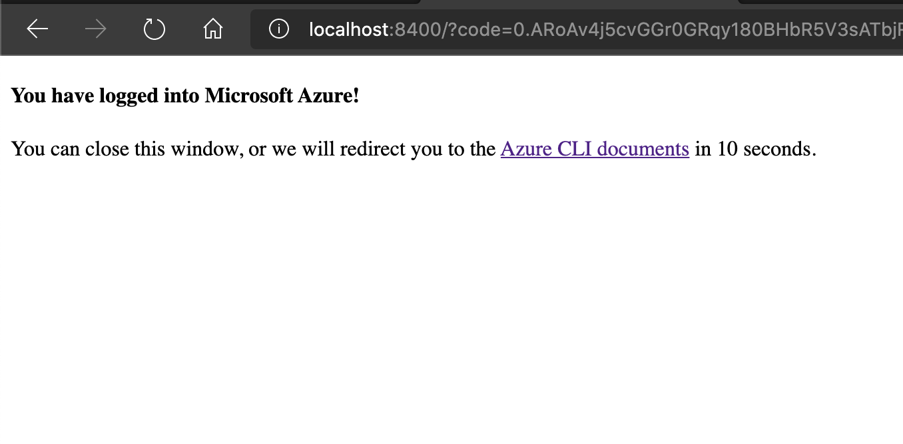
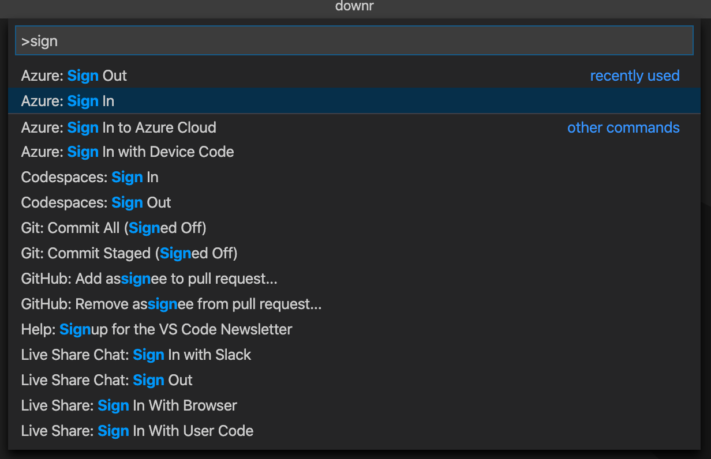
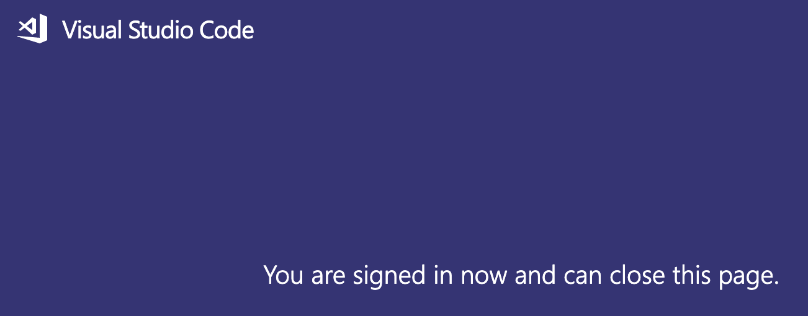
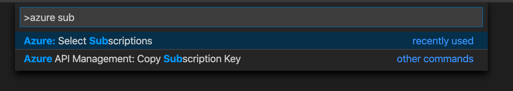

We'll be using a few online services so it'll be good to use one browser with multiple tabs throughout this workshop. Get started by logging into all of the appropriate web sites:

1. [GitHub](https://github.com)
1. The [Azure Portal](https://portal.azure.com)

## Authenticate your environment to GitHub

Once you've logged into these sites, get your git setup locally so you're ready to commit code to GitHub. You can learn about [connecting to GitHub using SSH](https://help.github.com/en/github/authenticating-to-github/connecting-to-github-with-ssh), or you can use the integrated authentication experience in Visual Studio or Visual Studio Code.

## Login to Azure via the Azure CLI

Make sure you have the browser with the Azure account you wish to use highlighted. Then, open a terminal (which ever terminal you choose to use), and invoke the Azure CLI login command by typing the following terminal command:

```bash
az login
```

> Note: whilst the Azure PowerShell Cmdlets are great, we'll be using the Azure CLI exclusively in this workshop. If you are familiar with both and want to use the Azure PowerShell Cmdlets, feel free, but the presenters may not be as familiar with Azure PowerShell as they are the Azure CLI.

A web browser should open up and present you with a success message that you've been logged into the Azure CLI. If you're new to the CLI, the redirection page - or the [Azure CLI docs start page](https://docs.microsoft.com/en-us/cli/azure/?view=azure-cli-latest) - is quite helpful for learning new commands and may be a good bookmark.



### Multiple Azure subscriptions?

Many folks have Azure subscriptions associated with their login from other workshops, from work, or any variety of reason. When you logged in to the CLI, you probably JSON output containing the list of subscriptions you can access via the CLI.

If you're unsure which one you want to use, you can see a list of all your subscriptions by using the `az account` command. Showing the result as a table makes it a bit easier to see in the terminal window.

```bash
az account list -o table
```

Once you see the list of subscriptions, you can select the one you want to use for the workshop by once again using the `az account` command:

```bash
az account set -s <your-subscription-guid>
```

## Login to Azure in Visual Studio Code

Open Visual Studio Code, and open the command palette using `Cmd-Shift-P` or `Ctrl-Shift-P`. Type the phrase **Sign in** and select the **Azure: Sign in** option.



Visual Studio Code will launch a web browser and you'll be authenticated to your Microsoft tenant and logged into your Azure subscription. Once you're presented with the login screen you can go back to Visual Studio Code.



Use the command palette in Visual Studio Code again to find the **Azure: Select Subscriptions** command.



Select the subscription you plan on using for the workshop, and click OK. Now, any of the Visual Studio Code extensions for Azure will have access to the resources in your subscription.

## Login to Azure in Visual Studio

By logging into Visual Studio with your Microsoft credentials you'll be autoatically logged into your Azure subscription so the Visual Studio tools for Azure will just work.

> Note: When you're using the integrated terminal in Visual Studio Code, and you're logged into a different account, the terminal wins. So, it is important to note that your AZ CLI terminal, Visual Studio Code extensions for Azure will all be using the same subscription.
