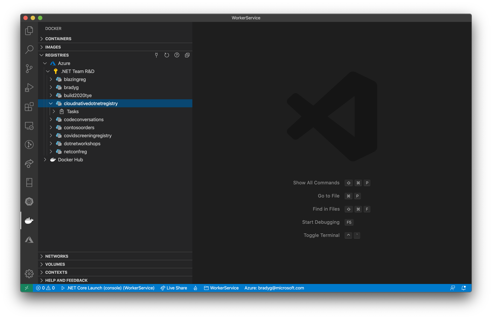
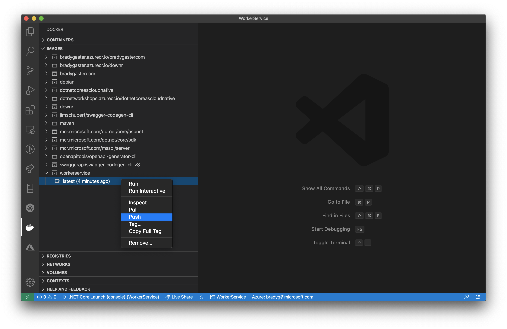
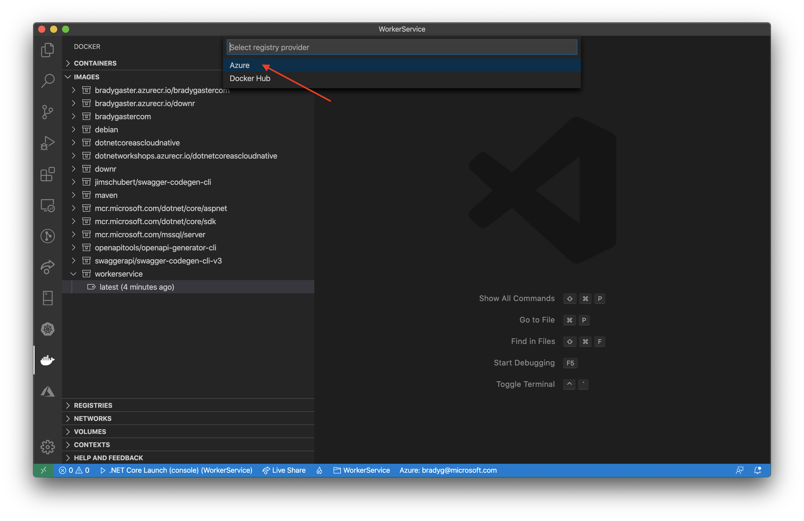
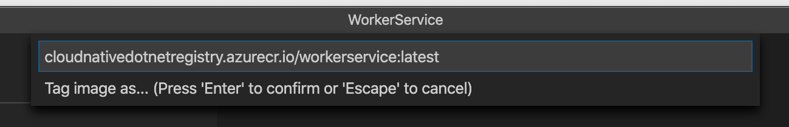
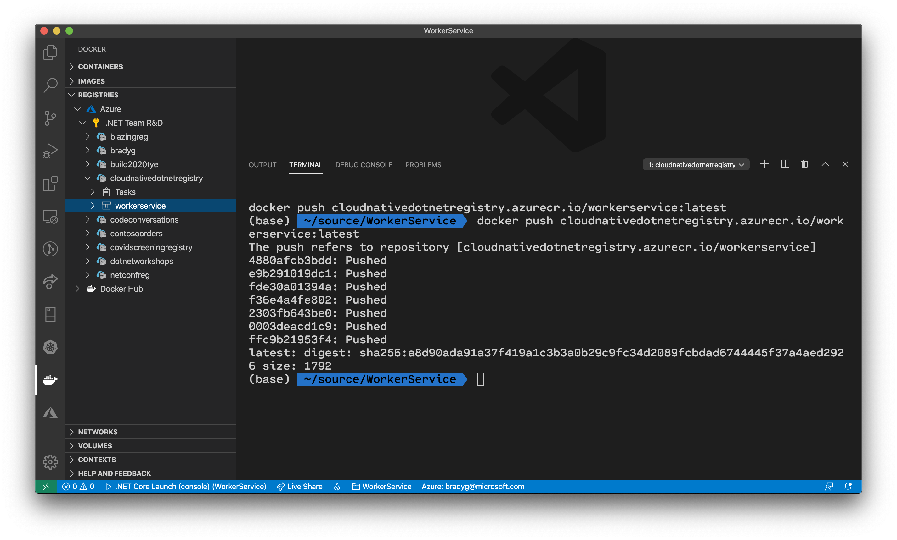
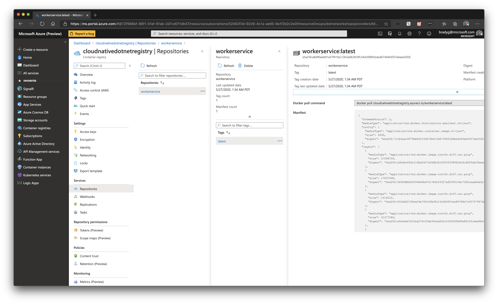

In addition to being able to see the Docker images and containers on your local development workstation, you can also see the Docker Hub and Azure Container Registry (ACR) instances and their container images. In the **Registries** panel, expand the Azure node and you'll see the ACR instance you created earlier.

Re-open the **Images** panel in the Docker tools. Find the `WeatherService` image you built on your computer. Right-click the image and select the **Push** menu item.

Visual Studio Code will begin to walk you through the process of publishing the image to a registry. First, Visual Studio Code will ask you about the destination type. Select **Azure**.

Select the ACR instance you created earlier when asked which ACR instance you want to target. When asked for the name, use the name format `{your-acr-name}.azurecr.io/workservice:latest`.

> **Note**: There is no need for `http` or `https` in the ACR publish target name.

Once the publish process completes, you'll see the `workerservice` repository in your ACR instance in Visual Studio Code.

Right-click the ACR instance in Visual Studio Code and select **Open in portal**. You'll be taken into the Azure portal page for your ACR instance. Go to the **Repositories** tab for your ACR instance in the Azure portal. You'll see the Docker images that have been published into the registry.

Now that the `WorkerService` project is in your registry, you can deploy it in a variety of ways&mdash;not just Azure Kubernetes Service.
