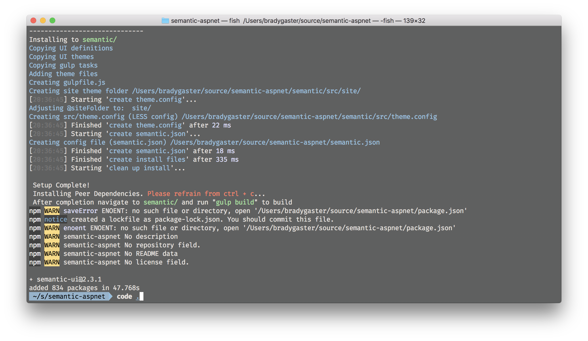
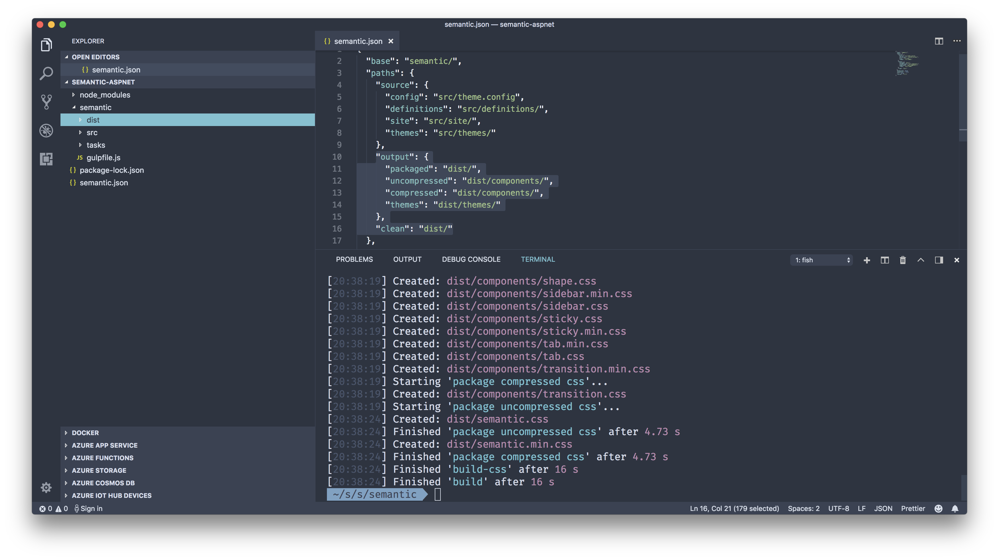
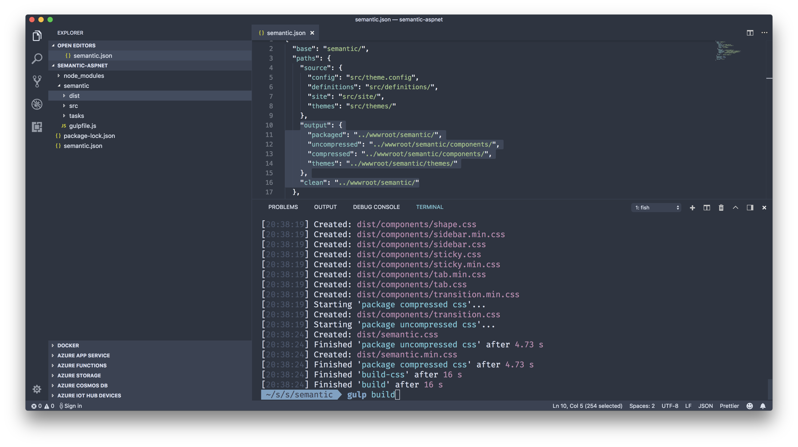
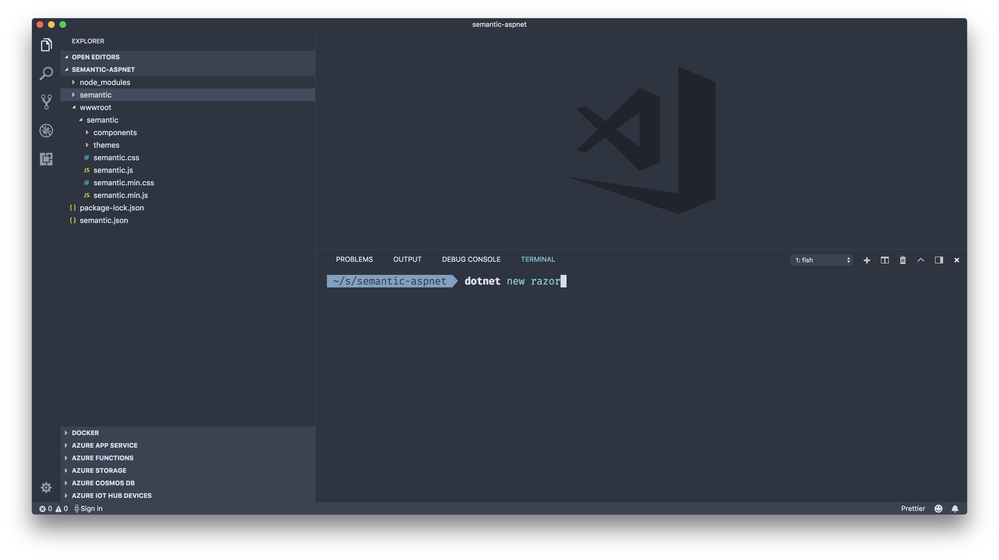
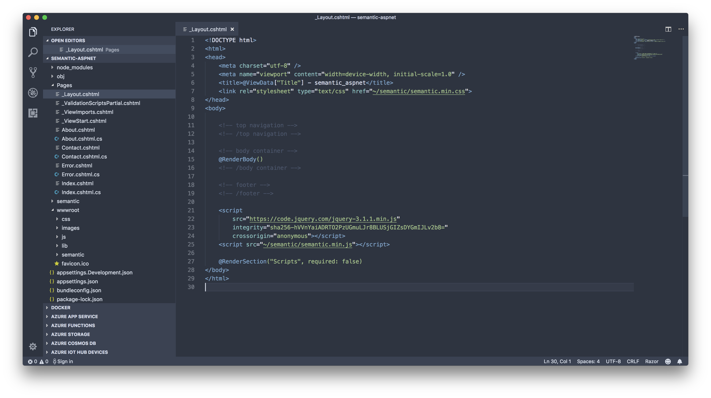

After thinking a lot about my blogging app I decided to start over somewhat on the UI of the site and to simplify things in general. In so doing, Razor seemed like the best option, as I won't have a lot of complexity in either the UI or the middle tier. Since I'm re-thinking the view layer anyway, it felt like a good time to investigate one of the awesome new UI frameworks I've heard about. After some review, [Semantic UI](http://semantic-ui.com) was my favorite, so after choosing to use it I found there are a few various resources on the web about using Semantic UI with ASP.NET at various levels of completeness, so I chose to write this one. In this post, I'll walk through the basic steps of using `dotnet new` along with the Semantic UI getting started experience to blend the two together. There's an accompaying [repository](https://github.com/bradygmsft/semantic-ui-aspnetcore-razor) if you prefer to just dive in. 


Every great project has to start somewhere. Mine always start with a brand new, spanking clean directory. My app will live in `semantic-aspnet.` The folks over at Semantic UI have a [great getting started article](https://semantic-ui.com/introduction/getting-started.html). Take a look at it to get the details, but for the impatient, getting started is as simple as:

```
npm install semantic-ui --save
```


Once NPM performs the magical routine of bringing all your site's dependencies down, you'll notice a call to `gulp install` at the very end of the process. This launches a friendly [Semantic UI step-by-step wizard](https://semantic-ui.com/introduction/getting-started.html#install-semantic-ui). Since I have no idea what I'm doing as this is my first rodeo with Semantic UI, I'll be gentle and accept the defaults. 


The obvious next step - open the directory up in [Visual Studio Code](http://code.visualstudio.com), [2018's favorite software development environment](https://insights.stackoverflow.com/survey/2018/#technology-most-popular-development-environments). Then the real fun can begin. 



The `semantic.json` file contains configuration that's used by Semantic UI's [Gulp](https://gulpjs.com/) build process (don't worry, we'll cover that next, and it's **not** complicated) to know where to drop files produced by the build. There are a ton of components ([Button](https://semantic-ui.com/elements/button.html), [Flags](https://semantic-ui.com/elements/flag.html) even a [Reveal](https://semantic-ui.com/elements/reveal.html)) in Semantic UI, and with all those modules come a good number of `.css` and `.js` files. They get minified and packaged up awesomely by the `gulp build` command. 

> Note: Take note that you need to CD into the `semantic` folder (the folder identified by the `base` property in `semantic.json`) before running `gulp build`.


When the build completes, all of the files needed to run Semantic UI will be in my `semantic\dist` folder. 



That's no good, since I know I'll need to have those files in the static files area - the `wwwroot` folder - so I need to make some tweaks to the configuration. Specifically, I'll swap all the instances of `dist` with `../wwwroot/semantic`. That way, I'll be able to edit my `.cshtml` files in the **Pages** folder, my C# source code, and my UI layer by making use of the great [theming capabilities](https://semantic-ui.com/usage/theming.html) and [layout features](https://semantic-ui.com/usage/layout.html) Semantic UI offers. Once I tweak the configuration I can simply run the `gulp build` command once more, and...



Voila! Now, the Semantic UI's output is dropped into the `wwwroot` folder. With it there, I'll be able to drop in the .NET Core stuff next. That way, the Semantic UI distribution components fit nicely inline with the conventions I'm used to when I'm building ASP.NET Core Razor page apps. 


Now I'll run `dotnet new razor` to lay down the ASP.NET source code I'll need to get started. It'll drop down the typical Bootstrap UI layer, but I can delete the `lib` folder altogether since I'll be using Semantic UI. 



Since I'm no longer using Bootstrap I can refer to the Semantic UI docs on [including Semantic UI in my site's HTML](https://semantic-ui.com/introduction/getting-started.html#include-in-your-html), as well as stripping out most of the remaining HTML from the layout page. 



Then I pull over the navigation and footer HTML from the [fixed layout sample](https://semantic-ui.com/examples/fixed.html), and rip the body area as well to surround the call to `@RenderBody()`, edit the `index.cshtml` file some to just show a basic text paragraph. All of the source code for this super-basic beginning is [in the accompanying repository](https://github.com/bradygmsft/semantic-ui-aspnetcore-razor), but the results look pretty nice. 


## Summary

I've taken a look at Semantic UI as it's been years since I tried a new UI framework. As with any new trick or sauce, it takes a little trial-and-error to get things perfect, but the effort is minimal to get tweak your new ASP.NET Razor app to make use of Semantic UI. I'm still learning about the theming capabilities; there are so many awesome things the folks at Semantic UI give you to make creating your own color schemes and layouts a breeze. Hope this helps you if you're thinking of using the two together, and getting started literally takes 10 minutes. Happy coding!