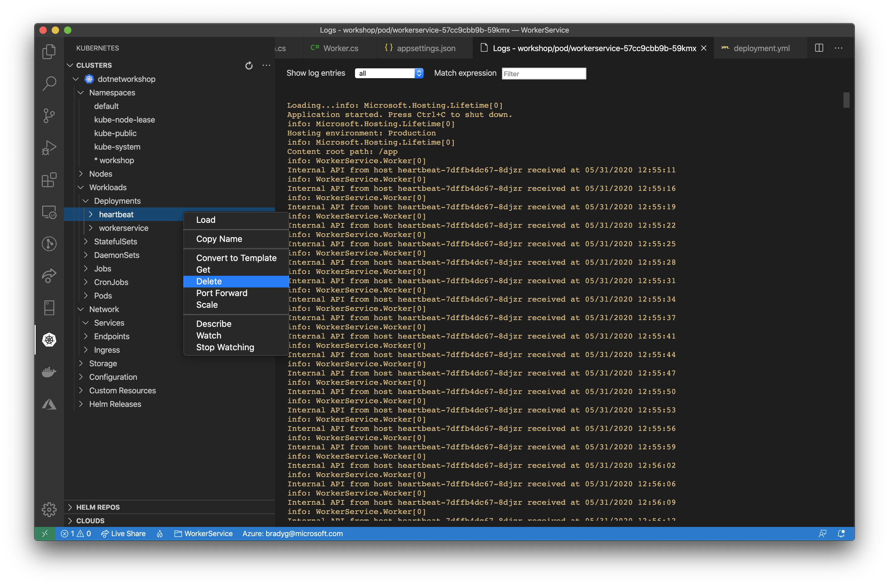
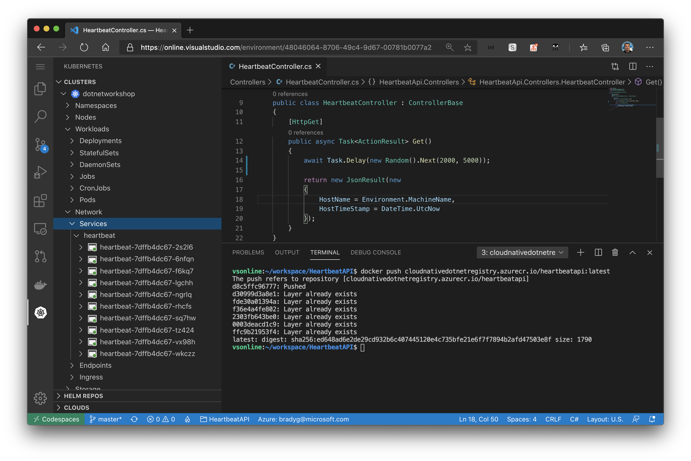
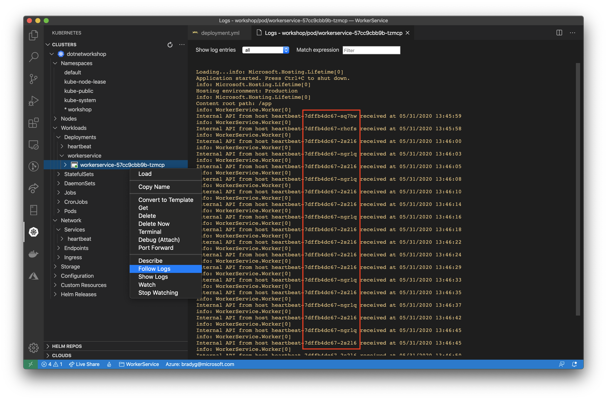

You've seen how the logs indicate that the `workerservice` gets "stuck" to an individual `heartbeat` service API. This is mostly due to the fact that a single instance of the API can easily withstand a request every 3 seconds from a single client. In this step you'll change the code in both microservices and re-deploy them to the cluster to see what would happen under a heavier load and when the service response time is degraded due to more work being done on each request.

Note, we'll be using `Task.Delay` here to simulate the "doing more work" part of this. Though a contrived method of simulation, it does provide a baseline for how to build one's microservices in an effort to be tolerant of real-world volume.

In the Codespace for the `heartbeat` service, change the controller's `Get` method to make it `async`.

```csharp
public async Task<ActionResult> Get()
```

Then, add a line of code that makes each request to the API delay for a random amount of time. This simulates the API having an unpredictable response time when being called by the `workerservice`.

```csharp
public async Task<ActionResult> Get()
{
    await Task.Delay(new Random().Next(2000, 5000));
    
    return new JsonResult(new
    {
        HostName = Environment.MachineName,
        HostTimeStamp = DateTime.UtcNow
    });
}
```

Re-package the `heartbeat` Docker container, and push it to ACR.

Then, delete the existing service by deleting the `heartbeat` service using the Kubernetes cluster explorer in Visual Studio Code.


Then do the same thing to delete the `heartbeat` deployment using the Kubernetes cluster explorer in Visual Studio Code.



Go ahead and delete the `workerservice` deployment using the Kubernetes cluster explorer in Visual Studio Code. Since there's no `heartbeat` service for it to call at the moment, we should delete it too.

In your Visual Studio Codespace, rebuild the `heartbeat` service's Docker container, and push it to ACR to make sure your code changes get to the registry. Then, open the `deployment.yml` file and use the **Kubernetes: Apply** command from the Visual Studio command palette to re-deploy the `heartbeat` service into the cluster. Make sure you see it running in the Codespace's Kubernetes cluster explorer once the deployment completes.



Back in Visual Studio Code where you're editing the code for the `workerservice`, open the `Worker.cs` file. Within the `ExecuteAsync` method, you'll wrap all of the code that "does the work" to call the `heartbeat` service in a `Task.Run` call. This will enable the worker to "request and forget" to the `heartbeat` service.

```csharp
Task.Run(() => {
    var json = _httpClient.GetStringAsync("http://heartbeat/").Result;
    var instanceInfo = JsonSerializer.Deserialize<InstanceInfo>(json);
    _logger.LogInformation($"Internal API from host {instanceInfo.HostName} received at {instanceInfo.HostTimeStamp}");
});
```

> **Note**: You may see a compiler warning that reports *Because this call is not awaited, execution of the current method continues before the call is completed. Consider applying the 'await' operator to the result of the call.* This is expected. Ignore this warning during compilation.

Finally, reduce the amount of time the `Worker` class waits in between each execution of `ExecuteAsync` so that it is set to `500` or something similar. The code for `ExecuteAsync` will now call the `heartbeat` service far faster than it will respond, without waiting between each request for the response to return.

```csharp
protected override async Task ExecuteAsync(CancellationToken stoppingToken)
{
    while (!stoppingToken.IsCancellationRequested)
    {
        try
        {
            Task.Run(() => {
                var json = _httpClient.GetStringAsync("http://heartbeat/").Result;
                var instanceInfo = JsonSerializer.Deserialize<InstanceInfo>(json);
                _logger.LogInformation($"Internal API from host {instanceInfo.HostName} received at {instanceInfo.HostTimeStamp}");
            });
        }
        catch(Exception ex)
        {
            _logger.LogError(ex, "Error during HTTP request");
        }

        await Task.Delay(500, stoppingToken);
    }
}
```

Package the `workerservice` back up into a Docker container and push it to ACR. Then open the `deployment.yml` file in Visual Studio Code use the **Kubernetes: Apply** command from the Visual Studio Code command palette to re-deploy the `workerservice` microservice into the AKS cluster.



Now you'll see that the `workerservice`'s requests are being randomly spread across the `heartbeat` service instances. This shows how Kubernetes is actively routing requests to the most appropriate instance. One microservice needs only to know the **service endpoint address**&mdash;in this example case, `http://heartbeat`&mdash;and Kubernetes does the rest of the work.
