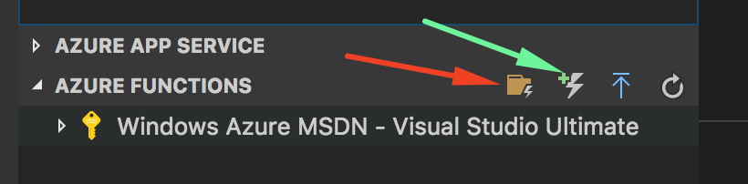
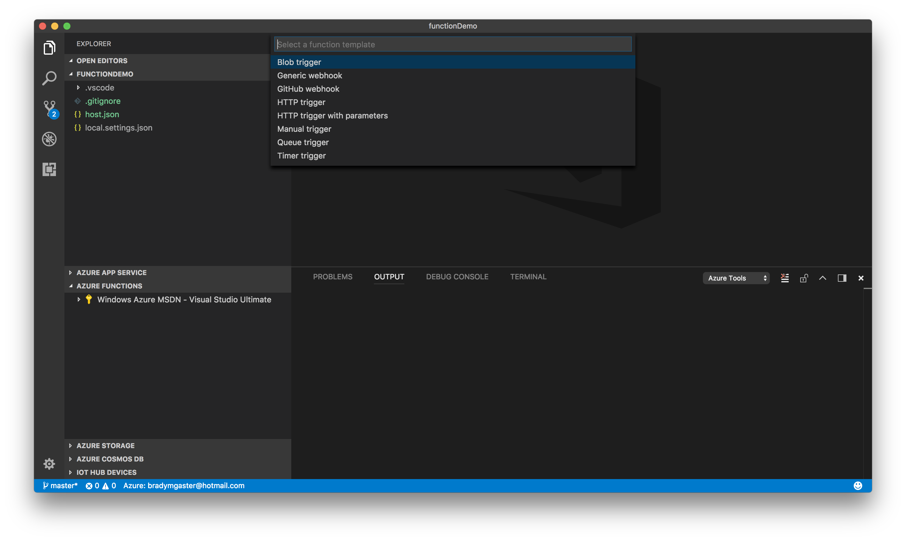
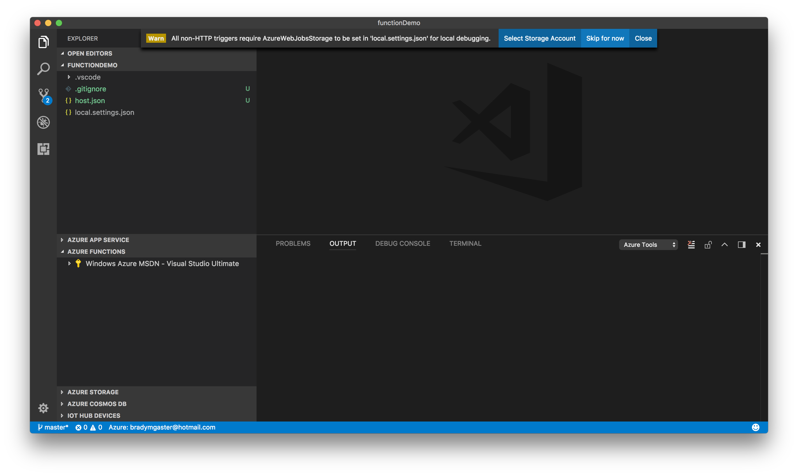
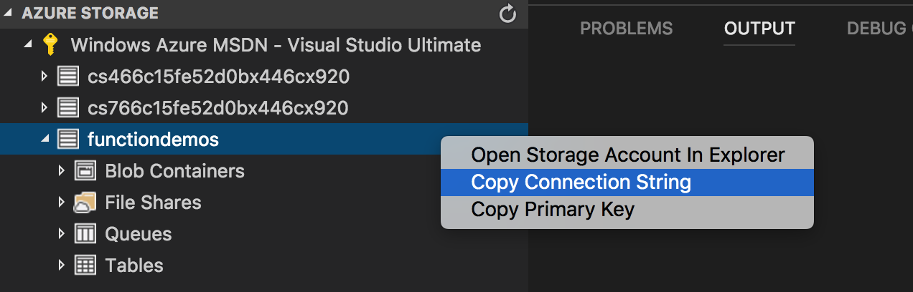

[Visual Studio Code](https://code.visualstudio.com/) offers some great extensions for use when you're developing your applications on Azure or using Azure resources. You can find the [collection of Azure extensions](https://marketplace.visualstudio.com/search?target=VSCode&category=Azure) in the Visual Studio Marketplace. I'm investigating ways I can use these extensions together to build apps. This post demonstrates how, when you're developing an [Azure Function](https://azure.microsoft.com/en-us/services/functions/) using Visual Studio Code's [Azure Functions](https://marketplace.visualstudio.com/items?itemName=ms-azuretools.vscode-azurefunctions) extension, you can *also* use the [Azure Storage](https://marketplace.visualstudio.com/items?itemName=ms-azuretools.vscode-azurestorage) extension to make configuration a snap. 

The [Azure Functions](https://marketplace.visualstudio.com/items?itemName=ms-azuretools.vscode-azurefunctions)  extension makes it really easy to create a new Functions project (red arrow) in your workspace's active directory. It also provides a button in the Functions Explorer pane that makes it easy to create new Function files in my project (green arrow).

In my case, I want to create a Function that wakes up when new blobs are dropped into a blob container. You can learn more about blob-triggered functions on  [docs.microsoft.com](https://docs.microsoft.com/en-us/azure/azure-functions/functions-create-storage-blob-triggered-function). 

During the handy Function-creation process, I'm asked if I'd like to configure my Function project with the storage account's connection string. I don't have this yet, as I'm still experimenting, so I click the **close** button. 

The new Function code opens up in Visual Studio Code, and I'm ready to start coding. At this point I'm curious what'll happen, so I go ahead and hit `F5` to start debugging.

Debugging immediately throws an error to let me know I should've given it a connection string. 

>Humorous narrator: If you're like me, you don't *always* let the tools do their jobs for you, accept the defaults, and pray things will be okay. As a result, I tend to do a lot of configuring (which I later replace with devops fanciness). This "I'll do it later myself" attitude results with my hastily copying connection strings and accidentally pasting them into emails later. Keep reading and I'll save you hours of the repeated process of copying and not-properly pasting your connection string. 

The good news is that the Azure Storage tools make it easy to fix the `Missing value for AzureWebJobsStorage in local.settings.json` error message shown below. 

Whether I forgot to create a Storage account, or didn't have one and wanted to create it later, or I'm migrating from my `localhost` Storage emulated environment to a live one in Azure, the tools make it easy.

By simply expanding the subscription so I can see all of my Storage Accounts, I can right-click the account I'm after and select the `Copy Connection String` context menu. 

The results can be pasted into my `local.settings.json` file in a jiffy. 

And with that, I've configured my Azure Function, and it runs just fine in the debugger. 

## Other Ideas for using Visual Studio Code &amp; Azure?

This post shows just one simple thing you can do with Visual Studio Code and Azure together. If you have other ideas you'd like to see, drop me a comment below, or send me a message on [twitter](http://twitter.com/bradygaster) to let me know what sorts of things you'd like to see. 
