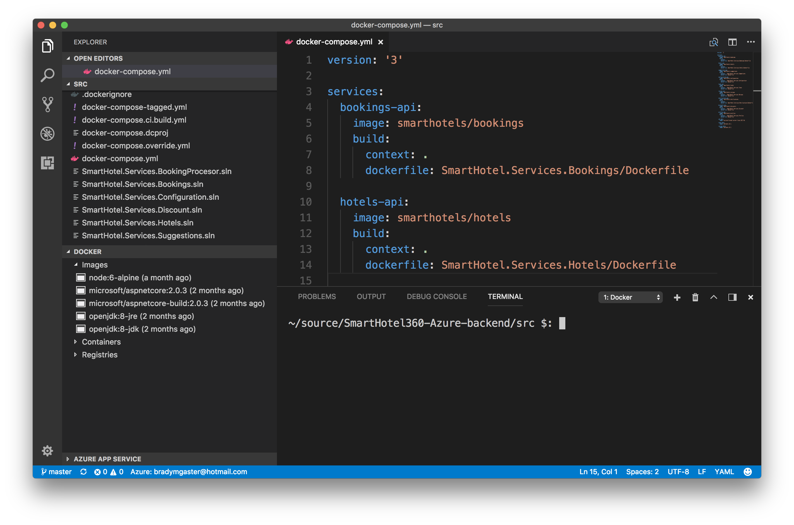
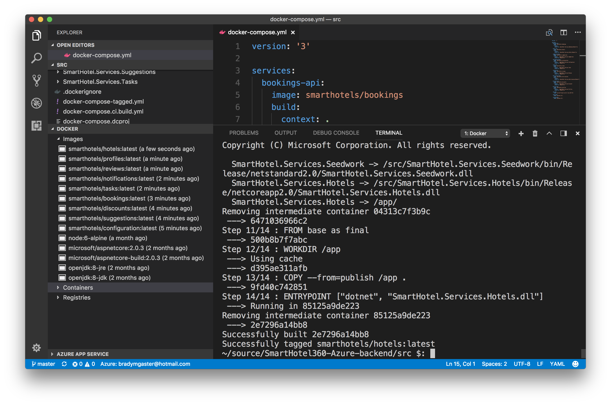
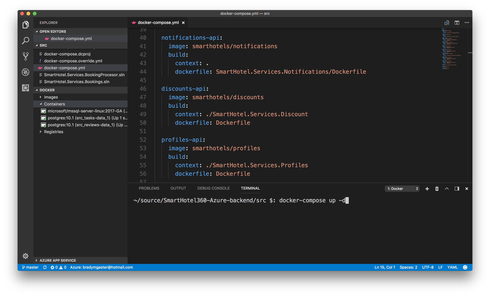
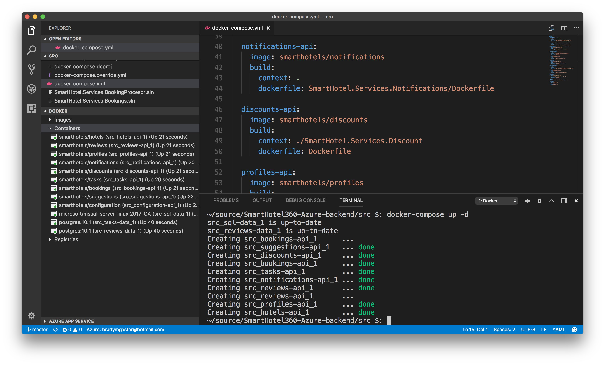
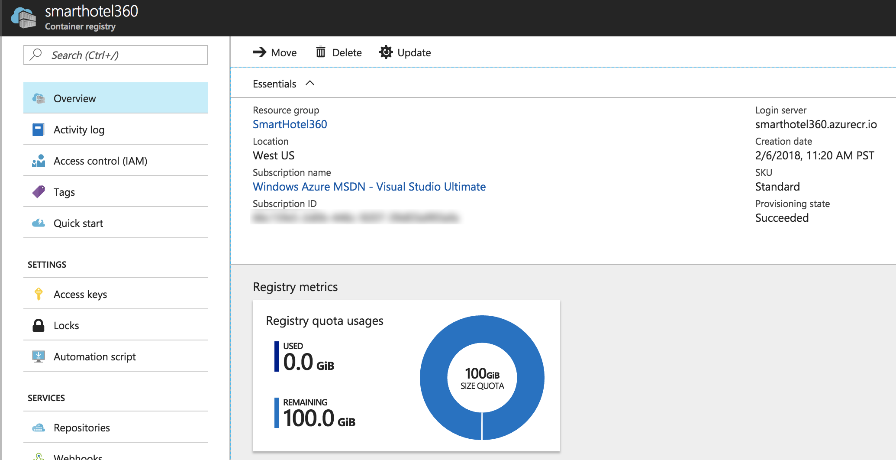
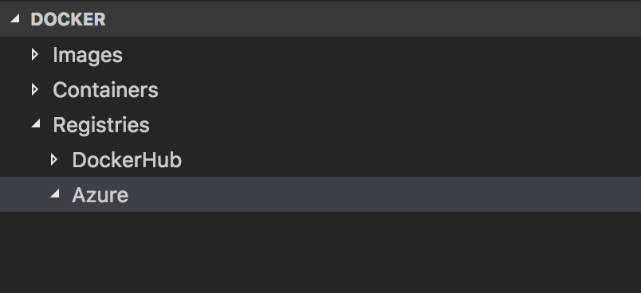

[Visual Studio Code](https://code.visualstudio.com/) offers some great extensions for use when you're developing your applications on Azure or using Azure resources. You can find the [collection of Azure extensions](https://marketplace.visualstudio.com/search?target=VSCode&category=Azure) in the Visual Studio Marketplace. I'm investigating ways I can use these extensions together to build apps. This post will walk through how you can use [Visual Studio Code](https://code.visualstudio.com/) to build a set of Docker images. Then those images will be published to the [Azure Container Registry](https://azure.microsoft.com/en-us/services/container-registry/), so I can share or deploy them later. I'll use the [Docker extension for Visual Studio Code](https://marketplace.visualstudio.com/items?itemName=PeterJausovec.vscode-docker) to see the images once they're published. 

## Starting with the SmartHotel360 Microservices
Given the recent work I've been doing with the [SmartHotel360](http://github.com/Microsoft/SmartHotel360) code and demonstrations, I had the [back-end microservices](https://github.com/Microsoft/SmartHotel360-Azure-backend) built on my machine, so I'll use those images for this demonstration. You can learn more about SmartHotel360 by watching some of the great videos we've recorded on the [Visual Studio Toolbox](https://channel9.msdn.com/Shows/Visual-Studio-Toolbox) show with [Robert Green](https://twitter.com/rogreen_ms). Our demo leader [Erika](https://twitter.com/erikaehrli1) [introduces SmartHotel360](https://channel9.msdn.com/Shows/Visual-Studio-Toolbox/SmartHotel360-Demo-App-Overview), then [Maria](https://twitter.com/LadyNaggaga) and I talk about the [Web & Serverless](https://channel9.msdn.com/Shows/Visual-Studio-Toolbox/SmartHotel360-Demo-App-Web-Site) areas of SmartHotel360 with .NET Core 2 and Azure Functions, and Robert talks to [James](https://twitter.com/JamesMontemagno) about the [SmartHotel360 mobile apps](https://channel9.msdn.com/Shows/Visual-Studio-Toolbox/SmartHotel360-Demo-App-Mobile-Apps?term=smarthotel360). We have a few more shows coming, so stay tuned to [Visual Studio Toolbox](https://channel9.msdn.com/Shows/Visual-Studio-Toolbox). 

### Build the Images

The screen shot below shows the SmartHotel360 `docker-compose.yml` file open in Visual Studio Code. Since I have the Docker extension installed, I can see the base images I've got from other builds on my machine. Note, none of the actual SmartHotel360 microservices are built yet, so none of those images are visible. 

The first step is to run `docker-compose build` to build all of the images. This will take a few minutes to build the numerous images that comprise all of the SmartHotel360 back-end microservices. 

Once the images are built, they'll show up in the Docker Visual Studio Code extension's tree view. I especially love that this is automatic, and I don't even have to manually refresh the list. 

### Composing the Databases

The `docker-compose.yml` file indicates we'll be creating a PostgreSQL database and a Microsoft SQL Server database. You can learn more interesting things on how to run SQL Server in Containers from the Connect(); 2017 session, [Use SQL Server 2017 in Docker containers for your CI/CD process.](https://channel9.msdn.com/events/Connect/2017/T152?term=sql%20server%20in%20container)

I prefer to make sure my data tier services are up first, so I'll run `docker-compose up sql-data reviews-data tasks-data` in the Visual Studio Code terminal. 

Once these images are built, I see the containers light up in the Visual Studio Code Docker extension treeview. 

Now, I'll run a `docker-compose up` to fire up the remaning images. Each of these provide a specific unit of functionality to the SmartHotel360 public web app, or to the individual mobile apps. If you peruse the code, you'll see Java, Node.js and C# code dispersed all throughout the source. This demonstrates how a team of developers using a variety of technologies and frameworks to isolate their functionality, but share in the construction of a community of dependent microservices.

Now that the containers are built I can see all of them in the Docker tools for Visual Studio Code. The handy context tools allow for easy management of the images and containers, and the integrated command line gives me a place to enter those frequently-used Docker commands. 

## Deploying to Azure Container Registry (ACR)

I want to make use of [Azure Container Registry](https://azure.microsoft.com/en-us/services/container-registry/) to store the SmartHotel360 private images, so I can share or deploy them later. I'll use the [Docker extension for Visual Studio Code](https://marketplace.visualstudio.com/items?itemName=PeterJausovec.vscode-docker) to see the images once they're published. 

Below is a screen shot of the SmartHotel360 private container registry, provided as an ACR instance. 

Note in particular that the **Admin user** property is disabled. This setting is documented well, as is implications for using it (or not using it) on [docs.microsoft.com](https://docs.microsoft.com/en-us/azure/container-registry/container-registry-authentication#admin-account). The short story is, I can't really access my registry outside of my cloud resources. 

As long as I've got this set, I won't be able to see my ACR instances and the repositories they contain. 

So when I first get started, I'll want to enable **Admin user** (you can always turn this off later, and passwords can be regenerated whenever you need). 

Then I'll use the username and password to publish images from the command line. As I do this, I'll see my container images lighting up in the Azure Registry pane in Visual Studio Code's Docker extension. 

Now my Azure Container Registry (ACR) instances light up, and I can begin using the Docker command line interface from within Visual Studio Code to push images into Azure. 

Now I'll enter a few commands into the terminal that will log me into my Azure Container Register instance and allow me to publish a Docker image into ACR. There, it'll be ready for deploymnet to App Service, Azure Container Service, or Azure Kubernetes Service. 

Once the image has been published, you can see it as a repository in the ACR tree view node in the Docker panel in Visual Studio Code. 

## Other Ideas for using Visual Studio Code &amp; Azure?

This post shows just one simple thing you can do with Visual Studio Code and Azure together. If you have other ideas you'd like to see, drop me a comment below, or send me a message on [twitter](http://twitter.com/bradygaster) to let me know what sorts of things you'd like to see. 
