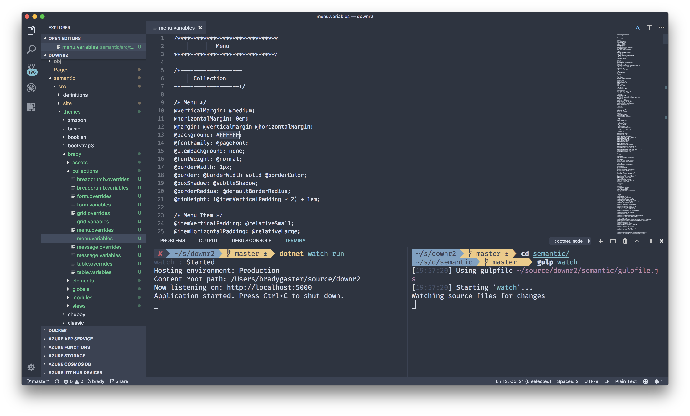
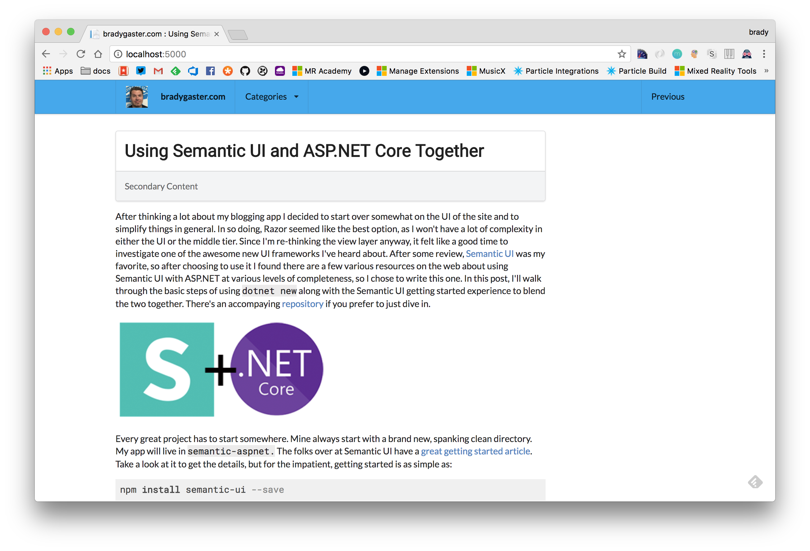

In my [previous post](http://www.bradygaster.com/posts/semantic-ui-aspnetcore-razor) I got started using .NET Core Razor pages with [Semantic UI](http://semantic-ui.com). After writing the post I was convinced I'd be using Semantic UI for my next blog redesign. One reason is that when you use Semantic UI's [gulp](https://gulpjs.com/) build tools alongside .NET's [watch](https://docs.microsoft.com/en-us/aspnet/core/tutorials/dotnet-watch) tool, you can be really efficient in designing your site and figuring out how you want it to look. This post demonstrates how to use [Visual Studio Code](http://code.visualstudio.com) and the built-in multiple-tab terminal window to make this a natural development experience. 

Copying the `default` theme into a new folder named `brady` makes it easy for me to feel comfortable customizing numerous colors and font sizes, and anything else I want to tweak without fearing I've boned up the default theme. Once I get that working I can run `dotnet watch run` to start up my site. 

I got started with one of the built-in Semantic UI layouts, with a simple menu at the top of my site. 

Semantic UI offers a handy `gulp watch` command that, when executed, will watch all of the files in my theme (or any of the Semantic UI override files). Whenever I change any of these files the changes will be picked up and the CSS/JS files will be rebuilt. I don't want to stop the ASP.NET server from running, but I do want to see immediate updates when I make changes to my Semantic UI theme files. So I open up a new tab in Visual Studio Code and `cd` into the `semantic` folder in my project root (**not the `semantic` folder inside of `wwwroot`!**).

Now I can run the `gulp watch` build step and any change I make will be automatically picked up. So, let's make a quick change to the top menu bar to give the site some color. 

I'll open up the original `default` menu theme file that I copied into my own `brady` theme. 

Now, I'll change the `@background` variable to be a blue that might look better with my photo. As soon as I save the file the files are rebuit. 

Once the build completes I can refresh the browser, and the changes are visible. 

## Summary

This post continues my exploration into how Semantic UI and ASP.NET can be great together. I'm in the process of re-writing my blog tool to use Semantic UI, so stay tuned as in the next few days I'll release a new-and-improved site and much simpler codebase for the downr blogging system. Happy coding!